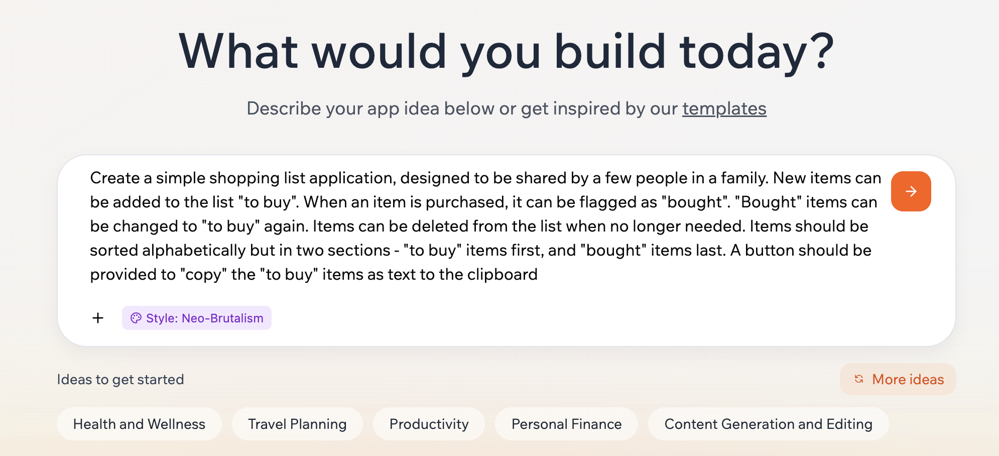
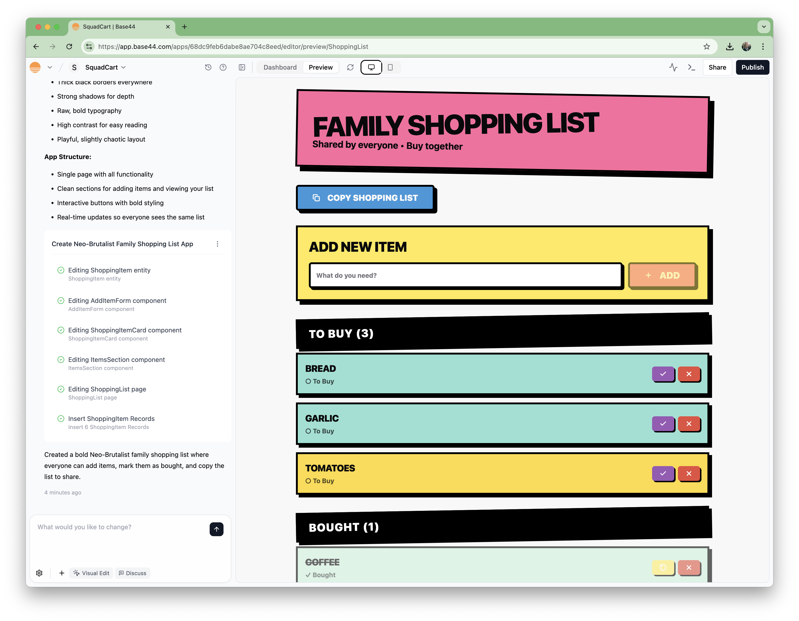
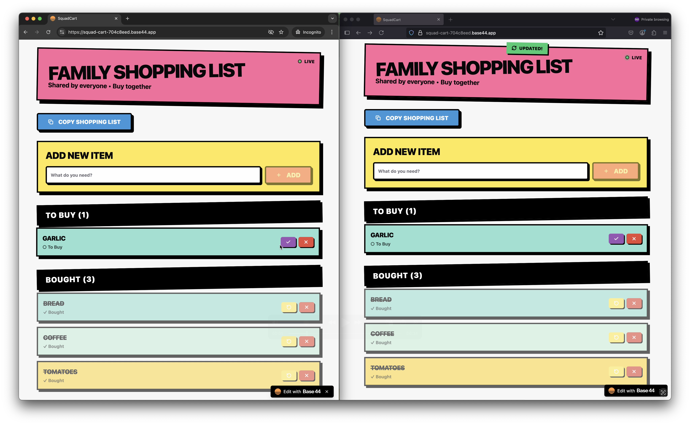

# #360 Base44

A quick review and test drive of Base44 AI-powered app builder and hosting solution.

## Notes

[Base44](https://base44.com/) claims to be a no-code app generator:

> Base44 lets you build fully-functional apps in minutes with just your words. No coding necessary.

Features:

* Uses a chat interface to generate the app, with instant preview
* Generates web-based apps with all the necessary front-end components, pages, flows and features.
* Generates backend including data storage, user authentication, role-based permissions.
* built-in hosting
    * custom domains
* supports a range of integrations including
    * Stripe for payment processing
    * email
* And at the end of the day, the app code can be exported or pushed to GitHub (paid plans only), where you can use other tools (or real people) to enhance the code base.

### Pricing

Has a free plan (25 message credits / month, 100 integration credits / month).

[Paid plans](https://base44.com/pricing) scale up base on message and integration credits. No mention of any additional hosting or bandwidth costs for live apps.

### Licensing

For commercial users, the [Terms of Service](https://base44.com/terms-of-service) contain some clauses that may be of concern, such as:

* License to Customer Data: very broad rights granted to the Company and Third-Party Service Providers, including to "publish and prepare derivative works"

However, it is very clear that the user owns the IP of the generated app. Specifically: "Company relinquishes all rights, title and interests it might have in the Generated Output".

### My Experience

I have tried Base44 with a couple of app ideas so far.

TLDR: good for quick mock-ups of familiar web applications. For complex or unusual applications it soon becomes a frustrating battle to get the app over 80% functionally complete without fatally breaking it.

For simple and very familiar applications (the kind which appear in coding tutorials and the like), it is very good at generating the app in one shot.
For anything more unusual or complex, the initial app is likely to fall short, and will usually have significant issues with functionality or broken features.

Attempting to refine the application too easily falls into a pattern of "one step forward, two steps back".

In general, I found that after about 10 prompts down the refinement path, it is often better to start from scratch with an improved initial prompt, rather than try to keep refining.

### Basic Demo

A shopping list application is about as prosaic as one can get. This has appeared in countless books, blog posts, and courses over the years. It is a well-known domain with many existing examples that the AI likely has captured in the model.

No surprise that Base44 does a decent job!

The prompt:

> Create a simple shopping list application, designed to be shared by a few people in a family. New items can be added to the list "to buy". When an item is purchased, it can be flagged as "bought". "Bought" items can be changed to "to buy" again. Items can be deleted from the list when no longer needed. Items should be sorted alphabetically but in two sections - "to buy" items first, and "bought" items last. A button should be provided to "copy" the "to buy" items as text to the clipboard

The initial generated app:

Review after a single prompt and app generation:

* The generated app is complete within the limits of the prompt:
    * all UI features of the app work correctly
    * the list is stored in a database
    * multiple users can [access the app](https://squad-cart-704c8eed.base44.app/) and maintain a shared list
    * includes user registration and authentication
* What it did not consider, because it wasn't specifically asked to:
    * support multiple "families" with their own list. It is just one common list.
    * support dynamic updates i.e. when one person updates the list, the change should be immediately reflected for others without needing a refresh

Let's try that refinement. The prompt:

> add support dynamic updates i.e. when one person updates the list, the change should be immediately reflected for others without needing a refresh

That worked pretty well. It added a refresh based on a 2 second polling rather than anything more sophisticated like web sockets.

### A more Complex and Unusual App

Let's try a domain that the model should still be reasonably familiar with, but is much more challenging in terms of function and presentation: a character design suite.

The prompt:

> An application designed for 3d figure designers. It features an articulated body skeleton. The user can pose the body using the mouse to set the position and angle of arms, legs, hands, feet, head, torso, neck etc. The character can be rotated to be viewed from all sides. A menu of controls are available to select between a side range of skin types, hair colour and style, gender, race, body type and so on. Clothing and character type can be selected from a range of options. The resulting character can be exported as an image, or as a 3D OBJ file. Selected Neumorphic UI

The initial generated app:

Review after a single prompt and app generation:

* the good:
    * it has generated a decent, basic application layout
* the bad:
    * lots of missing or broken functionality
    * drag to rotate does not work
    * most of the "appearance" options do not work/have no implementation
    * skeleton articulation is wrong. e.g. angle the neck does not also affect head position
    * export options do not work (files are generated, but they have no content)
* the ugly:
    * character rendering is far from ideal  - more South Park than Weta Workshop
    * lots of issues with the UI Design that would need cleaning up

So turning this idea into a useful application still requires significant work.

## Credits and References

* <https://base44.com/>
