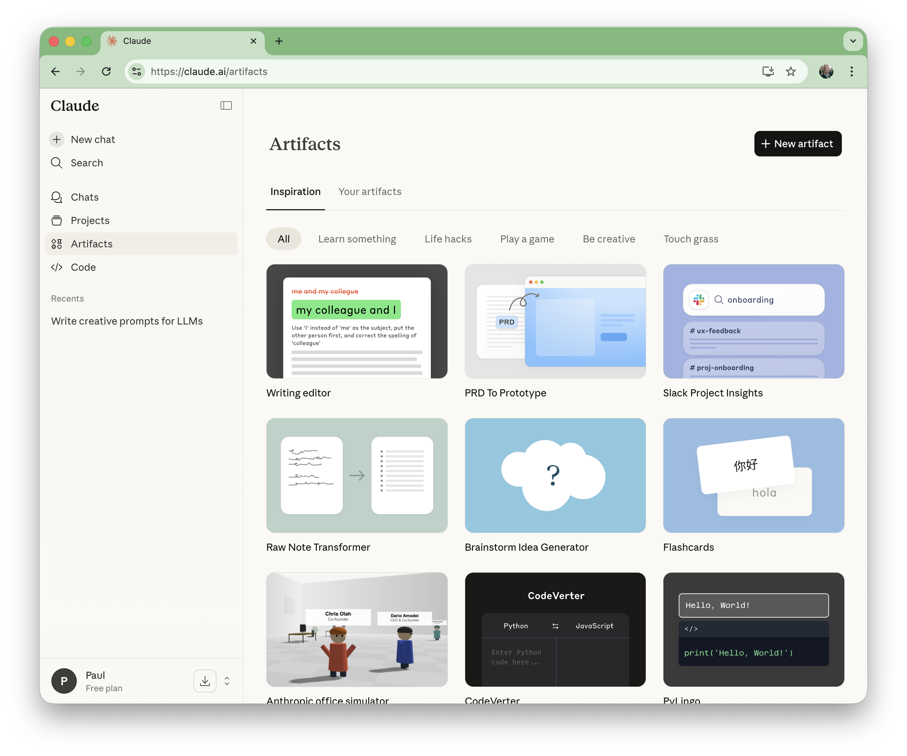
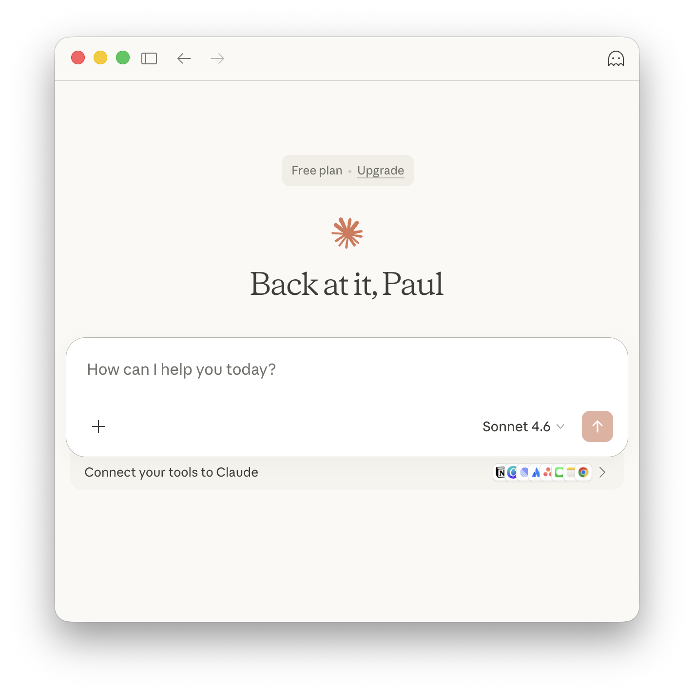
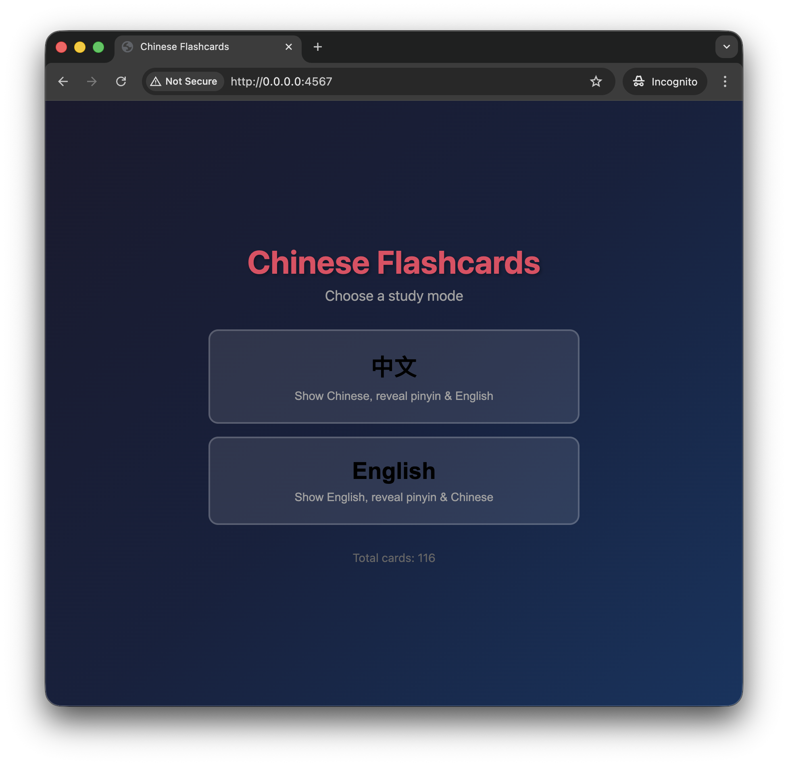
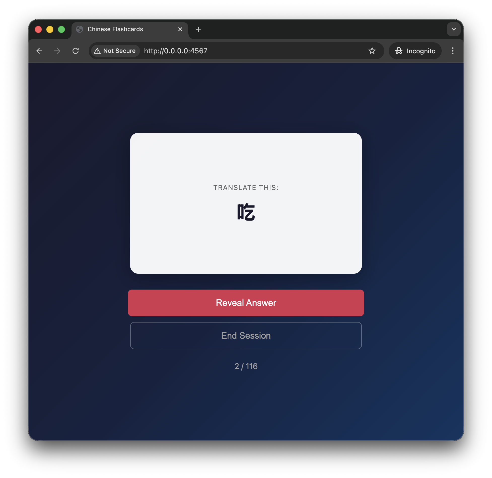
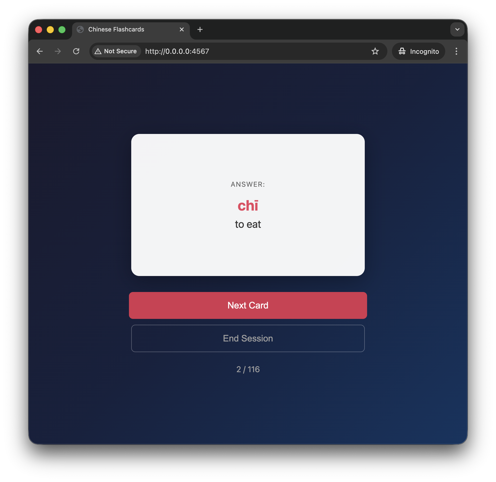

# #xxx Claude

A quick introduction to Claude and Claude Code; using ollama to swap models (including local models); and building a simple Chinese-English flashcard app as an example.

## Notes

Anthropic was founded in 2021 by former OpenAI researchers. The company is structured as a Public Benefit Corporation with a mission to build "reliable, interpretable, and steerable AI systems"
Key milestones:

* March 2023: Claude 1 launched (API + chat interface, limited access)
* July 2023: Claude 2 released—first public version with 100K context window
* March 2024: Claude 3 family (Haiku, Sonnet, Opus) introduced multimodal capabilities
* June 2024: Claude 3.5 Sonnet outperformed Claude 3 Opus on coding benchmarks
* October 2024: "Computer use" beta launched—Claude can control desktops
* May 2025: Claude 4 (Opus 4 + Sonnet 4) released with extended thinking mode
* May 2025: Claude Code moved from research preview to general availability

### Product Components & Features

Clause has a web based UI for chat and research tasks.

Claude Code is installed locally:

* Terminal CLI
* IDE integration: VS Code, JetBrains
* Desktop app - standalone app for running Claude Code outside your IDE or terminal.
* Slack integration

### Key technical features

* **Context windows**: 200K tokens standard (Haiku/Opus), with beta 1M token extension for Sonnet 4/4.5
* **Multimodal**: Text + image input capabilities
* **Extended thinking**: Reasoning mode that interleaves thinking with tool use
* **Computer use**: Ability to see screens, move cursors, click, and type across applications
* **MCP connector**: Model Context Protocol for tool integration

### Claude Code

A command-line AI coding agent that lives in your terminal:

* Understands entire codebases
* Executes routine coding tasks via natural language
* Handles git workflows
* Native VS Code and JetBrains IDE integrations
* GitHub Actions support
* Checkpoints: Save progress and rollback capabilities (added in 2025)
* Acquired Bun in December 2025 to improve speed and stability

## Most Suitable Use Cases

Software Development
Content Creation & Communication
Academic Research & Writing
Enterprise Automation
Specialized Applications

### macOS Installation

[Terminal installation](https://code.claude.com/docs/en/overview#terminal):

    $ curl -fsSL https://claude.ai/install.sh | bash
    Setting up Claude Code...

    ✔ Claude Code successfully installed!

      Version: 2.1.50

      Location: ~/.local/bin/claude

      Next: Run claude --help to get started

    ⚠ Setup notes:
      • Native installation exists but ~/.local/bin is not in your PATH. Run:

      echo 'export PATH="$HOME/.local/bin:$PATH"' >> ~/.bashrc && source ~/.bashrc

    ✅ Installation complete!

[Desktop app installation](https://code.claude.com/docs/en/overview#desktop-app):

Nice! All installed, but not much use without a subscription.

### Using Claude with a model served by Ollama

<https://docs.ollama.com/integrations/claude-code>

Recommended models:

* qwen3-coder
* glm-4.7
* gpt-oss:20b
* gpt-oss:120b

Claude Code requires a large context window. I've set the ollama context window to 64k tokens.

Using `qwen3-coder`, for example, by pulling the model locally and specifying it for use with claude:

    ollama pull qwen3-coder
    ANTHROPIC_AUTH_TOKEN=ollama ANTHROPIC_BASE_URL=http://localhost:11434 ANTHROPIC_API_KEY="" claude --model qwen3-coder

### Building a Flashcard App

Let's build a little Chinese-English flashcard app with claude.

I added a basic [CLAUDE.md](./flashcards/CLAUDE.md) and then build the app in three prompts:

> create data.json with at least 100 examples
> create index.html app with css and js assets
> create sinatra stub app.rb with Gemfile and .ruby-version and .ruby-gemset

I had to futz around a bit to get it to correct the animation sequencing (initially it didn't allow for css transforms to complete before accidentally showing the answers), but now I have a nice little app.
Source files:

* [flashcards/index.html](./flashcards/index.html)
* [flashcards/app.js](./flashcards/app.js)
* [flashcards/style.css](./flashcards/style.css)
* [flashcards/data.json](./flashcards/data.json)

There's also a sinatra wrapper so I can run it locally:

    cd flashcards
    ruby app.rb

In [action](./flashcards/), the main screen:

Showing a question:

And revealing the answer:

## Credits and References

* <https://claude.ai/>
* <https://code.claude.com/docs>
* ["How Claude Code is built"](https://newsletter.pragmaticengineer.com/p/how-claude-code-is-built)
* [Claude workflow by @moremattbell](https://www.tiktok.com/@moremattbell/video/7519236792718183702)
