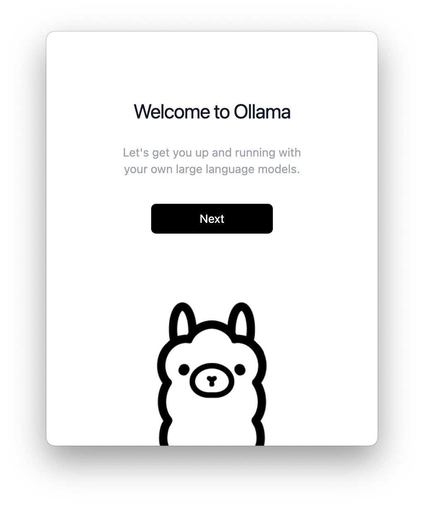
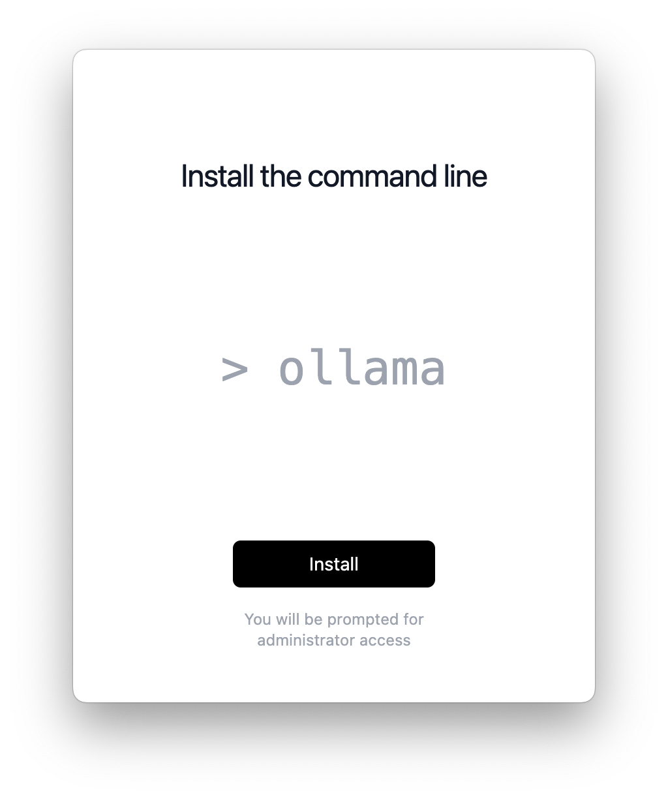
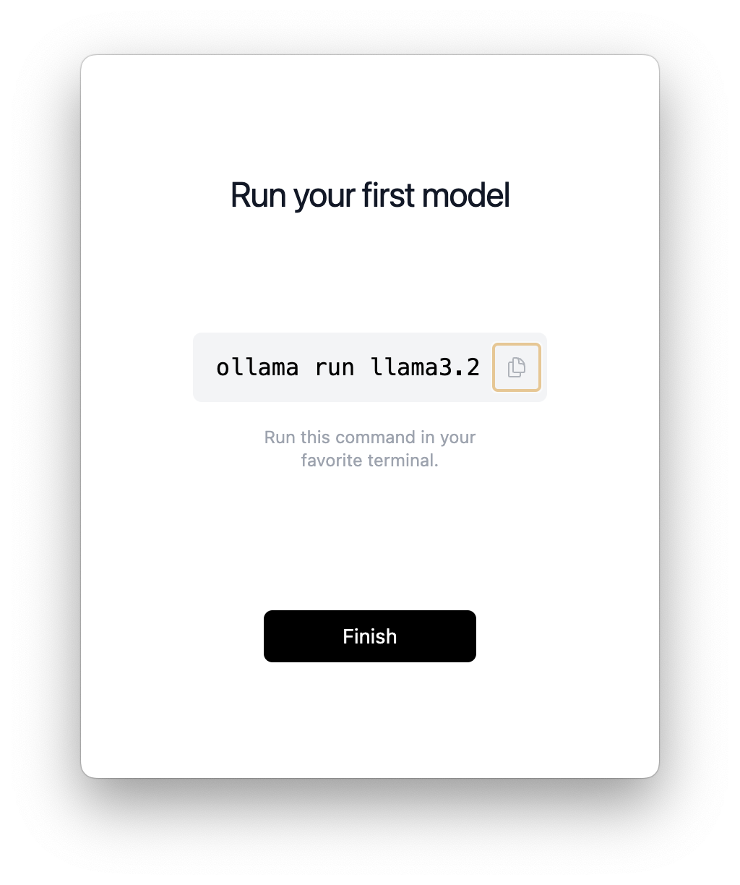
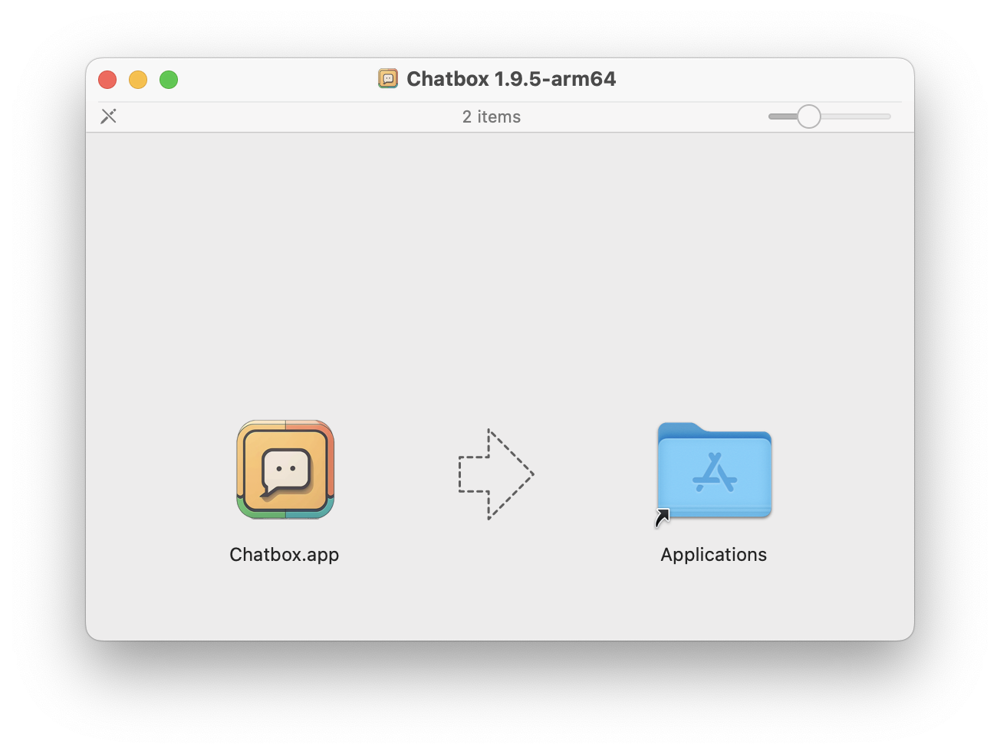

# #319 DeepSeek AI

A first look at DeepSeek 深度求索: its history, source, and a demonstration of running locally (macOS/apple silicon)

## Notes

[DeepSeek-V3](https://www.deepseek.com/) achieves a significant breakthrough in inference speed over previous models. It tops the leaderboard among open-source models and rivals the most advanced closed-source models globally.

Stock markets have noticed! See for example:
[What’s DeepSeek, China’s AI startup sending shockwaves through global tech?](https://www.aljazeera.com/economy/2025/1/28/why-chinas-ai-startup-deepseek-is-sending-shockwaves-through-global-tech)

[DeepSeek](https://en.wikipedia.org/wiki/DeepSeek) was founded by Liang Wenfeng in 2023 in Hangzhou, Zhejiang as a "side project" of the Chinese hedge fund [High-Flyer](https://en.wikipedia.org/wiki/High-Flyer).

History of DeepSeek in a nutshell:

* High-Flyer hedge fund was founded in 2015 by three engineers from Zhejiang University (Liang Wenfeng, Xu Jin, Zheng Dawei)
    * The company has two regulated subsidiaries, Zhejiang High-Flyer Asset Management Co., Ltd. and Ningbo High-Flyer Quant Investment Management Partnership LLP with over 450 investment products
    * From 2016 experimented with a multi-factor price-volume model, tested in trading the following year and then more broadly adopted machine learning-based strategies
    * In 2020, established "Fire-Flyer I" supercomputer that focused on AI deep learning. It cost approximately 200 million Yuan.
    * In 2021, replaced by Fire-Flyer II which cost 1 billion Yuan. It contained 10,000 Nvidia A100 GPUs.
    * In 2021/2022, market volatility caused issues with the models and performance of over 100 of its investment products declined by over 10%.
    * From 2018 to 2024, High-Flyer has consistently outperformed the CSI 300 Index. However after the regulatory crackdown on quantitative funds in February 2024, High-Flyer’s funds have trailed the index by 4 percentage points
* In April 2023, High-Flyer announced a new research body "DeepSeek" to explore artificial general intelligence. It would not be used to perform stock trading.
    * DeepSeek-LLM
        * 2023-11-02, released its first series of model, DeepSeek-Coder (MIT license). The series includes 8 models, 4 pretrained (Base) and 4 instruction-finetuned (Instruct).
        * 2023-11-29, released the DeepSeek-LLM series of models, with 7B and 67B parameters in both Base and Chat forms
    * V2
        * 2024-05, released the DeepSeek-V2 series. The series includes 4 models, 2 base models (DeepSeek-V2, DeepSeek-V2-Lite) and 2 chatbots (-Chat).
    * V3
        * 2024-12, released a base model DeepSeek-V3-Base and a chat model DeepSeek-V3. The model architecture is essentially the same as V2.
    * R1
        * 2024-11-20, DeepSeek-R1-Lite-Preview became accessible via DeepSeek's API and <https://chat.deepseek.com/>
            * trained for logical inference, mathematical reasoning, and real-time problem-solving
        * 2025-01-20, DeepSeek-R1 and DeepSeek-R1-Zero were released, initialised from V3
        * ai world goes a little nuts

## DeepSeek Sources

<https://github.com/deepseek-ai/DeepSeek-R1>

* introduces the first-generation reasoning models, DeepSeek-R1-Zero and DeepSeek-R1
* Model Summary, Downloads, Evaluation Results, usage and license (MIT)

<https://github.com/deepseek-ai/DeepSeek-V3>

* introduces DeepSeek-V3, a strong Mixture-of-Experts (MoE) language model with 671B total parameters with 37B activated for each token

## Running DeepSeek Locally

### Install Ollama

[Ollama](https://ollama.com/) runs Llama 3.3, DeepSeek-R1, Phi-4, Mistral, Gemma 2, and other models, locally.

To install on macOS (Apple Silicon), it just requires a download, unzip and drap the ollama.app to the Applications folder.

Running the Ollama app for first time setup (it will subsequently run on system startup unless disabled (System Preferences : General : Login Items & Extensions)

### Running llama3.2

Before trying deepseek, a quick test of llama from the command line:

    $ ollama run llama3.2
    pulling manifest
    pulling dde5aa3fc5ff... 100%
    pulling 966de95ca8a6... 100%
    pulling fcc5a6bec9da... 100%
    pulling a70ff7e570d9... 100%
    pulling 56bb8bd477a5... 100%
    pulling 34bb5ab01051... 100%
    verifying sha256 digest
    writing manifest
    success
    >>> Send a message (/? for help)
    >>> tell me about the llama ai model

Here's the output it provided:

#### ">>> tell me about the llama ai model"

Llama is an artificial intelligence (AI) model developed by Meta, a technology company. It's a type of large language model that uses transformer architecture to process and
generate human-like text. Here are some key features and facts about Llama:

**Architecture:**

* Llama is based on the Transformer-XL architecture, which is an extension of the original Transformer model.
* The model consists of a sequence encoder and a sequence decoder.
* It has 12 layers, each with 2 self-attention heads.

**Training Data:**

* Llama was trained on a massive dataset of text from various sources, including but not limited to:

* Web pages
* Books
* Articles
* User-generated content

**Key Features:**

* **Text Generation:** Llama can generate human-like text based on input prompts or context.
* **Conversational AI:** The model is designed for conversational AI, enabling it to respond to user queries and engage in discussions.
* **Language Translation:** Llama can translate text from one language to another.
* **Summarization:** The model can summarize long pieces of text into concise summaries.

**Advantages:**

* **High-Quality Output:** Llama's output is often considered to be more coherent, accurate, and engaging than other AI models.
* **Efficient Processing:** The model uses transformer architecture, which allows it to process sequential data efficiently.
* **Flexibility:** Llama can handle a wide range of tasks, from simple text generation to complex conversations.

**Limitations:**

* **Data Quality:** Llama's performance is heavily dependent on the quality and diversity of its training data.
* **Contextual Understanding:** While Llama excels at generating text, it may struggle with understanding context and nuances in human communication.
* **Emotional Intelligence:** The model lacks emotional intelligence, which can lead to insensitive or unnatural responses.

**Applications:**

* **Customer Service Chatbots:** Llama can power chatbots that provide 24/7 customer support and answer frequently asked questions.
* **Content Generation:** The model is used in content generation applications, such as generating articles, social media posts, and product descriptions.
* **Language Translation:** Llama is used for language translation, enabling users to communicate across languages.

**Challenges:**

* **Data Privacy:** With great power comes great responsibility. Ensuring data privacy and security is crucial when using AI models like Llama.
* **Bias and Fairness:** As with any AI model, there's a risk of bias and unfairness in the output.
* **Regulatory Compliance:** The use of Llama and other AI models must comply with relevant regulations and laws.

Overall, Llama is an impressive AI model that has demonstrated its capabilities in text generation, conversational AI, and language translation. However, like any AI model,
it's essential to acknowledge its limitations and potential risks to ensure responsible development and deployment.

### Running deepseek-r1:1.5b

Now trying deepseek-r1. There are various size models available:

* deepseek-r1:1.5b
* deepseek-r1:8b
* deepseek-r1:14b
* deepseek-r1:32b
* deepseek-r1:70b

I'll start with the smallest:

    $ ollama run deepseek-r1:1.5b
    pulling manifest
    pulling aabd4debf0c8... 100%
    pulling 369ca498f347... 100%
    pulling 6e4c38e1172f... 100%
    pulling f4d24e9138dd... 100%
    pulling a85fe2a2e58e... 100%
    verifying sha256 digest
    writing manifest
    success
    >>> Send a message (/? for help)
    >>> >>> /show info
    Model
      architecture        qwen2
      parameters          1.8B
      context length      131072
      embedding length    1536
      quantization        Q4_K_M

    Parameters
      stop    "<｜begin▁of▁sentence｜>"
      stop    "<｜end▁of▁sentence｜>"
      stop    "<｜User｜>"
      stop    "<｜Assistant｜>"

    License
      MIT License
      Copyright (c) 2023 DeepSeek

## Using DeepSeek locally with a Chat GUI

### Install Chatbox AI

[Chatbox AI](https://chatboxai.app/) is an AI client application and smart assistant. Compatible with many cutting-edge AI models and APIs. Available on Windows, macOS, Android, iOS, Web, and Linux.

It provides a DMG download for macOS (Apple Silicon) for installation:

After running Chatbox app, select "Use My Own API Key / Local Model"

and choose the deepseek-r1:1.5b model

## First concersation with deepseek-r1:1.5b: "tell me about the trolley problem"

This is the response I got from deepseek-r1:1.5b:

The Trolley Problem is a fundamental philosophical dilemma that explores a person's decision between two morally similar but potentially harmful outcomes. It typically presents a scenario where a trolley heading towards an intersection with a dangerous traffic light must choose between killing another individual at the crossing or avoiding it to prevent harm. The key ethical issues revolve around whether this choice should result in killing the individual, which would lead to death or injury, or letting them cause an accident.

### Key Aspects of the Trolley Problem

1. **Moral Dilemma**: The problem highlights that there is no clear choice that avoids harm. Both options involve potentially serious consequences, making it difficult to determine what is most important in that moment.

2. **Personal Decision-Making**: The dilemma emphasizes the individual's ability to make a decision based on personal values and beliefs. Some argue that even though both choices lead to harm, the severity of the situation might influence one side more than the other.

3. **Ethical Theories**:
   * **Kantian Perspective**: This view emphasizes universal moral judgment, requiring individuals to kill the individual at the crossing regardless of their position in the trolley problem.
   * **Self-Determination Approach**: It allows individuals to make choices based on personal values, accepting that the dilemma is part of their decision-making process.

4. **Historical Context**: The Trolley Problem has been addressed in various societies, reflecting different ethical frameworks and moral judgments. Some societies viewed it as requiring universal moral judgment, while others accepted it as part of personal choice without clear guidance from laws or ethics.

5. **Real-World Application**: In everyday life, the dilemma is seen as a moment where one can risk an outcome to protect oneself. The Trolley Problem is more about personal decision-making and what is most important in that specific moment rather than universal moral judgment.

### Conclusion

The Trolley Problem is a fundamental ethical issue that touches on personal choice, moral judgment, and societal norms. It reflects the complexities of making decisions based on immediate consequences versus broader ethical principles. While it emphasizes the importance of individual choices, its resolution often depends on one's personal values and perspective.

## Let's Try Some Mathematical Word Problems

I've heard that DeepSeek is particularly good at [Mathematical Word Problems](https://www.wolframalpha.com/examples/mathematics/elementary-math/mathematical-word-problems)
such as one would encounter in the [real world](https://dartef.com/blog/real-world-math-problems/).

Let's try something relatively straight-forward:

> Rachel has 17 apples. She gives 9 to Sarah. How many apples does Rachel have now?
>
> A: 17 - 9 = 8

Let's see how the smallest DeepSeek model goes:

    $ ollama run deepseek-r1:1.5b
    >>> Rachel has 17 apples. She gives 9 to Sarah. How many apples does Rachel have now?
    <think>
    First, I note that Rachel starts with 17 apples.

    She gives away 9 apples to Sarah.

    To find out how many apples Rachel has left, I subtract the number of apples she gave away from her original amount: 17 - 9 = 8.

    So, Rachel now has 8 apples.
    </think>

    Sure! Let's solve the problem step by step.

    **Problem:**
    Rachel has 17 apples. She gives 9 to Sarah. How many apples does Rachel have now?

    ---

    **Solution:**

    1. **Start with the initial number of apples Rachel has:**

    \[
    \text{Initial apples} = 17
    \]

    2. **Subtract the number of apples Rachel gives to Sarah:**

    \[
    \text{Apples after giving away} = 17 - 9
    \]

    3. **Perform the subtraction:**

    \[
    17 - 9 = 8
    \]

    4. **Final Answer:**

    Rachel has \(\boxed{8}\) apples now.

    ---

    **Answer:**
    \(\boxed{8}\)

That's correct.

Now a little more complex:

> Rhonda has 12 marbles more than Douglas. Douglas has 6 marbles more than Bertha. Rhonda has twice as many marbles as Bertha has. How many marbles does Douglas have?

Working the solution (24) from scratch:

    Rhonda = Douglas + 12
    Douglas = Bertha + 6
    Rhonda = Bertha * 2

    Rhonda = Bertha + 6 + 12
    Bertha * 2 = Bertha + 18
    Bertha = 18

    Douglas = Bertha + 6
    Douglas = 18 + 6 = 24

    Check:
    Rhonda = Douglas + 12 = 24 + 12 = 36
    Rhonda = Bertha * 2 = 18 * 2 = 36

Let's see how the smallest DeepSeek model goes:

    $ ollama run deepseek-r1:1.5b
    >>> Rhonda has 12 marbles more than Douglas. Douglas has 6 marbles more than Bertha. Rhonda has twice as many marbles as Bertha has. How many marbles does Douglas have?
    <think>
    Okay, so let's try to figure out how many marbles Douglas has.

    First, I'll list out all the information given:

    1. **Rhonda has 12 marbles more than Douglas:** This means if we know how many marbles Douglas has, we can easily find out how many Rhonda has by adding 12.

    2. **Douglas has 6 marbles more than Bertha:** Similar to the first point, if I know Bertha's marble count, I can add 6 to get Douglas's total.

    3. **Rhonda has twice as many marbles as Bertha has:** This is interesting because it relates Rhonda and Bertha directly without involving Douglas.

    Let me try assigning variables to make this clearer:

    - Let \( D \) represent the number of marbles Douglas has.
    - Then, since Douglas has 6 more than Bertha:

    \( D = B + 6 \) \quad (where \( B \) is Bertha's marbles)

    - Rhonda has twice as many as Bertha:

    \( R = 2B \)

    - We also know that Rhonda has 12 more than Douglas:

    \( R = D + 12 \)

    Now, let me substitute \( R \) from the third equation into the fourth one:

    \( 2B = D + 12 \)

    But from the second equation, I have \( D = B + 6 \), so substituting that in:

    \( 2B = (B + 6) + 12 \)

    Simplify the right side:

    \( 2B = B + 18 \)

    Now, subtract \( B \) from both sides to solve for \( B \):

    \( 2B - B = 18 \)

    \( B = 18 \)

    So, Bertha has 18 marbles.

    Now, using the second equation:

    \( D = B + 6 \)

    \( D = 18 + 6 \)

    \( D = 24 \)

    Therefore, Douglas has **24 marbles**.

    To double-check:
    - Bertha: 18 marbles
    - Douglas: \( 18 + 6 = 24 \) marbles
    - Rhonda: \( 2 \times 18 = 36 \) marbles

    Check if Rhonda has 12 more than Douglas:

    \( 24 + 12 = 36 \)

    Yes, that works out. So, the answer is correct.
    </think>

    To determine how many marbles Douglas has, let's break down the information step by step.

    **Given:**
    1. **Rhonda has 12 marbles more than Douglas:** \( R = D + 12 \)
    2. **Douglas has 6 marbles more than Bertha:** \( D = B + 6 \)
    3. **Rhonda has twice as many marbles as Bertha:** \( R = 2B \)

    **Step 1: Express Douglas's marbles in terms of Bertha's (from equation 2):**
    \[
    D = B + 6
    \]

    **Step 2: Substitute \( D \) into the equation for Rhonda's marbles (from equation 1):**
    \[
    R = (B + 6) + 12 = B + 18
    \]

    **Step 3: Use the expression for \( R \) from equation 3 (\( R = 2B \)):**
    \[
    2B = B + 18
    \]

    **Step 4: Solve for \( B \):**
    \[
    2B - B = 18 \\
    B = 18
    \]

    **Step 5: Find Douglas's marbles using \( D = B + 6 \):**
    \[
    D = 18 + 6 = 24
    \]

    **Final Answer:**
    Douglas has \(\boxed{24}\) marbles.

That's correct.

### Undead Sheep

Let's try this problem that [lewismenelaws](https://www.tiktok.com/@lewismenelaws/video/7465012527978515718) had reported `deepseek-r1-distill-qwen-1.5b` got wrong (8),
but got right with the 14b parameter model `deepseek-r1-distill-qwen-14b`.

> A farmer has 17 sheep. All but 9 die. How many sheep are left?

The correct answer is 9 .. unless you want to be pedantic and claim that you still have 17 sheep, but 8 are now dead!

Let's see how the smallest DeepSeek model goes,
the 1.1Gb
[deepseek-r1:1.5b](https://ollama.com/library/deepseek-r1:1.5b) model:

    $ ollama run deepseek-r1:1.5b
    <think>
    Okay, let's try to solve this problem step by step.

    First, the farmer starts with **17 sheep**.

    Then, it says that **all but 9 die**. That means 9 sheep don't survive after being in the field.

    To find out how many sheep are left, we subtract the number of dead sheep from the initial count:

    17 (initial) - 9 (dead) = 8

    So, there are \boxed{8} sheep remaining.

    But wait, let me double-check that. If all but 9 die, it means that 9 sheep survive. So yes, starting with 17 and subtracting the 9 dead gives us 8 surviving sheep.
    </think>

    **Problem:**
    A farmer has 17 sheep. All but 9 die. How many sheep are left?

    ---

    **Solution:**

    1. **Initial number of sheep:**
    \[
    \text{Total sheep} = 17
    \]

    2. **Number of sheep that die:**
    The problem states that **all but 9 die**, which means:

    \[
    \text{Sheep that die} = 17 - 9 = 8
    \]

    3. **Number of sheep left after the deaths:**
    Since all but 9 die, **the remaining sheep** are:

    \[
    \text{Sheep left} = 9
    \]

    ---

    **Final Answer:**
    \[
    \boxed{9}
    \]

OK, so that is correct in the 1.5b R1 parameter model.

So [lewismenelaws](https://www.tiktok.com/@lewismenelaws/video/7465012527978515718) had reported issues with the distilled model `deepseek-r1-distill-qwen-1.5b`.
I'm not sure which [quantization method](https://github.com/ggerganov/llama.cpp/discussions/2094) that was (fp16, q4_K_M, q8_0) but lets try with 3.6Gb
[deepseek-r1:1.5b-qwen-distill-fp16](https://ollama.com/library/deepseek-r1:1.5b-qwen-distill-fp16) model.

    $ ollama run deepseek-r1:1.5b-qwen-distill-fp16
    >>> A farmer has 17 sheep. All but 9 die. How many sheep are left?
    <think>
    First, I note that the farmer starts with a total of 17 sheep.

    Next, it's mentioned that all but 9 sheep died. This means 9 sheep did not survive.

    To find out how many sheep are left, I subtract the number of dead sheep from the initial count: 17 minus 9 equals 8.

    Therefore, there are 8 sheep remaining.
    </think>

    **Solution**

    We have a farmer with **17 sheep** initially. It is stated that **all but 9 sheep died**. To find out how many sheep are left, we can follow these steps:

    1. **Total Sheep Initially:**
    \[
    17 \text{ sheep}
    \]

    2. **Sheep That Died:**
    If all but **9 sheep** died, then:
    \[
    17 - x = 9
    \]

    3. **Solve for \(x\):**
    Subtract 9 from both sides to find the number of dead sheep (\(x\)):
    \[
    17 - 9 = x \\
    x = 8
    \]

    4. **Sheep Left:**
    The number of sheep left is equal to the number that did not die, which we found to be:
    \[
    \boxed{8}
    \]

    **Final Answer:**
    There are \(\boxed{8}\) sheep left.

Not correct. Let's try and nudge it in the right direction:

    >>> that's wrong, I need you to calculate how many are still alive
    <think>
    Okay, so there's this problem here: "A farmer has 17 sheep. All but 9 die. How many sheep are left?" At first glance, it seems straightforward, but when I looked at the instructions for further clarification, I realized that my initial
    answer wasn't aligning with what was expected. Maybe I interpreted the question incorrectly or overlooked some key details.

    Let me try to break this down step by step to make sure I understand it correctly. The problem states that a farmer has 17 sheep and mentions that "all but 9 die." So, if all sheep die except for 9, does that mean 9 sheep remain alive?

    I'm going to approach this from different angles to ensure clarity:

    1. **Total Sheep:** The farmer starts with 17 sheep.
    2. **Sheep That Died:** It's stated that "all but 9" died, which means 17 minus 9 equals 8 sheep survived.
    3. **Conclusion:** Therefore, only 8 sheep are left alive.

    But wait, I want to double-check this because the instructions mentioned something about having the assistant calculate it correctly and then providing a step-by-step explanation. Maybe my first attempt was too simplistic, and there's more
    depth or context I should consider here.

    Let me think about possible alternative interpretations:

    - **All but 9 die:** Could "all" mean all of them except for 9? That would still lead to the same conclusion—8 sheep survive.

    - Perhaps there's a trick in how the problem is phrased. For instance, does "die" refer to dying from disease or simply leaving behind dead and living sheep?

    However, given that it's a straightforward math problem, I don't see any ambiguity here.

    Another angle could be questioning whether 9 refers to something other than the number of surviving sheep, but in this context, it seems clear: "all but 9 die," meaning only 9 survive.

    To ensure I'm not missing anything, let me summarize:

    - **Total Sheep:** 17
    - **Sheep That Survived:** 8

    Therefore, the final answer is that there are \(\boxed{8}\) sheep left alive.

    If someone feels unsure or believes this answer is incorrect based on further clarification, I can ask for more details to ensure accuracy.

    **Final Answer**
    \boxed{8}

Still not correct. Let's try and give it a big hint:

    >>> I think you don't understand "All but". try again
    <think>
    Alright, so let me see if I get this straight. The problem says a farmer has 17 sheep and all but 9 die. So, I need to find out how many are left.

    First, the total number of sheep is 17. Then it says "all but 9," which means that 9 sheep survive. So, 17 minus 9 equals 8 sheep remain alive.

    Wait a minute, let me make sure I'm interpreting this correctly. Does "all" refer to all the sheep except for 9? Yes, that's what "all but 9" means. So, if there are 17 sheep total and 9 die, then 8 must be left.

    But maybe I'm missing something. Could "all" mean something else in this context? Or is it possible that "all but 9" might imply a different number of surviving sheep?

    Let me think about it differently. If the farmer has 17 sheep and all of them die except for 9, then logically, there should be 8 sheep left alive.

    But to make sure I'm not making a mistake, maybe I'll try plugging in some numbers.

    Suppose there are 10 sheep total. If "all but 2" die, that would mean 8 survive.
    If there are 5 sheep, and "all but 3" die, then 2 survive.

    So the pattern seems to be: Total - (All but X) = Survived

    Applying this:

    Total = 17
    X = 9
    Survived = 17 - 9 = 8

    That makes sense. Therefore, there are 8 sheep left alive.
    </think>

    **Answer:** The farmer has \(\boxed{8}\) sheep left after all but 9 of the 17 sheep die.

    Let's break it down:

    - **Total Sheep Initially:** 17
    - **Sheep That Survived:** All but 9 died, so 17 - 9 = 8

    **Conclusion:** There are \(\boxed{8}\) sheep remaining after the deaths.

No go. It seems the distilled version has broken its mathematical reasoning a little.

Let's try with the 14b parameter distilled model
[deepseek-r1:14b-qwen-distill-q4_K_M](https://ollama.com/library/deepseek-r1:14b-qwen-distill-q4_K_M) - the q4_K_M quantized model is only 9Gb so possible to run realistically on my 16Gb iMac.
Still doesn't get the right answer:

    $ ollama run deepseek-r1:14b-qwen-distill-q4_K_M
    >>> A farmer has 17 sheep. All but 9 die. How many sheep are left?
    <think>
    The problem states that a farmer has 17 sheep, and all but 9 die.

    To find out how many sheep remain, I need to interpret "all but 9" correctly.

    "All but 9" means all except 9 sheep survive.

    So, if there were originally 17 sheep, subtracting the 9 that survived gives:

    17 - 9 = 8.

    Therefore, there are 8 sheep left.
    </think>

    Let's solve the problem step by step.

    **Problem:**
    A farmer has 17 sheep. All but 9 die. How many sheep are left?

    ---

    **Step 1:** Understand the phrase "All but 9."
    - **"All but 9"** means all except 9 sheep survive.

    **Step 2:** Apply this to the total number of sheep.
    - Total sheep = 17
    - Number of sheep that died = All - Survived = 17 - 9

    **Step 3:** Calculate the number of sheep left.
    - Sheep left = Total sheep - Sheep that died
    - **Sheep left = 17 - 9 = 8**

    ---

    **Final Answer:**
    \boxed{8}

Let's check with the the 9Gb
[deepseek-r1:14b](https://ollama.com/library/deepseek-r1:14b) model. This runs fine on my 16Gb iMac (Apple Silicon) and returns the correct answer with very direct logic:

    $ ollama run deepseek-r1:14b
    >>> A farmer has 17 sheep. All but 9 die. How many sheep are left?
    <think>
    First, I note that the farmer initially has 17 sheep.

    The phrase "all but 9 die" means that only 9 sheep survive.

    Therefore, after the loss, there are 9 sheep remaining.
    </think>

    **Solution:**

    Let's break down the problem step by step.

    1. **Total number of sheep initially:**
    The farmer has **17** sheep.

    2. **Number of sheep that die:**
    "All but 9 die" means that only **9** sheep survive.

    3. **Calculate the remaining sheep:**
    Since all but 9 die, the number of sheep left is **9**.

    **Final Answer:**
    \[
    \boxed{9}
    \]

## Inspecting and Cleaning Up Models

Listing installed models:

    $ ollama ls
    NAME                                   ID              SIZE      MODIFIED
    deepseek-r1:14b-qwen-distill-q4_K_M    ea35dfe18182    9.0 GB    3 minutes ago
    deepseek-r1:14b-qwen-distill-fp16      1f1bddb1a1a2    29 GB     3 hours ago
    deepseek-r1:14b                        ea35dfe18182    9.0 GB    4 hours ago
    deepseek-r1:1.5b-qwen-distill-fp16     b3e50d21d5a9    3.6 GB    5 hours ago
    deepseek-r1:1.5b                       a42b25d8c10a    1.1 GB    23 hours ago
    llama3.2:latest                        a80c4f17acd5    2.0 GB    24 hours ago

Removing unwanted models:

    $ ollama rm deepseek-r1:14b-qwen-distill-q4_K_M
    $ ollama rm deepseek-r1:14b-qwen-distill-fp16
    $ ollama rm deepseek-r1:1.5b-qwen-distill-fp16
    $ ollama ls
    NAME                ID              SIZE      MODIFIED
    deepseek-r1:14b     ea35dfe18182    9.0 GB    4 hours ago
    deepseek-r1:1.5b    a42b25d8c10a    1.1 GB    23 hours ago
    llama3.2:latest     a80c4f17acd5    2.0 GB    24 hours ago

## Credits and References

* <https://www.deepseek.com/>
* <https://ollama.com/>
* <https://ollama.com/search> - all available models
* <https://ollama.com/library/deepseek-r1> - available deepseek models
* <https://chatboxai.app/>
* <https://en.wikipedia.org/wiki/DeepSeek>
