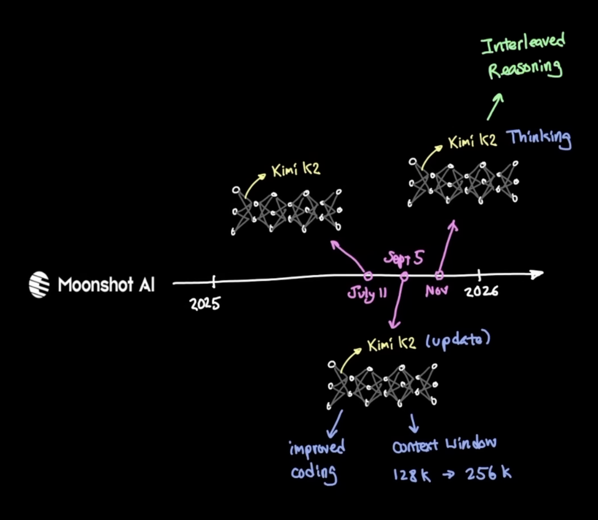
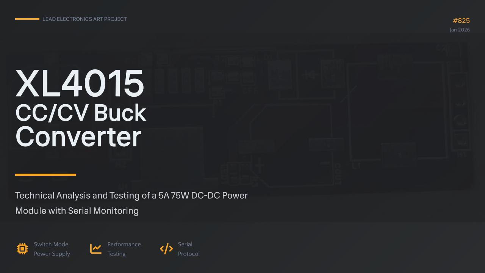

# #404 Moonshot AI: Kimi K2 Thinking

About Kimi K2 and Kimi K2 Thinking from Moonshot AI.

## Notes

I recently saw the
[Kimi K2 Thinking](https://moonshotai.github.io/Kimi-K2/thinking.html)
announcement...

> Kimi K2 Thinking is the latest, most capable version of open-source thinking model. Starting with Kimi K2, we built it as a thinking agent that reasons step-by-step while dynamically invoking tools. It sets a new state-of-the-art on Humanity's Last Exam (HLE), BrowseComp, and other benchmarks by dramatically scaling multi-step reasoning depth and maintaining stable tool-use across 200–300 sequential calls. At the same time, K2 Thinking is a native INT4 quantization model with 256k context window, achieving lossless reductions in inference latency and GPU memory usage.

[](https://youtu.be/cegIxJwDPyk?t=102)

### Chat Interface

The first exposure to Kimi K2 will likely be the classic chat interface:
<https://www.kimi.com/chat>

In addition to the standard chat, it offers:

* OK Computer
* Researcher
* Slides
* Kimi Code

### OK Computer: Creating a Website

> create a website that simulates a cyberpunk book nook, with interactive features such as controlling lights and messages on neon signs. the book nook should be animated e.g. with cats and rats crawling around, birds, washing fluttering in the wind, fans spinning, and the progression of time from day to dusk to night to morning

Try [it here](./app/dist/).

[](./app/dist/)

[](./app/dist/)

### Researcher

I asked:

> in-depth report on trends for the kinds of software that individuals pay for. what are the relevant software categories? what kind of software do people still pay for? what are the revenue models? how do the trends vary around the world?

It did a decent job, see the [report](./report.html).
Top level conclusions seem reasonable .. as in, duh!
It still managed to introduce some "lorem ipsum" (!), and I haven't checked any of the numbers yet.

### Slides

I tried the Slides feature with this prompt:

> use this web page <https://leap.tardate.com/electronics101/power/switchmodepowersupplies/buckconvertermodules/xl4015module2/> and turn it into a clear, engaging slide deck

The result was so-so. Looked good, however it didn't include appropriate images, and many of the details were incorrect (despite having a perfect reference on the indicated web page)

I won't share the slides (to avoid promulgating slop), but here's a glance at the title slide:



### Running with Ollama

The Ollama library includes [kimi-k2-thinking](https://ollama.com/library/kimi-k2-thinking).
It can be used from the UI or command line. For example:

```sh
$ ollama run kimi-k2-thinking:cloud
pulling manifest
pulling 8ff85bd699dc: 100% ▕███████████████████████████████████████████████████████████████████████████████████████████████████████████████████████████████████████████▏  393 B
verifying sha256 digest
writing manifest
success
Connecting to 'kimi-k2-thinking' on 'ollama.com' ⚡
>>> what would our world be like today if the blue LED was never discovered or invented?
...
...(lots of workings)
...
...done thinking.
```

And the response:

> #### A World Without the Blue LED
>
> If the blue LED had never been discovered, our world would be noticeably less efficient, less vibrant, and technologically behind in several key areas. Here’s how different aspects of modern life
> would be affected:
>
> ##### **1. Lighting: Still Stuck in the 20th Century**
>
> * **No white LEDs**: White LEDs are created by coating blue LEDs with phosphors. Without them, the lighting revolution wouldn’t exist. We’d still rely heavily on **fluorescent tubes, CCFLs, and
> incandescent bulbs**—bulky, inefficient, and containing toxic mercury.
>
> * **Energy waste**: Lighting accounts for ~15% of global electricity use. Without LEDs (which are 80% more efficient than incandescents), global electricity consumption would be significantly
> higher, with billions of dollars in extra energy costs and hundreds of millions of tons more CO₂ emissions annually.
> * **No smart/home LED lighting**: The customizable, dimmable, color-changing bulbs from Philips Hue and others simply wouldn’t exist.
>
> ##### **2. Displays: Thicker, Dimmer, Less Colorful**
>
> * **Smartphones & TVs**: LCD screens would still use **CCFL backlights**—making devices thicker, heavier, and far less energy-efficient. Battery life would be worse, and color reproduction would
> be duller. The ultra-thin TV revolution would be delayed by a decade or more.
>
> * **No LED billboards**: Those massive, bright outdoor displays in Times Square and sports stadiums wouldn’t exist. We’d still use projection or neon.
> * **OLED/microLED**: These next-gen display technologies likely wouldn’t have developed, as they build on the same GaN semiconductor breakthroughs.
>
> ##### **3. Digital Storage: No Blu-ray, Slower Progress**
>
> * **Optical discs**: Without blue lasers (which rely on the same GaN technology), **Blu-ray never happens**. We’d be stuck with DVDs as the HD physical media standard, limiting storage capacity
> and slowing the shift to HD content. The jump to 4K would have been nearly impossible without digital downloads.
>
> ##### **4. Environmental & Health Impact**
>
> * **More pollution**: More mercury from discarded fluorescent bulbs contaminating landfills.
>
> * **Slower solar adoption**: LED lighting is crucial for off-grid solar systems in developing nations. Without it, rural electrification would be slower and more expensive.
> * **Water purification**: UV-C LEDs (descended from blue LED tech) for portable water sterilization wouldn’t exist.
>
> ##### **5. Economic & Cultural Shifts**
>
> * **Different industrial winners**: Companies like Cree, Nichia, and Samsung that dominate the LED market wouldn’t exist in their current form. Traditional lighting giants (GE, Philips) would
> have remained dominant longer.
>
> * **Aesthetic changes**: Cities would retain more **neon signage** (fragile, expensive) instead of programmable LED facades. Concert light shows and interactive art installations would be far
> less dynamic.
> * **Scientific tools**: Fluorescence microscopy and certain medical diagnostics that rely on precise blue/UV light sources would be more expensive and less accessible.
>
> ##### **What *Might* Have Developed Instead?**
>
> * **Quantum dots** could have been pursued more aggressively for displays and lighting.
>
> * **Laser-based lighting** might have become a niche alternative for high-efficiency applications.
> * **OLEDs** could still exist, but without the manufacturing ecosystem driven by LED demand, they’d be pricier and slower to mature.
>
> **Bottom line**: The blue LED wasn’t just about making blue light—it unlocked the entire solid-state lighting and display revolution. Without it, we’d live in a dimmer, less efficient, and
> visually less spectacular world, still transitioning slowly from analog to digital in many visible ways. The invention’s impact is so foundational that its absence would be felt in nearly every
> room, device, and cityscape.

I asked a follow-up: so what about the iPhone? And it decided that it maybe 10 years late and without the same commercial success. So a **small** oversight!

## Credits and References

* <https://www.kimi.com/>
* <https://www.moonshot.ai/>
* <https://moonshotai.github.io/Kimi-K2/thinking.html>
* <https://huggingface.co/moonshotai/Kimi-K2-Thinking>
* <https://www.interconnects.ai/p/kimi-k2-thinking-what-it-means>
