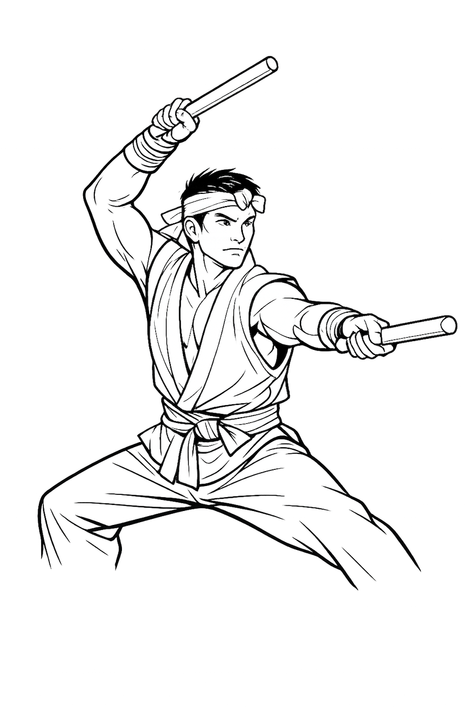
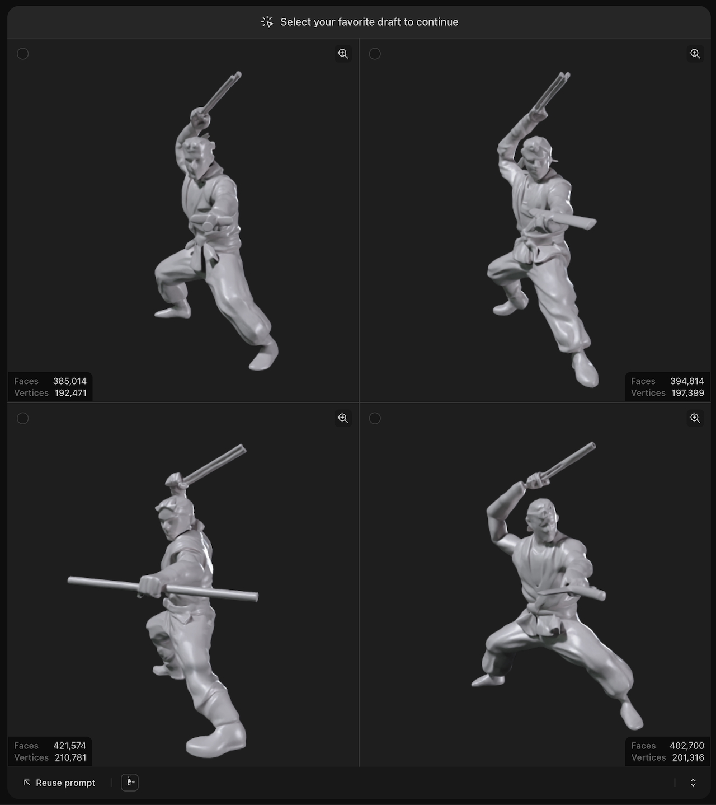
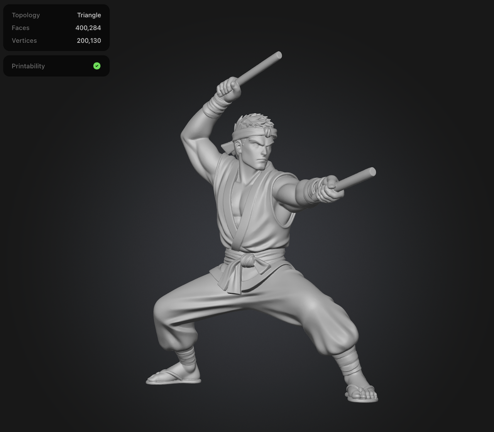
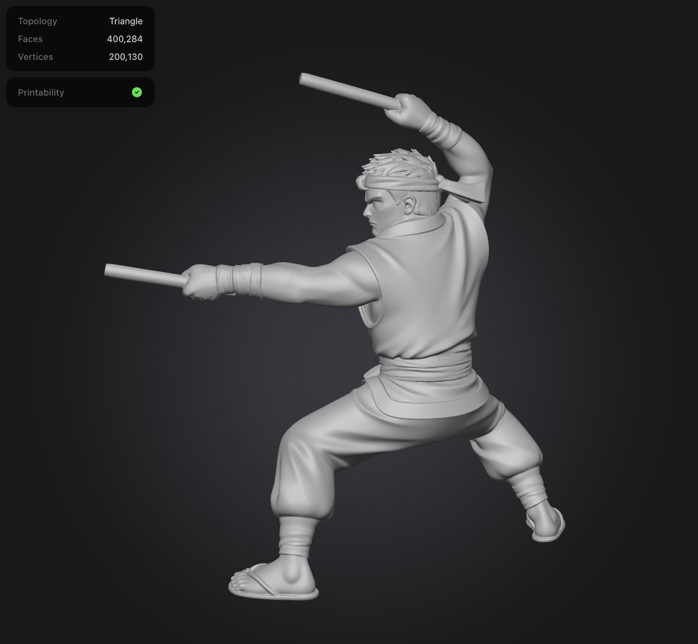
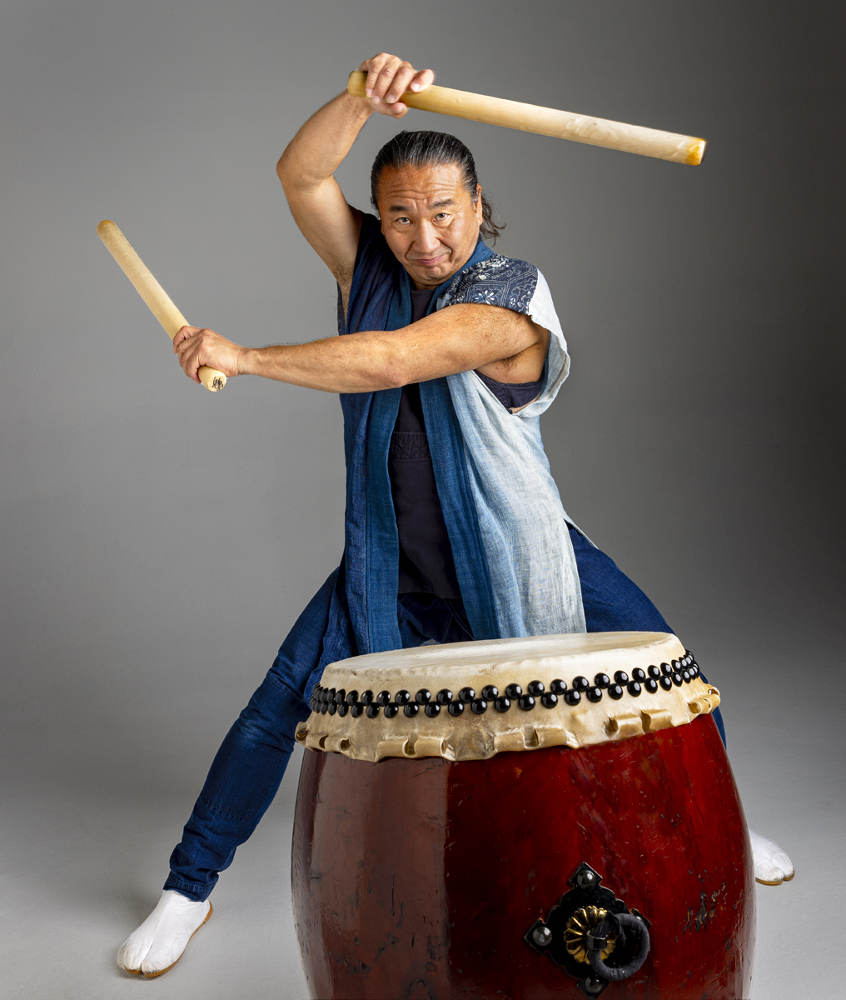
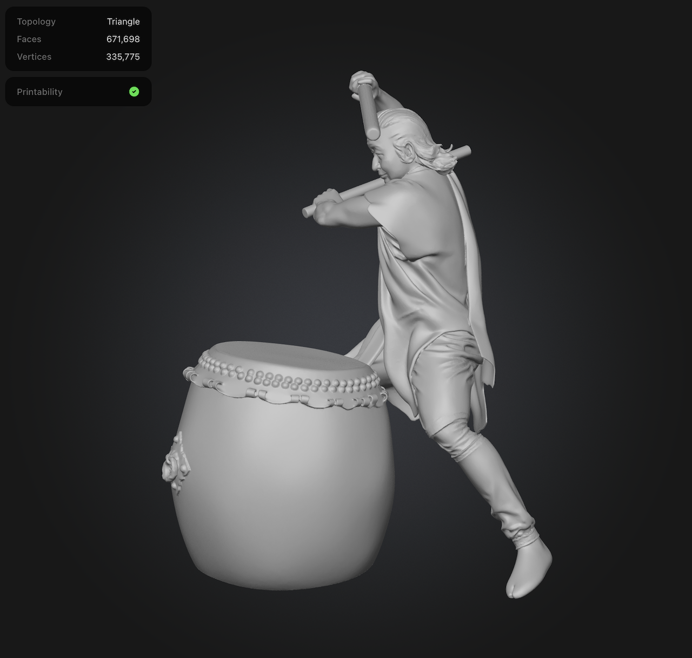
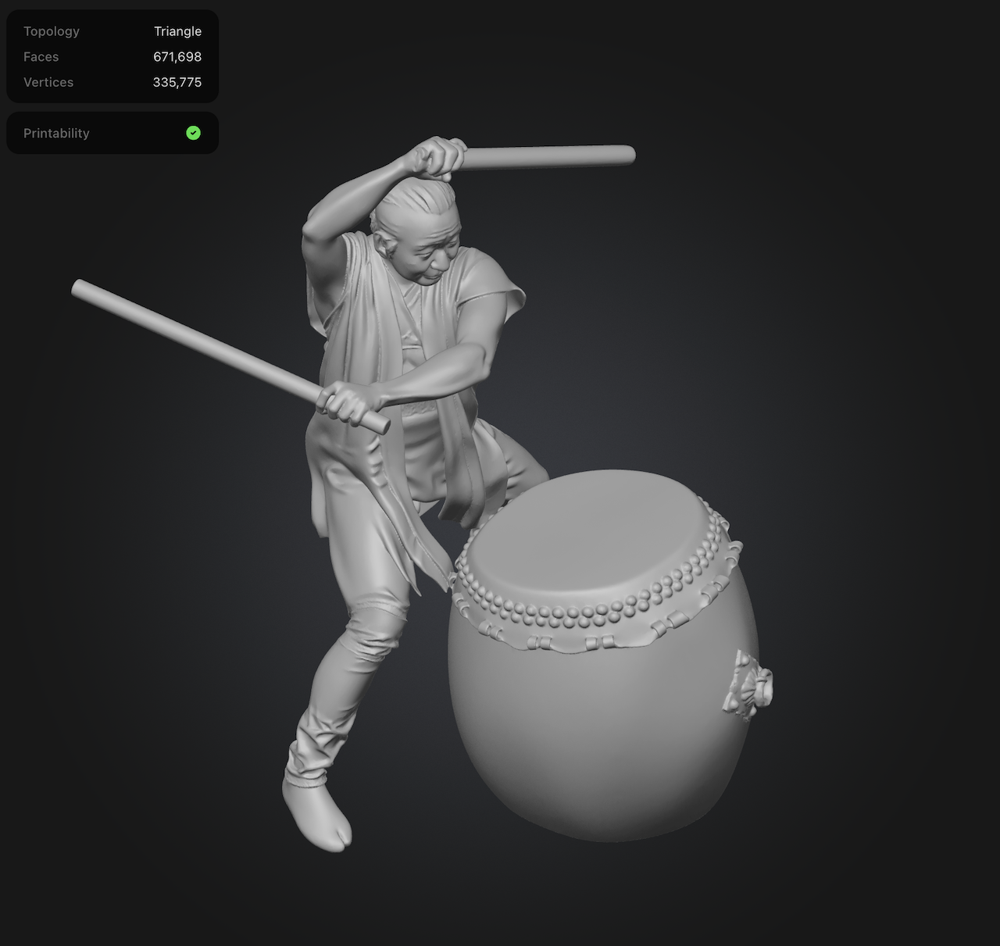
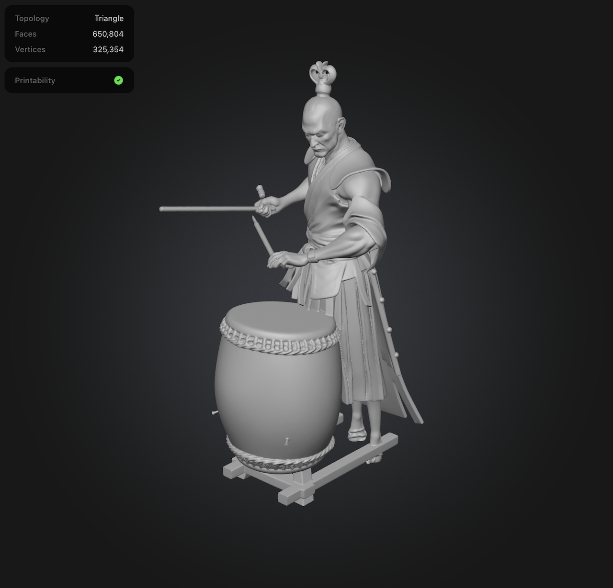
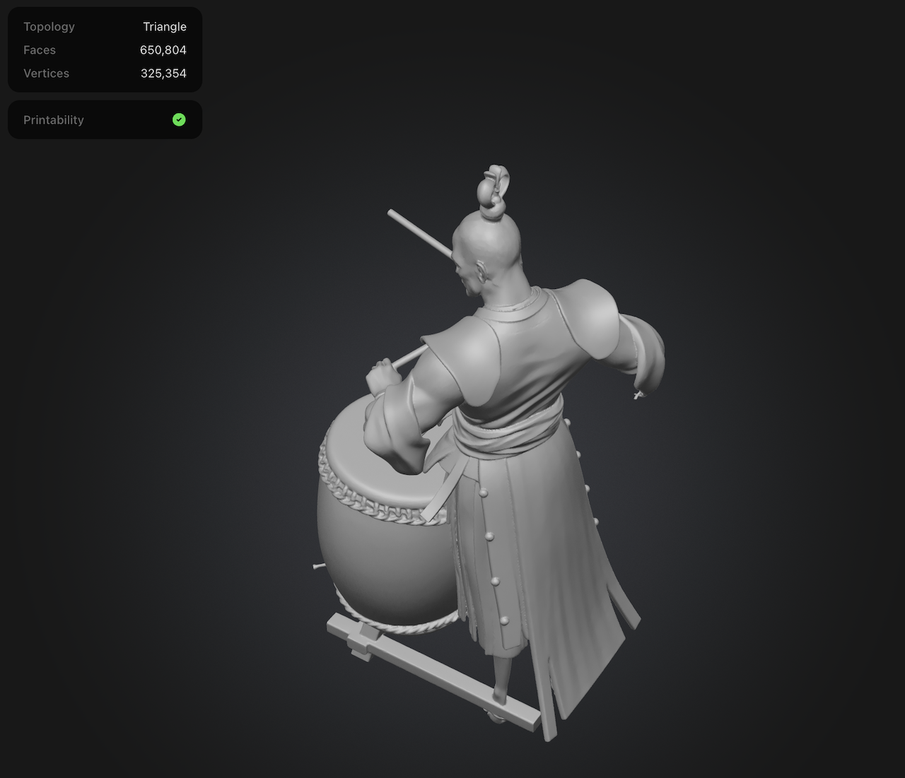

# #xxx Meshy

About Meshy, an AI 3D model generator. The Meshy 6 model is quite accomplished at generating and manipulating models from 2D images. Text prompt generation is a little more prone to errors.

## Notes

Meshy is an AI 3D model generator. 3D models can be

* generated from a prompt
* generated from an image
* uploaded (e.g. blender)

Once generated, the models can be manipulated with AI assistance:

* texturing using text prompts or reference images
* adjust triangle or quad counts, switch topology types
* automatic rigging

It is possible to experiment with Meshy on their free plan, but to do anything useful (including downloading models), a subscription is required.

I first looked at Meshy back in 2025 when their leading model was Meshy 4. I was not very impressed and did not stick around.
The results achieved with their current Meshy 6 model are now quite good.

In particular, generation from recognisable IP or photos is very good, but prompt-based generation is much more prone to impossible artifacts and hallucinations.

The actual Meshy UI has some klunky vibe-coded rough edges!
It is functional enough though.

## Line Drawing Trial

Image generated with ChatGPT:

> create a black and white outline drawing of a taiko drummer, in dramatic pose holding bachi. Only the figure, on a clear background without taiko or other elements

Not a bad image, but note the legs are not complete. This could be a common challenge for 3D model generators, given incomplete source material.

As a benchmark, let's first test the legacy Meshy 4 model (soon to be retired). I have never been impressed by this model, and yes, the results are indeed pretty poor..

After switching to their latest Meshy 6 model, results are excellent.
However, doing a reverse image search, the results are suspiciously close
to Ryu from the Street Fighter and Sega Virtua Fighter Akira Yuki. I suspect strong hints in the training data!

### Photo Trial

I started with this image from
<https://southwestfolklife.org/ken-koshio-taiko-player/>

Let's see how Meshy performs. I used default settings with their latest Meshy 6 model:

### Prompt Generation

Let's try Meshy 6 with prompt-based generation. Here's my promot:

> a taiko drummer, in dramatic pose holding bachi in a classic kamae. Only the figure, without taiko or other elements

And the result:

* hmm, not so good
* didn't follow the instructions to only generate the figure
* hallucinated some weird garb for a taiko player
* lots of "impossibles": foot through the taiko stand; clothing fragments that wrap around the arms; bachi fragments hanging in thin air..

## Credits and References

* [Meshy](https://www.meshy.ai/)
