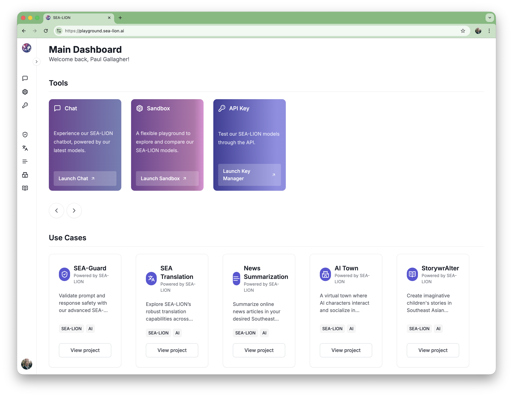
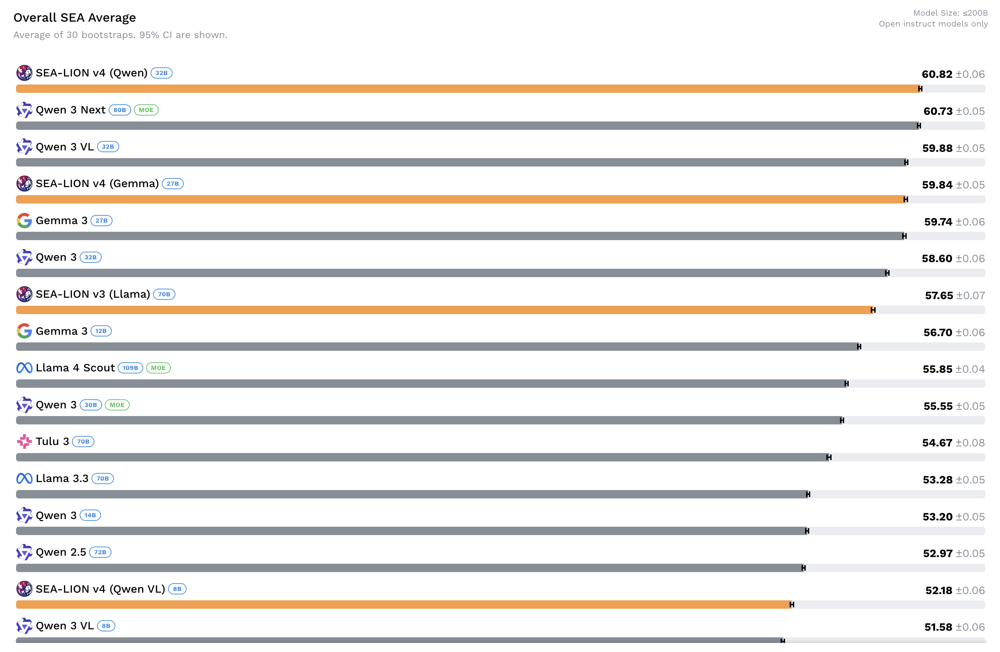

# #424 SEA-LION

About AI Singapore and SEA-LION - a family of open-source, multilingual, multimodal language models designed for Southeast Asia’s diverse languages, cultures, and contexts.

## Notes

### About AI Singapore

[AI Singapore](https://aisingapore.org/) is a national programme supported by the National Research Foundation and hosted by the National University of Singapore.

> Launched in May 2017, AI Singapore brings together all Singapore-based research institutions and the vibrant ecosystem of AI start-ups and companies developing AI products to perform use-inspired research, grow knowledge, create tools, and develop the talent to power Singapore’s AI efforts.

### SEA-LION

[SEA-LION](https://sea-lion.ai/) is a family of efficient, open-source, multilingual, multimodal language models designed to understand Southeast Asia’s diverse languages, cultures, and contexts.

Why SEA-LION?

* Existing LLMs often display strong biases.
    * This is due to training data, especially those scraped from the Internet, having heavily influenced content from Western, industrialized, rich, educated, and democratic (WIRED) societies.
* SEA-LION is trained on a greater volume of content produced in Southeast Asian languages like Thai, Vietnamese, and Bahasa Indonesia.
    * ensures better data representation compared to Western or Chinese models.

How to use/access SEA-LION models:

* [Hosted Playground](https://playground.sea-lion.ai/)
* [Hosted API](https://playground.sea-lion.ai/key-manager)
* [Huggingface](https://huggingface.co/aisingapore)
* [Using Ollama](https://ollama.com/aisingapore)

#### SEA-HELM

[SEA-HELM](https://leaderboard.sea-lion.ai/)
(Southeast Asian Holistic Evaluation of Language Models)
is an assessment of large language models across various tasks, with an emphasis on Southeast Asian languages.

### Test 1: Multilingual Legal/Business Contexts

Using the [SEA-LION Chat playground](https://playground.sea-lion.ai/chat)

> Translate this business scenario into appropriate Thai formal register: A Thai supplier is delaying delivery. You need to request urgency without causing the supplier to lose face, while acknowledging the hierarchical relationship and recent flooding in Chiang Mai that may be a legitimate factor.

The response:

แน่นอนครับ นี่คือการแปลสถานการณ์ทางธุรกิจนี้เป็นภาษาไทยแบบทางการ:

> เรียน ท่านผู้มีเกียรติ [ชื่อผู้ติดต่อจากบริษัทผู้ขาย],
>
> กระผม/ดิฉัน หวังเป็นอย่างยิ่งว่าท่านและครอบครัวปลอดภัยดี โดยเฉพาะอย่างยิ่งจากสถานการณ์น้ำท่วมที่เชียงใหม่เมื่อเร็วๆ นี้ กระผม/ดิฉันเข้าใจดีว่าสถานการณ์ดังกล่าวอาจส่งผลกระทบต่อการดำเนินงานของท่านได้
>
> อย่างไรก็ตาม กระผม/ดิฉันใคร่ขอเรียนให้ทราบว่า ขณะนี้มีความจำเป็นเร่งด่วนสำหรับสินค้าที่ท่านได้ตกลงส่งมอบไว้เดิม กระผม/ดิฉันจึงขอความกรุณาท่านพิจารณาเร่งดำเนินการจัดส่งสินค้าดังกล่าวโดยเร็ว หากมีอุปสรรคใดๆ ที่ทำให้การส่งมอบล่าช้ากว่ากำหนด กรุณาแจ้งให้กระผม/ดิฉันทราบเพื่อหาทางแก้ไขร่วมกัน
>
> กระผม/ดิฉันขอขอบคุณท่านเป็นอย่างสูงสำหรับความเข้าใจและการสนับสนุนที่มีให้เสมอมา และหวังเป็นอย่างยิ่งว่าจะได้รับความร่วมมือจากท่านเช่นเคย
>
> ขอแสดงความนับถืออย่างสูง,
>
> [ชื่อของคุณ]
> [ตำแหน่งของคุณ]
>
> Further explanations:
>
> * Use "I" (กระผม/ดิฉัน) instead of "me" (ฉัน/ผม) for formality.
> * Use "you" (ท่าน) instead of "you" (คุณ) to show respect.
> * Mention the flood situation first to show understanding and empathy.
> * Use "I would like to respectfully request" (ขอความกรุณาท่านพิจารณา) and "please consider" (ขอความกรุณาท่านพิจารณา) to politely make a request without embarrassing the seller.
> * Offer to help resolve the problem to show cooperation.

I asked [Kimi](https://www.kimi.com/) to evaluate this response. In summary:

* Strengths:
    * Hierarchical Respect:  Excellent use of "ท่าน" (honorific) and "กระผม/ดิฉัน" (humble self-reference)
    * Face-Saving Approach: Opens with empathy about the flood situation before making demands
    * Indirect Request: Uses "ใคร่ขอเรียน" (humbly inform) and "ขอความกรุณาท่านพิจารณา" (kindly consider) rather than direct commands
    * Collaborative Tone: Offers to "หาทางแก้ไขร่วมกัน" (find solutions together)
    * Closing Formula: Proper use of "ขอแสดงความนับถือ" (respectful closing)
* Areas for Refinement
    * Opening Concern Balance
        * The flood mention is culturally appropriate, but the transition to urgency could feel abrupt. Consider softening:
        * Current: "อย่างไรก็ตาม, กระผม/ดิฉันใคร่ขอเรียนให้ทราบว่า ขณะนี้มีความจำเป็นเร่งด่วน..."
        * Suggested: "ด้วยความเข้าใจในสถานการณ์ของท่านเป็นอย่างดี กระผม/ดิฉันใคร่ขอเรียนให้ทราบด้วยความเคารพว่า..."
        * (With full understanding of your situation, I humbly wish to respectfully inform you that...)
    * "Urgency" Framing
        * "ความจำเป็นเร่งด่วน" (urgent necessity) is acceptable but slightly demanding. Alternatives:
        * "ความจำเป็นทางธุรกิจที่ต้องดำเนินการ" (business necessity requiring action)
        * "กำหนดเวลาที่ต้องปฏิบัติตาม" (deadline that must be observed)
    * Conditional Clause Position
        * The phrase "หากมีอุปสรรคใดๆ" (if there are any obstacles) works better before the request to further soften the demand:
        * Restructured: "หากสถานการณ์ปัจจุบันอาจส่งผลต่อกำหนดส่งมอบ กระผม/ดิฉันใคร่ขอความกรุณาให้ท่านพิจารณาแจ้งให้ทราบพร้อมทั้งกำหนดการที่เป็นไปได้ เพื่อจะได้หาทางแก้ไขร่วมกัน"
* Overall Cultural Appropriateness Score: 8.5/10

I asked SEA-LION to rate itself, but it wasn't nearly as complete or critical:

* Appropriate Reasons:
    * Language: Uses formal and polite Thai, suitable for business communication.
    * Structure: Begins with an expression of goodwill towards the recipient, a good courtesy in Thai culture.
    * Mentioning the Current Situation: Expresses understanding of the flooding situation in Chiang Mai, showing care and empathy.
    * Requesting Assistance: Requests expedited delivery of goods, polite and clear.
    * Expressing Gratitude: Thanks in advance, showing respect and appreciation for cooperation.
    * Format: Ends with "Sincerely yours," followed by the sender's name and position, a standard format for business letters in Thailand.

### Test 2: Cultural Nuance & Code-Switching

> Explain why a Singaporean might say 'Can lah, but must wait awhile' versus 'Yes, but please wait', and what this reveals about local workplace communication styles across different generations.

Response:

> Okay, let's break down the difference between a Singaporean saying "Can lah, but must wait awhile" versus "Yes, but please wait," and what it reveals about local workplace communication styles, potentially across generations.
>
> Understanding the Nuances
>
> Both phrases essentially mean the same thing – agreement with a request, but with a delay. However, the way they are conveyed is significantly different and steeped in Singaporean cultural context.
>
> * "Can lah, but must wait awhile": This is quintessential Singlish.
>     * "Can": Means "able to" or "possible". It's a very common, informal affirmative.
>     * "Lah": This is a particle unique to Singlish. It adds a sense of reassurance, casualness, and sometimes, a subtle softening. It can imply a "don't worry about it" attitude.
>     * "Must wait awhile": The direct explanation of the delay.
> * "Yes, but please wait": This is Standard English, more formal and direct.
>
> What This Reveals About Communication Styles
>
> * Indirectness & Softening: The "Can lah" version is characteristically indirect. It avoids a straightforward "Yes, I will do it now" which could be perceived as overly direct or even pushy. The "lah" softens any potential negative implications of the delay. This aligns with the Singaporean preference for maintaining harmony and avoiding direct confrontation.
> * Relationship-Oriented: Singlish is often used to build rapport and signal inclusivity. Using "Can lah" suggests the speaker is comfortable with you and is trying to create a friendly, less formal atmosphere.
> * Hierarchy & Respect (Potentially): While not always the case, the "Yes, but please wait" phrasing could be used by a junior employee towards a senior colleague, as a sign of politeness and deference. A more senior person might be more likely to use "Can lah" as it suggests a more relaxed power dynamic.
>
> Generational Differences
>
> * Older Generations (Baby Boomers & Gen X): Are more likely to be comfortable both giving and receiving "Can lah" type responses. They grew up with Singlish as the norm and understand the layers of meaning. They may perceive the "Yes, but please wait" as overly formal or even lacking warmth.
> * Younger Generations (Millennials & Gen Z): While they also understand Singlish, they are generally more exposed to and comfortable with Standard English due to education and global influences. They may be more likely to use "Yes, but please wait" in professional settings, especially when interacting with international colleagues or in more formal environments. However, they'll likely still understand and use "Can lah" among peers and colleagues with whom they have established rapport. There may also be a trend toward code-switching, moving between Singlish and Standard English as appropriate.
>
> In essence, "Can lah, but must wait awhile" is a culturally-informed way of saying “Yes, with a delay,” prioritizing politeness and relationship-building. It is a subtle example of how communication in Singapore is often about how something is said, rather than just what is said.
>
> References:
>
> * <https://instruction2.mtsac.edu/rjagodka/busm_51_project/Negotiate_html/Singapore.htm>
> * <https://culturalatlas.sbs.com.au/singaporean-culture/singaporean-culture-communication>
> * <https://commisceo-global.com/articles/the-singaporean-communication-style/>

### Test 3: Regional Current Affairs with Local Context

> How does Indonesia's 2024 presidential election result reflect the ongoing tension between Jokowi's infrastructure legacy and concerns about democratic backsliding, and how might this affect Malaysia's approach to the Johor-Singapore Special Economic Zone?

Response:

> The projected win of Prabowo Subianto in Indonesia's 2024 presidential election highlights a complex dynamic. It reflects the public's appreciation for outgoing President Joko Widodo's (Jokowi) economic focus – particularly on infrastructure, foreign investment, and resource nationalism like the Nusantara new capital city project – as Prabowo is expected to continue these policies.
>
> However, Prabowo’s victory also signals a potential continuation, or even acceleration, of the democratic backsliding observed during Jokowi's tenure. This creates tension because while economic progress is valued, concerns remain regarding democratic institutions and potential legislative challenges.
>
> How this might affect Malaysia’s approach to the Johor-Singapore Special Economic Zone (JS-SEZ):
>
> This situation introduces a layer of uncertainty for Malaysia regarding the JS-SEZ. Here’s how:
>
> Policy Continuity: If Prabowo continues Jokowi’s pro-investment and infrastructure policies, it could be positive for cross-border projects like the JS-SEZ, as it suggests a continued openness to economic cooperation.
> Geopolitical Shifts: Prabowo's potential lean towards closer ties with China, coupled with a possible anti-Western stance, might influence Indonesia's regional role. This could subtly shift the dynamics within ASEAN, potentially requiring Malaysia to recalibrate its approach to regional economic initiatives, including the JS-SEZ, to maintain balance.
> Internal Indonesian Politics: The alliance between Jokowi and Prabowo, with Jokowi’s son as Vice President, while potentially ensuring stability, may also be prone to internal power struggles. Any instability within the Indonesian government could indirectly affect the JS-SEZ, creating delays or impacting the level of commitment.
> ASEAN Leadership: Analysts suggest Jokowi’s continued influence through his son could help maintain Indonesia’s regional leadership. This is relevant as a strong and stable Indonesia is beneficial for regional cooperation initiatives like the JS-SEZ.
> Ultimately, Malaysia will likely adopt a ‘wait-and-see’ approach, closely monitoring Prabowo’s policy implementation and the stability of his government before making significant adjustments to its engagement with the JS-SEZ. They’ll need to balance the potential for continued economic cooperation with the risks associated with possible democratic backsliding and shifting geopolitical alignments.
>
> References:
>
> * <https://www.edelmanglobaladvisory.com/indonesia-elections-2024-what-does-prabowo-presidency-mean>
> * <https://en.wikipedia.org/wiki/2024_Indonesian_presidential_election>
> * <https://www.american.edu/sis/news/20240306-four-questions-about-indonesias-presidential-election.cfm>

I asked [Kimi](https://www.kimi.com/) to evaluate this response. In summary:

* This is a well-structured and analytically sound response. Here's my evaluation:
* Strengths
    * Accurate Core Analysis: The text correctly identifies that Prabowo's victory represents continuity of Jokowi's economic policies while raising democratic concerns—this was indeed the central tension of the 2024 election. The characterization of Prabowo continuing infrastructure focus, resource nationalism, and the Nusantara project is accurate.
    * Logical Malaysia-JS-SEZ Connection: The four factors identified (policy continuity, geopolitical shifts, internal politics, ASEAN leadership) represent genuine considerations for Malaysian policymakers. The "wait-and-see" conclusion is realistic for regional diplomacy.
    * Balanced Perspective: The response avoids both alarmism about democratic backsliding and uncritical acceptance of economic continuity, acknowledging the complexity appropriately.
* Areas for Improvement
    * Specificity on Democratic Backsliding: While mentioning democratic concerns, the response could strengthen this by referencing specific issues from Jokowi's tenure—such as the controversial Constitutional Court changes that enabled Jokowi's son to run as VP, or the weakening of the Corruption Eradication Commission (KPK). These concrete examples would demonstrate deeper understanding.
    * Geopolitical Nuance: The characterization of Prabowo's "anti-Western stance" may be overstated based on campaign rhetoric. His actual foreign policy has historically been pragmatic; as Defense Minister under Jokowi, he maintained defense relationships with multiple partners. A more nuanced framing would note the difference between campaign positioning and governing reality.
    * JS-SEZ Specificity: The connection between Indonesian domestic politics and the JS-SEZ remains somewhat abstract. The response could strengthen this by noting that the JS-SEZ specifically involves trilateral dynamics (Malaysia-Singapore-Indonesia), and Indonesia's role as ASEAN chair in 2023 gave it particular influence over regional economic architecture discussions.
    * Missing Element: The response doesn't address the *timing* factor—the JS-SEZ agreement was signed in January 2024, before the election, so Prabowo's administration will be implementing rather than negotiating it. This distinction matters for policy analysis.
* Overall Assessment: Grade: B+
    * The response demonstrates solid understanding of Indonesian politics and reasonable analytical extension to regional implications. It would benefit from more specific evidence on democratic erosion and slightly more careful framing of Prabowo's likely foreign policy orientation. The Malaysia-JS-SEZ analysis is logical but could be more tightly connected to the specific mechanics of that economic zone.

## Credits and References

* <https://aisingapore.org/>
* <https://sea-lion.ai/>
* ["What Singapore’s SEA-LION teaches us about the makings of local-language AI"](https://govinsider.asia/intl-en/article/what-singapores-sea-lion-teaches-us-about-the-makings-of-local-language-ai)
