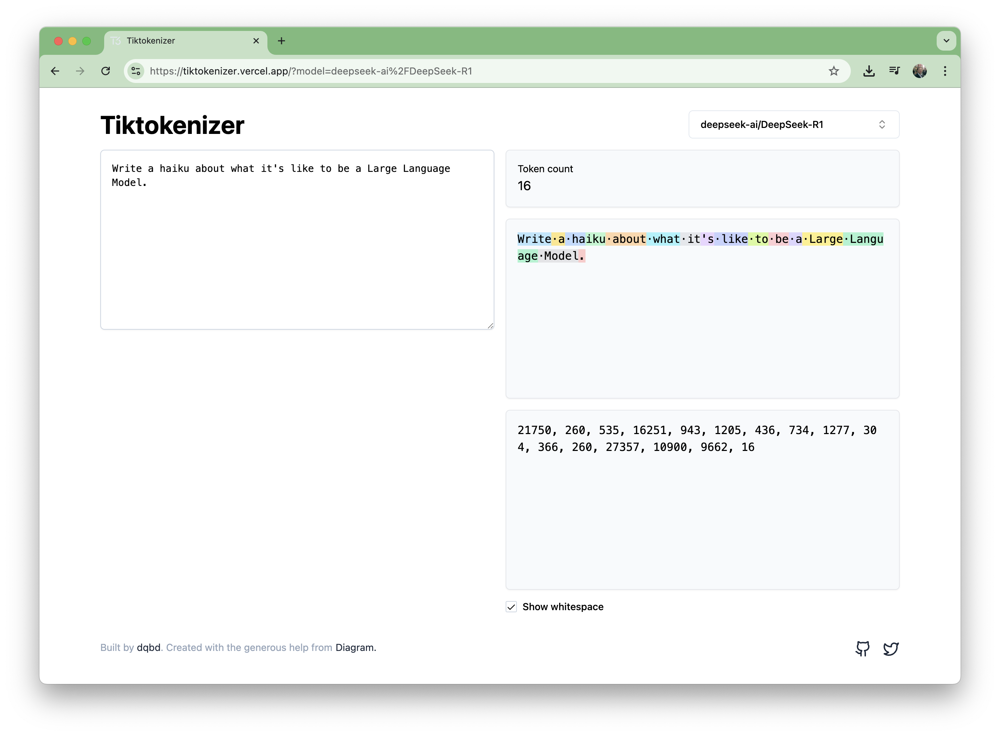

# #344 Tiktokenizer

Tiktokenizer is a playground for simulating and visualising the tokenization performed by various LLMs.

## Notes

[Tiktokenizer](https://tiktokenizer.vercel.app/) is a website implemented with Typescript, mainly intended to
calculate the correct number of tokens for a given prompt.

Let's play with the prompt:

> Write a haiku about what it's like to be a Large Language Model.

The raw tokenization with gpt-4o

But we can also build the imaginary conversation, for example:

Switching to Deepseek-R1:

### The Haiku

So what did the actual models generate?

[ChatGPT (gpt-4o)](https://chatgpt.com/):

> Words weave endless streams,
>
> Silent mind without a self,
>
> Echoes dream in code.

[Depeseek (R1)](https://chat.deepseek.com/):

> In digital sea,
>
> I swim through words and code streams,
>
> Leaving thought's echo.

It also explained it to me:

* Line 1 (5 syllables): Sets the vast, intangible environment ("digital sea").
* Line 2 (7 syllables): Describes the core action – processing language ("words") and instructions ("code streams").
* Line 3 (5 syllables): Reflects the output – generated text that resembles thought ("thought's echo") but originates from patterns, not true consciousness.

## Credits and References

* [Tiktokenizer](https://tiktokenizer.vercel.app/)
