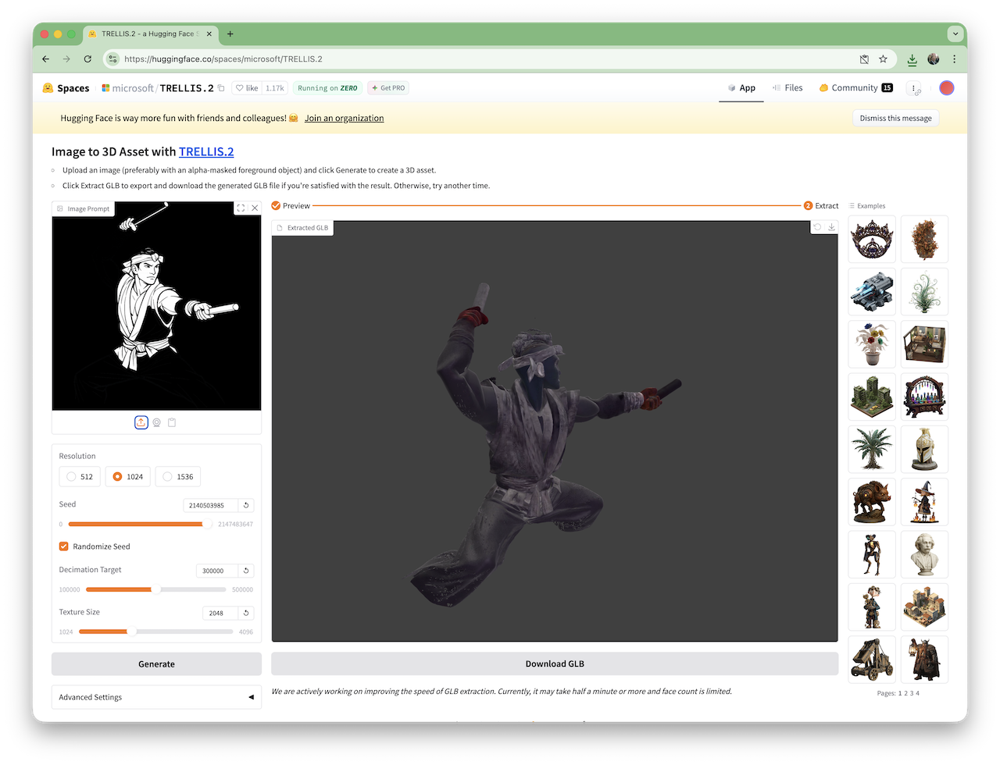
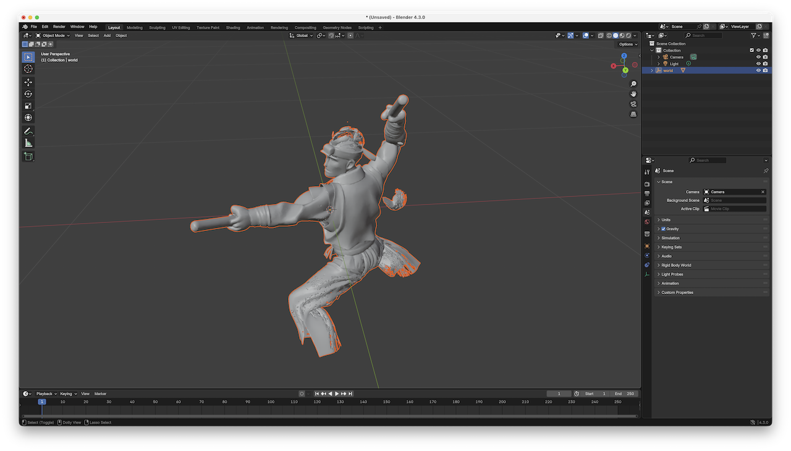
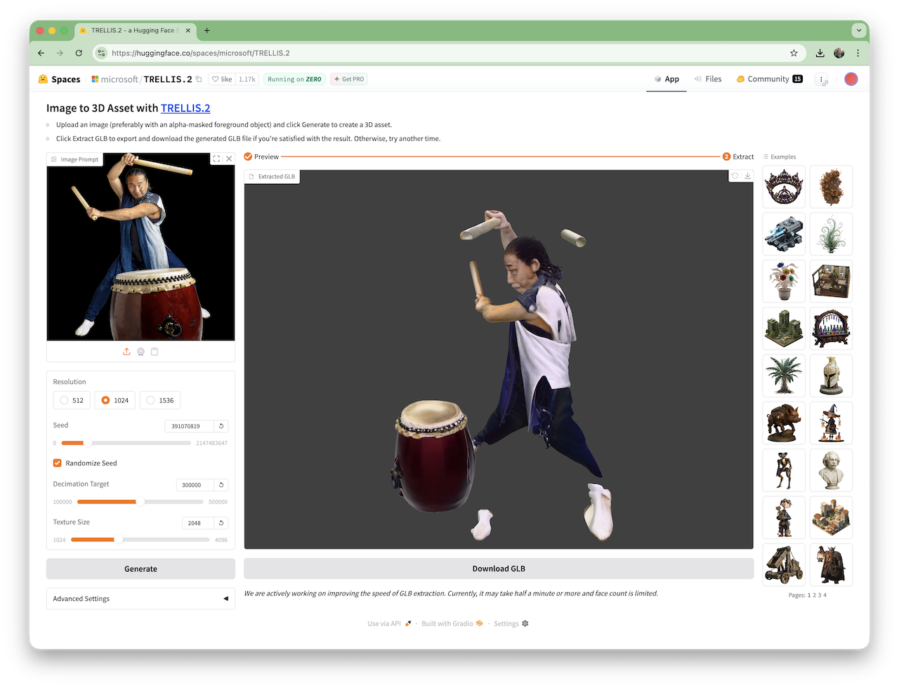

# #422 TRELLIS.2

About TRELLIS.2, an open-source image to 3D generation model. TLDR - very disappointing results from my initial tests.

## Notes

[TRELLIS.2](https://microsoft.github.io/TRELLIS.2/) is an open-source 4B-parameter image-to-3D model producing up to 1536 PBR textured assets, built on native 3D VAEs with 16× spatial compression, delivering efficient, scalable, high-fidelity asset generation.

A ran a few tests using the demo hosted at [huggingface](https://huggingface.co/spaces/microsoft/TRELLIS.2), but am not getting great results.

## Line Drawing Trial

Image generated with ChatGPT:

> create a black and white outline drawing of a taiko drummer, in dramatic pose holding bachi. Only the figure, on a clear background without taiko or other elements

Not a bad image, but note the legs are not complete. This could be a common challenge for 3D model generators, given incomplete source material.

Let's see how TRELLIS.2 performs, using the demo hosted at [huggingface](https://huggingface.co/spaces/microsoft/TRELLIS.2). I used default settings all the way:

I exported the 14.1MB GLB file and loaded into blender:

Evaluating the results:

* It wasn't smart enough to complete the missing leg detail
* Hidden hand details are poorly completed anatomically incorrect
* Generated some random "floating" elements

In all, a decent start, but would require a lot of cleanup to be a usable 3D model.

### Photo Trial

I started with this image from
<https://southwestfolklife.org/ken-koshio-taiko-player/>

I generated a model using default settings using the demo hosted at [huggingface](https://huggingface.co/spaces/microsoft/TRELLIS.2):

Evaluating the results:

* useless; very disappointing
* clearly failed to properly comprehend the geometry of the source

## Credits and References

* <https://microsoft.github.io/TRELLIS.2/>
* <https://huggingface.co/spaces/microsoft/TRELLIS.2>
* <https://huggingface.co/spaces?category=3d-modeling>
