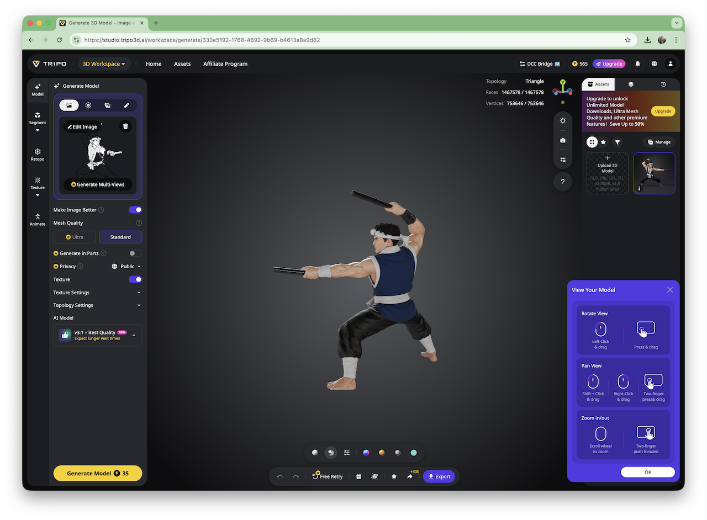
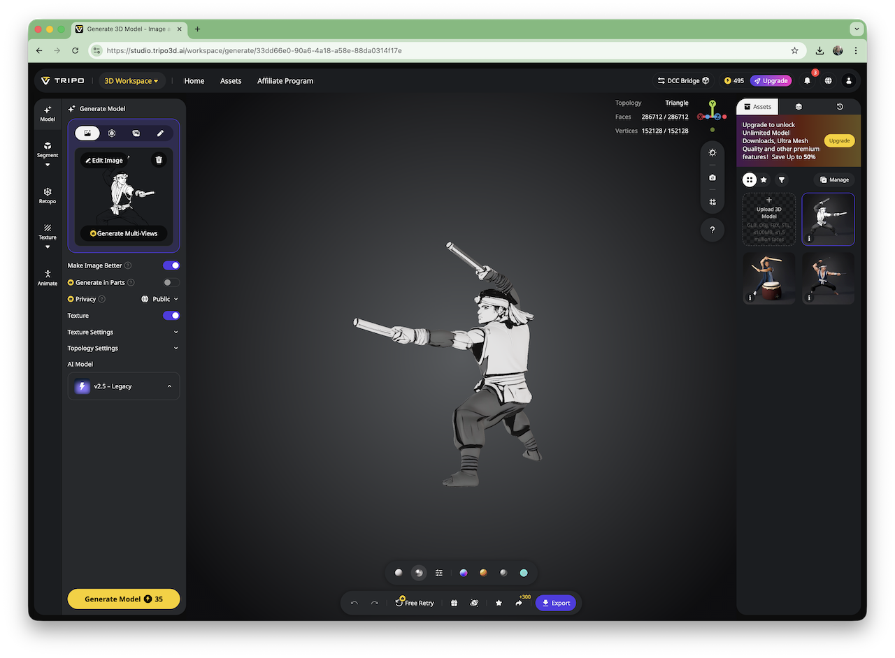
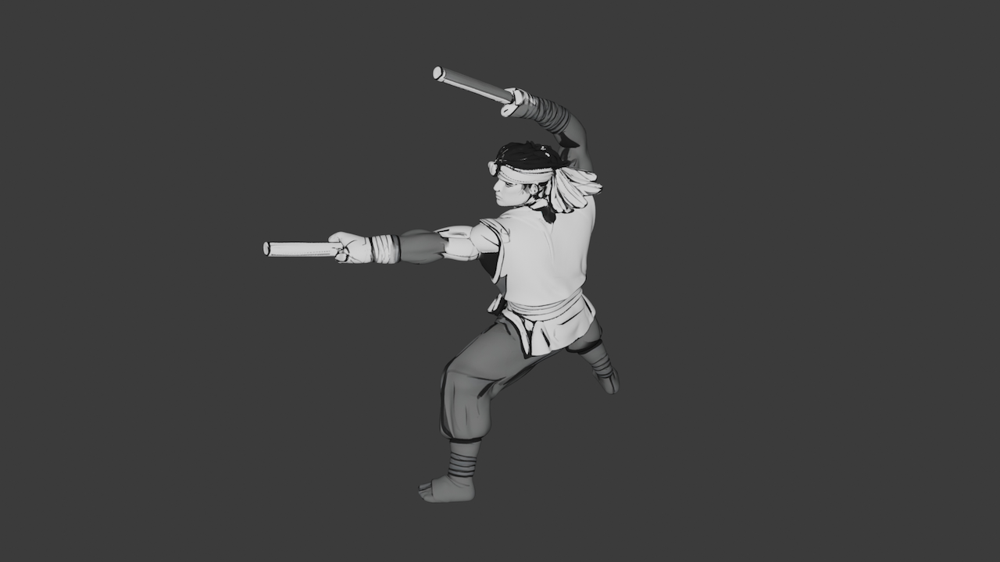
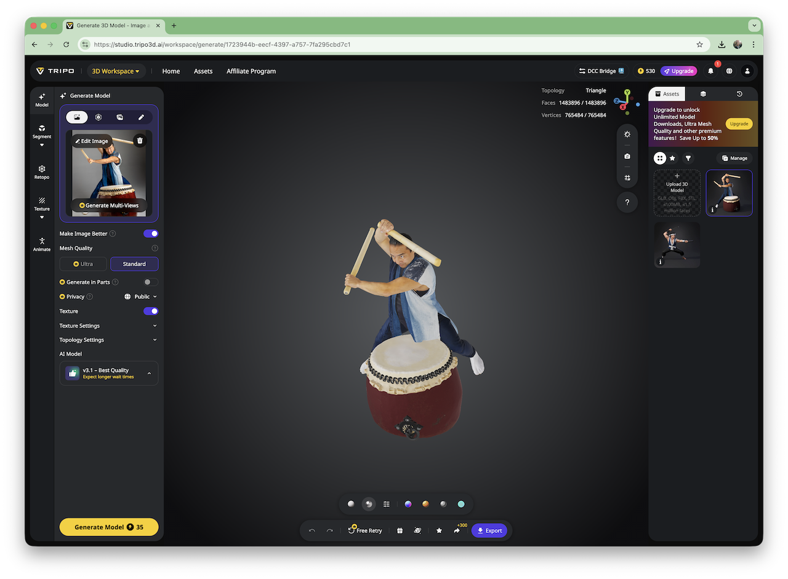

# #421 Tripo3D

About Tripo3D, an advanced AI-powered platform that generates high-quality 3D models. TLDR - incredibly accurate generation of coherent 3D models from even incomplete 2D images.

## Notes

[Tripo3D](https://www.tripo3d.ai/) is an advanced AI-powered platform that generates high-quality 3D models from simple text prompts or images. It is designed to make 3D content creation fast and accessible, producing detailed models in seconds.

Tripo3D is produced by VAST - an AI company specializing in the development of general-purpose 3D large models, founded in March 2023 by Song Yachen 宋亚宸.

A ran a few tests on their free plan, and am so far extremely impressed by the results.

## Line Drawing Trial

Image generated with ChatGPT:

> create a black and white outline drawing of a taiko drummer, in dramatic pose holding bachi. Only the figure, on a clear background without taiko or other elements

Not a bad image, but note the legs are not complete. This could be a common challenge for 3D model generators, given incomplete source material.

Let's see how Tripo3D performs. I used default settings with their latest v3.1 model:

Result:

* Outstanding
* Has completed the leg detail without prompting
* Anatomically correct completion of hidden detail such as the fingers
* Fully coherent model - no floating artifacts
* Has retained the character of the original image
* Some texture issues, as it identified the figure as a "ninja" rather than a taiko player:
    * black bachi rather than untreated wood
    * some strange costume colours!

I'm doing this on the cheap, so can't export the v3.1 model results.

Let's see how the legacy v2.5 model goes (as this one allows downloads)...

Exported as GLB and imported into Blender:

Result:

* Still outstanding
* Has completed the leg detail without prompting
* Anatomically correct completion of hidden detail such as the fingers
* Fully coherent model - no floating artifacts
* Has retained the character and texturing of the original image.

I've also exported [the STL](./assets/taiko-line-example-1/generated-2.stl) and will try printing it soon.

### Photo Trial

I started with this image from
<https://southwestfolklife.org/ken-koshio-taiko-player/>

Let's see how Tripo3D performs. I used default settings with their latest v3.1 model:

Result:

* Again, outstanding
* Has completed hidden leg detail without prompting
* Anatomically correct completion of hidden detail such as the fingers
* Fully coherent model -
* Has retained the character and detail of the original image

## Credits and References

* <https://www.tripo3d.ai/>
* <https://studio.tripo3d.ai/>
