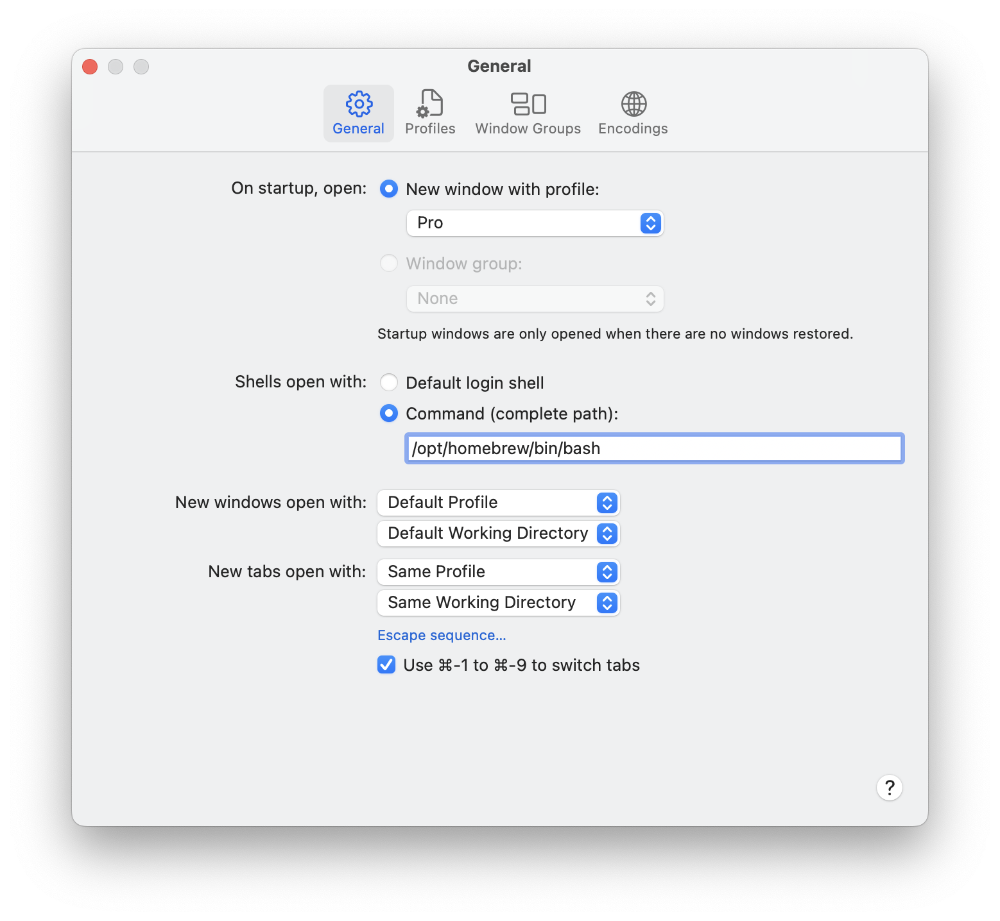

# #271 Bash on macOS

Using latest bash releases on the latest versions of macOS.

## Notes

Since Catalina (10.15), macOS has used zsh as the default shell.

Apple still does ship bash with macOS but it is very old (v3). 
It can do this because it is still [licensed under GPLv2](https://discussions.apple.com/thread/250722978?sortBy=best), whereas the current v5 bash is under the GPLv3 license.

Bash as installed by Apple:

    % bash --version
    GNU bash, version 3.2.57(1)-release (arm64-apple-darwin23)
    Copyright (C) 2007 Free Software Foundation, Inc.
    % which bash
    /bin/bash

### Installing Bash with Homebrew

The latest bash shell can be installed from source, or perhaps more conveniently 
using the [Homebrew](https://brew.sh/) [bash formula](https://formulae.brew.sh/formula/bash):

    % brew install bash

After installation, we have the latest bash installed:

    % bash --version
    GNU bash, version 5.2.21(1)-release (aarch64-apple-darwin23.0.0)
    Copyright (C) 2022 Free Software Foundation, Inc.
    License GPLv3+: GNU GPL version 3 or later <http://gnu.org/licenses/gpl.html>

    This is free software; you are free to change and redistribute it.
    There is NO WARRANTY, to the extent permitted by law.
    % which bash
    /opt/homebrew/bin/bash

### Adding bash to `/etc/shells`

The `/etc/shells` file contains a list of login shells on the system. Applications use this file to determine whether a shell is valid.

Adding the homebrew bash link makes it a valid option:

    % cat /etc/shells
    # List of acceptable shells for chpass(1).
    # Ftpd will not allow users to connect who are not using
    # one of these shells.

    /bin/bash
    /bin/csh
    /bin/dash
    /bin/ksh
    /bin/sh
    /bin/tcsh
    /bin/zsh
    /opt/homebrew/bin/bash

### Changing the Terminal Default

Default shell can be set for the Terminal application in General Options:

While this has the effect of changing the default shell used by Terminal, it does not change the default login shell (over ssh for example) or the default shell used by scripts:

    $ echo $BASH_VERSION
    5.2.21(1)-release
    $ ./bash_version.sh 
    Which version of bash am I running?
    Answer: 3.2.57(1)-release

### Changing the default login shell

To make a more permanent change to the login shell,
the [chsh](https://linux.die.net/man/1/chsh) utility can be used to change the default login shell for a user.

Prior to making any change:

    $ echo $SHELL
    /bin/zsh

Change to bash:

    chsh -s /opt/homebrew/bin/bash

Open a new terminal window:

    $ echo $SHELL
    /opt/homebrew/bin/bash

### Script Defaults

Bash scripts will conventionally specify the required shell as `#!/bin/bash`.
Because we haven't changed `/bin/bash` yet, we still get the older version in scripts:

    % ./bash_version.sh
    Which version of bash am I running?
    Answer: 3.2.57(1)-release

What we really want is for `/bin/bash` to invoke the v5 version.
The default `/bin/bash` is actually the v3 binary:

    $ ls -al /bin/bash
    -r-xr-xr-x  1 root  wheel  1310224 Dec 15 22:43 /bin/bash

Unfortunately, in macOS the
[`/bin`](https://apple.stackexchange.com/questions/193368/what-is-the-rootless-feature-in-el-capitan-really) folder is read-only, even for root.
So it is not possible to change this bash version.

If the bash version is significant, the best solution is to change the shebang line
from  `#!/bin/bash` to `#!/usr/bin/env bash`
and ensure that the v5 shell is found first in the `PATH`:

    export PATH=/opt/homebrew/bin:$PATH

Now scripts will pickup the v5 shell instead:

    $ ./bash_version.sh 
    Which version of bash am I running?
    Answer: 5.2.21(1)-release

## Credits and References

* [Zsh](https://www.zsh.org/)
* [GNU Bash](https://www.gnu.org/software/bash/)
* [homebrew bash formula](https://formulae.brew.sh/formula/bash)
* [chsh](https://linux.die.net/man/1/chsh)
* [How to Switch Between Zsh and Bash on macOS: A Comprehensive Guide](https://tecadmin.net/switching-between-zsh-and-bash-on-macos/)
* [Why did apple switch to zsh? Is it somehow better?](https://discussions.apple.com/thread/250722978?sortBy=best)
* [How to install bash 5.0 Mac OS](https://medium.com/@thechiefalone/how-to-install-bash-5-0-mac-os-ae570be6c687)
* [Install Upgraded GNU Bash on a Macbook Pro](https://kizu514.com/blog/install-upgraded-gnu-bash-on-a-macbook-pro/)
* [Understanding the /etc/shells file](https://techacad.net/understanding-the-etc-shells-file/)
* [What is the "rootless" feature in El Capitan, really?](https://apple.stackexchange.com/questions/193368/what-is-the-rootless-feature-in-el-capitan-really)
