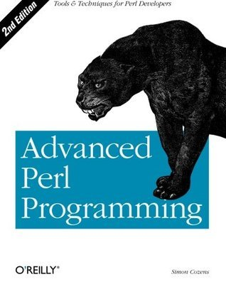

# #448 Advanced Perl Programming

Book notes - Advanced Perl Programming: The Worlds Most Highly Developed Perl Tutorial, Second Edition by Simon Cozens.
First published January 1, 2005.

## Notes

NB: I originally read the first edition: Advanced Perl Programming by Sriram Srinivasan, published August 1, 1997.

[](https://amzn.to/4u956LK)

## First Edition

### First Edition Contents

* Chapter 1: Data References and Anonymous Storage
* Chapter 2: Implementing Complex Data Structures
* Chapter 3: Typeglobs and Symbol Tables
* Chapter 4: Subroutine References and Closures
* Chapter 5: Eval
* Chapter 6: Modules
* Chapter 7: Object-Oriented Programming
* Chapter 8: Object Orientation: The Next Few Steps
* Chapter 9: Tie
* Chapter 10: Persistence
* Chapter 11: Implementing Object Persistence
* Chapter 12: Networking with Sockets
* Chapter 13: Networking: Implementing RPC
* Chapter 14: User Interfaces with Tk
* Chapter 15: GUI Example: Tetris
* Chapter 16: GUI Example: Man Page Viewer
* Chapter 17: Template-Driven Code Generation
* Chapter 18: Extending Perl:A First Course
* Chapter 19: Embedding Perl:The Easy Way
* Chapter 20: Perl Internals
* Appendix A: Tk Widget Reference
* Appendix B: Syntax Summary

### First Edition Source Code

Example sources are maintained at <https://resources.oreilly.com/examples/9781565922204/>.
Cloning to an `example_source_1st_edition` folder:

```sh
git clone https://resources.oreilly.com/examples/9781565922204 example_source_1st_edition
```

## Second Edition

### Second Edition Contents

1. Advanced Techniques
2. Parsing Techniques
3. Templating Tools
4. Objects, Databases, and Applications
5. Natural Language Tools
6. Perl and Unicode
7. POE
8. Testing
9. Inline Extensions
10. Fun with Perl

### Second Edition Source Code

I can't find the examples online. Maybe they are available is one has an O'Reilly membership.

## Credits and References

* Advanced Perl Programming, First Edition
    * [amazon](https://amzn.to/4mRFX61)
    * [goodreads](https://www.goodreads.com/book/show/583608.Advanced_Perl_Programing)
    * [O'Reilly](https://www.oreilly.com/library/view/advanced-perl-programming/1565922204/)
    * [source code](https://resources.oreilly.com/examples/9781565922204/)
* Advanced Perl Programming, Second Edition
    * [amazon](https://amzn.to/4u956LK)
    * [goodreads](https://www.goodreads.com/book/show/583607.Advanced_Perl_Programming)
    * [O'Reilly](https://www.oreilly.com/library/view/advanced-perl-programming/0596004567/)
