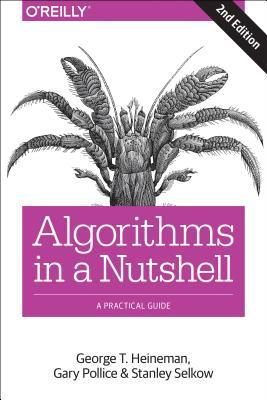

# #xxx Algorithms in a Nutshell

Book notes - Algorithms in a Nutshell: A Practical Guide by George T. Heineman, Gary Pollice, Stanley Selkow.
First published October 14, 2008. Second edition published March 9, 2016 by O'Reilly Media.

## Notes

A good reference for common algorithms in computer science.
It focuses on fundamental mathematical and data processing algorithms,
and doesn't venture much into applied areas such as queue and process optimisation.

[](https://amzn.to/4kT8vuX)

### Contents

* 1 Thinking in Algorithms
    * Understand the Problem
    * Naïve Solution
    * Intelligent Approaches
    * Summary
    * References
* 2 The Mathematics of Algorithms
    * Size of a Problem Instance
    * Rate of Growth of Functions
    * Analysis in the Best, Average, and Worst Cases
    * Performance Families
    * Benchmark Operations
    * References
* 3 Algorithm Building Blocks
    * Algorithm Template Format
    * Pseudocode Template Format
    * Empirical Evaluation Format
    * Floating-Point Computation
    * Example Algorithm
    * Common Approaches
    * References
* 4 Sorting Algorithms
    * Transposition Sorting
    * Selection Sort
    * Heap Sort
    * Partition-Based Sorting
    * Sorting without Comparisons
    * Bucket Sort
    * Sorting with Extra Storage
    * String Benchmark Results
    * Analysis Techniques
    * References
* 5 Searching
    * Sequential Search
    * Binary Search
    * Hash-Based Search
    * Bloom Filter
    * Binary Search Tree
    * References
* 6 Graph Algorithms
    * Graphs
    * Depth-First Search
    * Breadth-First Search
    * Single-Source Shortest Path
    * Dijkstras Algorithm for Dense Graphs
    * Comparing Single-Source Shortest-Path Options
    * All-Pairs Shortest Path
    * Minimum Spanning Tree Algorithms
    * Final Thoughts on Graphs
    * References
* 7 Path Finding in AI
    * Game Trees
    * Path-Finding Concepts
    * Minimax
    * NegMax
    * AlphaBeta
    * Search Trees
    * Depth-First Search
    * Breadth-First Search
    * A*Search
    * Comparing Search-Tree Algorithms
    * References
* 8 Network Flow Algorithms
    * Network Flow
    * Maximum Flow
    * Bipartite Matching
    * Reflections on Augmenting Paths
    * Minimum Cost Flow
    * Transshipment Transportation
    * Assignment
    * Linear Programming
    * References
* 9 Computational Geometry
    * Classifying Problems
    * Convex Hull
    * Convex Hull Scan
    * Computing Line-Segment Intersections
    * LineSweep
    * Voronoi Diagram
    * References
* 10 Spatial Tree Structures
    * Nearest Neighbor Queries
    * Range Queries
    * Intersection Queries
    * Spatial Tree Structures
    * Nearest Neighbor Queries
    * Range Query
    * Quadtrees
    * R-Trees
    * References
* 11 Emerging Algorithm Categories
    * Variations on a Theme
    * Approximation Algorithms
    * Parallel Algorithms
    * Probabilistic Algorithms
    * References
* 12 Epilogue: Principles of Algorithms
    * Know Your Data
    * Decompose a Problem into Smaller Problems
    * Choose the Right Data Structure
    * Make the Space versus Time Trade-Off
    * Construct a Search
    * Reduce Your Problem to Another Problem
    * Writing Algorithms Is Hard-Testing Algorithms Is Harder
    * Accept Approximate Solutions When Possible
    * Add Parallelism to Increase Performance
* A Benchmarking

### Source Code

Example sources are maintained on [GitHub](https://github.com/heineman/algorithms-nutshell-2ed).
Cloning to an `example_source` folder:

```sh
git clone https://github.com/heineman/algorithms-nutshell-2ed example_source
```

## Credits and References

* Algorithms in a Nutshell
    * [amazon](https://amzn.to/4kT8vuX)
    * [goodreads](https://www.goodreads.com/book/show/26171186-algorithms-in-a-nutshell)
    * [O'Reilly](https://www.oreilly.com/library/view/algorithms-in-a/9781491912973/)
    * [source code](https://github.com/heineman/algorithms-nutshell-2ed)
