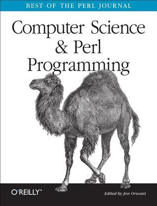

# #442 Computer Science & Perl Programming

Book notes - Computer Science & Perl Programming: Best of The Perl Journal, by Jon Orwant.
First published November 4, 2002.

## Notes

This is the book that kept me entertained and occupied while on an extended work assignment in Japan some years ago.
After a stressful week and all the chores out of the way, there was nothing more enjoyable than finding a quiet coffee shop on a Sunday
to relax for a few hours, read a chapter or two, and pull out the laptop to explore some of the examples.

I finished that assignment with a deep set of Perl skills (we were using it at work too), which have since almost completely atrophied!

[](https://amzn.to/4myguhO)

### Contents

* 1 Introduction
* I Beginner Concepts
    * 2 All About Arrays
    * 3 Perfect Programming
    * 4 Precedence
    * 5 The Birth of a One-Liner
    * 6 Comparators, Sorting, and Hashes
    * 7 What Is Truth?
    * 8 Using Object-Oriented Modules
    * 9 Unreal Numbers
    * 10 CryptoContext
    * 11 References
    * 12 Perl Heresies
* II Regular Expressions
    * 13 Understanding Regular Expressions, Part I
    * 14 Understanding Regular Expressions, Part II
    * 15 Understanding Regular Expressions, Part III
    * 16 Nibbling Strings
    * 17 How Regexes Work
* III Computer Science
    * 18 Infinite Lists
    * 19 Compression
    * 20 Memoization
    * 21 Parsing
    * 22 Trees and Game Trees
    * 23 B_Trees
    * 24 Making Life and Death Decisions with Perl
    * 25 Information Retrieval
    * 26 Randomness
    * 27 Random Number Generators and XS
* IV Programming Techniques
    * 28 Suffering from Buffering
    * 29 Scoping
    * 30 Seven Useful Uses of local
    * 31 Parsing Command-Line Options
    * 32 Building a Better Hash with tie
    * 33 Source Filters
    * 34 Overloading
    * 35 Building Objects Out of Arrays
    * 36 Hiding Objects with Closures
    * 37 Multiple Dispatch in Perl
* V Software Development
    * 38 Using Other Languages from Perl
    * 39 SWIG
    * 40 Benchmarking
    * 41 Building Software with Cons
    * 42 MakeMaker
    * 43 Autoloading Perl Code
    * 44 Debugging and Devel::
* VI Networking
    * 45 Email with Attachments
    * 46 Sending Mail Without sendmail
    * 47 Filtering Mail
    * 48 Net::Telnet
    * 49 Microsoft Office
    * 50 Client-Server Applications
    * 51 Managing Streaming Audio
    * 52 A 74-Line Ip Telephone
    * 53 Controlling Modems
    * 54 Using Usenet from Perl
    * 55 Transferring Files with FTP
    * 56 Spidering an FTP Site
    * 57 DNS Updates with Perl
* VII Databases
    * 58 DBI
    * 59 Using DBI with Microsoft Access
    * 60 DBI Caveats
    * 61 Beyond Hardcoded Database Applications with DBIx::Recordset
    * 62 Win32::ODBC
    * 63 Net:: LDAP
    * 64 Web Databases the Genome Project Way
    * 65 Spreadsheet:: WriteExcel
* VIII Internals
    * 66 How to Improve Perl
    * 67 Components of the Perl Distribution
    * 68 Basic Perl Anatomy
    * 69 Lexical Analysis
    * 70 Debugging Perl Programs with - D
    * 71 Microperl

### Source Code

Example sources are maintained at <https://resources.oreilly.com/examples/9780596003104/>.
Cloning to an `example_source` folder:

```sh
git clone https://resources.oreilly.com/examples/9780596003104 example_source
```

## Credits and References

* Computer Science & Perl Programming
    * [amazon](https://amzn.to/4myguhO)
    * [goodreads](https://www.goodreads.com/book/show/860884.Computer_Science_Perl_Programming)
    * [O'Reilly](https://www.oreilly.com/library/view/computer-science/9780596003104/)
    * [source code](https://resources.oreilly.com/examples/9780596003104/)
