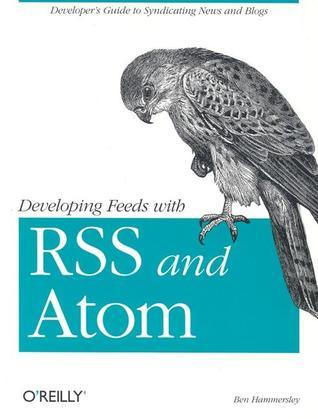

# #xxx Developing Feeds with RSS and Atom

Book notes - Developing Feeds with RSS and Atom: Developers Guide to Syndicating News & Blogs, by Ben Hammersley.
First published January 1, 2005.

## Notes

[](https://amzn.to/4bip3YR)

### Contents

* 1 Introduction
    * 1.1 What Are RSS and Atom for?
    * 1.2 A Short History of RSS and Atom
    * 1.3 Why Syndicate Your Content?
    * 1.4 Legal Implications
* 2 Using Feeds
    * 2.1 Web-Based Applications
    * 2.2 Desktop Applications
    * 2.3 Other Cunning Techniques
    * 2.4 Finding Feeds to Read
* 3 Feeds Without Programming
    * 3.1 From Email
    * 3.2 From a Search Engine
    * 3.3 From Online Stores
* 4 RSS 2.0
    * 4.1 Bringing Things Up to Date
    * 4.2 The Basic Structure
    * 4.3 Producing RSS 2.0 with Blogging Tools
    * 4.4 Introducing Modules
    * 4.5 Creating RSS 2.0 Feeds
* 5 RSS 1.0
    * 5.1 Metadata in RSS 2.0
    * 5.2 Resource Description Framework
    * 5.3 RDF in XML
    * 5.4 Introducing RSS 1.0
    * 5.5 The Specification in Detail
    * 5.6 Creating RSS 1.0 Feeds
* 6 RSS 1.0 Modules
    * 6.1 Module Status
    * 6.2 Support for Modules in Common Applications
    * 6.3 Other RSS 1.0 Modules
* 7 The Atom Syndication Format
    * 7.1 Introducing Atom
    * 7.2 The Atom Entry Document in Detail
    * 7.3 Producing Atom Feeds
* 8 Parsing and Using Feeds
    * 8.1 Important Issues
    * 8.2 JavaScript Display Parsers
    * 8.3 Parsing for Programming
    * 8.4 Using Regular Expressions
    * 8.5 Using XSLT
    * 8.6 Client-Side Inclusion
    * 8.7 Server-Side Inclusion
* 9 Feeds in the Wild
    * 9.1 Once You Have Created Your Simple RSS Feed
    * 9.2 Publish and Subscribe
    * 9.3 Rolling Your Own: LinkPimp PubSub
    * 9.4 LinkpimpClient.pl
* 10 Unconventional Feeds
    * 10.1 Apache Logfiles
    * 10.2 Code TODOs to RSS
    * 10.3 Daily Doonesbury
    * 10.4 Amazon.com Wishlist to RSS
    * 10.5 FedEx Parcel Tracker
    * 10.6 Google to RSS with SOAP
    * 10.7 Last-Modified Files
    * 10.8 Installed Perl Modules
    * 10.9 The W3C Validator to RSS
    * 10.10 Game Statistics to Excel
    * 10.11 Feeds by SMS
    * 10.12 Podcasting Weather Forecasts
    * 10.13 Having Amazon Produce Its Own RSS Feeds
    * 10.14 Cross-Poster for Movable Type
* 11 Developing New Modules
    * 11.1 Namespaces and Modules Within RSS 2.0 and Atom
    * 11.2 Case Study: mod_Book
    * 11.3 Extending Your Desktop Reader
    * 11.4 Introducing AmphetaDesk
* A The XML You Need for RSS
    * A.1 What Is XML?
    * A.2 Anatomy of an XML Document
    * A.3 Tools for Processing XML
* B Useful Sites and Software
    * B.1 Uber Resources
    * B.2 Specification Documents
    * B.3 Mailing Lists
    * B.4 Validators
    * B.5 Desktop Readers

### Source Code

Example sources are maintained on <https://resources.oreilly.com/examples/9780596008819/>.
Cloning to an `example_source` folder:

```sh
git clone https://resources.oreilly.com/examples/9780596008819/ example_source
```

## Credits and References

* Developing Feeds with RSS and Atom, by Ben Hammersley
    * [amazon](https://amzn.to/4bip3YR)
    * [goodreads](https://www.goodreads.com/book/show/926310.Developing_Feeds_with_Rss_and_Atom)
    * [O'Reilly](https://www.oreilly.com/library/view/developing-feeds-with/0596008813/)
    * [example source](https://resources.oreilly.com/examples/9780596008819/)
