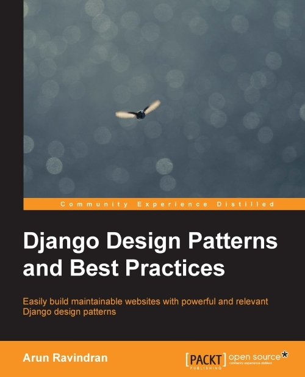

# #483 Django Design Patterns and Best Practices

Book Notes - Django Design Patterns and Best Practices, by Arun Ravindran.
First published March 1, 2015. 4th Edition 2011.

## Notes

[](https://amzn.to/46PaOJe)

### Contents

* Chapter 1: Django and Patterns
    * Why Django?
    * The story of Django
        * A framework is born
        * Removing the magic
        * Django keeps getting better
        * How does Django work?
    * What is a Pattern?
        * Gang of Four Patterns
        * Is Django MVC?
        * Fowler's Patterns
        * Are there more patterns?
    * Patterns in this book
        * Criticism of Patterns
        * How to use Patterns
    * Best practices
        * Python Zen and Django's design philosophy
    * Summary
* Chapter 2: Application Design
    * How to gather requirements
    * Are you a story teller?
    * HTML mockups
    * Designing the application
        * Dividing a project into Apps
        * Reuse or roll-your-own?
            * My app sandbox
        * Which packages made it?
    * Before starting the project
    * SuperBook - your mission, should you choose to accept it
        * Why Python 3?
        * Starting the project
    * Summary
* Chapter 3: Models
    * M is bigger than V and C
    * The model hunt
        * Splitting models.py into multiple files
    * Structural patterns
        * Patterns - normalized models
        * Pattern - model mixins
        * Pattern - user profiles
        * Pattern - service objects
    * Retrieval patterns
        * Pattern - property field
        * Pattern - custom model managers
    * Migrations
    * Summary
* Chapter 4: Views and URLs
    * A view from the top
        * Views got classier
    * Class-based generic views
    * View mixins
        * Order of mixins
    * Decorators
    * View patterns
        * Pattern - access controlled views
        * Pattern - context enhancers
        * Pattern - services
    * Designing URLs
        * URL anatomy
        * What happens in urls.py?
        * The URL pattern syntax
        * Names and namespaces
        * Pattern order
        * URL pattern styles
    * Summary
* Chapter 5: Templates
    * Understanding Django's template language features
        * Variables
        * Attributes
        * Filters
        * Tags
        * Philosophy - don't invent a programming language
    * Organizing templates
        * Support for other template languages
    * Using Bootstrap
        * But they all look the same!
    * Template patterns
        * Pattern - template inheritance tree
        * Pattern - the active link
    * Summary
* Chapter 6: Admin Interface
    * Using the admin interface
    * Enhancing models for the admin
        * Not everyone should be an admin
    * Admin interface customizations
        * Changing the heading
        * Changing the base and stylesheets
        * Adding a Rich Text Editor for WYSIWYG editing
        * Bootstrap-themed admin
        * Complete overhauls
        * Protecting the admin
        * Pattern - feature flags
    * Summary
* Chapter 7: Forms
    * How forms work
        * Forms in Django
        * Why does data need cleaning?
    * Displaying forms Time to be crisp
    * Understanding CSRF
    * Form processing with Class-based views
    * Form patterns
        * Pattern - dynamic form generation
        * Pattern - user-based forms
        * Pattern - multiple form actions per view
        * Pattern - CRUD views
    * Summary
* Chapter 8: Dealing with Legacy Code
    * Finding the Django version
        * Activating the virtual environment
    * Where are the files? This is not PHP
    * Starting with urls.py
    * Jumping around the code
    * Understanding the code base
        * Creating the big picture
    * Incremental change or a full rewrite?
    * Write tests before making any changes
        * Step-by-step process to writing tests
    * Legacy databases
    * Summary
* Chapter 9: Testing and Debugging
    * Why write tests?
    * Test-driven development
    * Writing a test case
        * The assert method
        * Writing better test cases
    * Mocking
    * Pattern - test fixtures and factories
        * Problem details
        * Solution details
    * Learning more about testing
    * Debugging
        * Django debug page
        * A better debug page
    * The print function
    * Logging
    * The Django Debug Toolbar
    * The Python debugger pdb
    * Other Debuggers
    * Debugging django templates
    * Summary
* Chapter 10: Security
    * Cross-site scripting (XSS)
        * Why are your cookies valuable?
            * How Django helps
            * Where Django might not help
        * Cross-Site Request Forgery (CSRF)
            * How Django helps
            * Where Django might not help
        * SQL injection
            * How Django helps
            * Where Django might not help
        * Clickjacking
            * How Django helps
        * Shell injection
            * How Django helps
        * And the list goes on
    * A handy security checklist
    * Summary
* Chapter 11: Production-ready
    * Production environment
        * Choosing a web stack
        * Components of a stack
    * Hosting
        * Platform as a service
        * Virtual private servers
        * Other hosting approaches
    * Deployment tools
        * Fabric
        * Typical deployment steps
        * Configuration management
    * Monitoring
    * Performance
        * Frontend performance
        * Backend performance
            * Templates
            * Database
            * Caching
    * Summary
* Appendix: Python 2 versus Python 3
    * But I still use Python 2.7!
    * Python 3
        * Python 3 for Djangonauts
        * Change all the unicode methods into str
        * All classes inherit from the object class
        * Calling super() is easier
        * Relative imports must be explicit
        * HttpRequest and HttpResponse have str and bytes types
        * Exception syntax changes and improvements
        * Standard library reorganized
        * New goodies
            * Using Pyvenv and Pip
        * Other changes
    * Further information
* Index

### Getting the Example Source

```sh
git clone https://resources.oreilly.com/examples/9781783986644/ example_source
```

## Credits and References

* Django Design Patterns and Best Practices
    * [amazon](https://amzn.to/46PaOJe)
    * [O'Reilly](https://www.oreilly.com/library/view/programming-python-4th/9781449398712/)
    * [goodreads](https://www.goodreads.com/book/show/8941077-programming-python)
    * [examples](https://resources.oreilly.com/examples/9781783986644/)
* Django Design Patterns and Best Practices - Second Edition
    * [O'Reilly](https://www.oreilly.com/library/view/django-design-patterns/9781788831345/)
