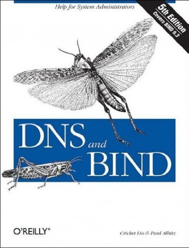

# #468 DNS and BIND

Book notes - DNS and BIND by Cricket Liu, Paul Albitz.
First published October 8, 1992. Latest 5th edition, 2006.

## Notes

[](https://amzn.to/4vcK0fG)

### Table of Contents - 5th Edition

* 1: Background
* 2: How Does DNS Work?
* 3: Where Do I Start?
* 4: Setting Up BIND
* 5: DNS and Electronic Mail
* 6: Configuring Hosts
* 7: Maintaining BIND
* 8: Growing Your Domain
* 9: Parenting
* 10: Advanced Features
* 11: Security
* 12: nslookup and dig
* 13: Reading BIND Debugging Output
* 14: Troubleshooting DNS and BIND
* 15: Programming with the Resolver and Nameserver Library Routines
* 16: Architecture
* 17: Miscellaneous
* A: DNS Message Format and Resource Records
* B: BIND Compatibility Matrix
* C: Compiling and Installing BIND on Linux
* D: Top-Level Domains
* E: BIND Nameserver and Resolver Configuration

### Source Code - 5th Edition

Example sources are maintained on <https://resources.oreilly.com/examples/9780596100575/>
The git repo actually contains a zipped archive of the sources.
I've extracted locally to a folder called `example_source_v5` as follows:

```sh
git clone https://resources.oreilly.com/examples/9780596100575/
mkdir ./example_source_v5
tar zxvf 9780596100575/dns.5ed.tar.Z -C ././example_source_v5
rm -fR 9780596100575
```

## Credits and References

* DNS and BIND, 5th Edition
    * [amazon](https://amzn.to/4vcK0fG)
    * [goodreads](https://www.goodreads.com/book/show/69969562-dns-and-bind)
    * [O'Reilly](https://www.oreilly.com/library/view/dns-and-bind/0596100574/)
    * [example source](https://resources.oreilly.com/examples/9780596100575/)
* DNS and BIND, 4th Edition
    * [example source](https://resources.oreilly.com/examples/9780596001582/)
