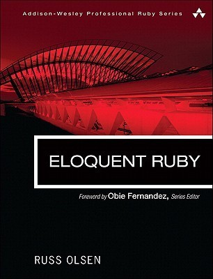

# #xxx Eloquent Ruby

Book notes - Eloquent Ruby, by Russ Olsen.
First published January 27, 2011. Second Edition currently in beta - due Q1 2026.

## Notes

This was the book that finally helped me crack the core concepts of lambdas, meta-programming and DSLs.

The first edition is showing its age now - written in the ruby 1.9 era, but a new Second Edition is on the way, due later in 2026.

[](https://amzn.to/3LNCtU4)

### Contents - First Edition

* Part I. The Basics
    * Chapter 1. Write Code That Looks Like Ruby
    * Chapter 2. Choose the Right Control Structure
    * Chapter 3. Take Advantage of Ruby’s Smart Collections
    * Chapter 4. Take Advantage of Ruby’s Smart Strings
    * Chapter 5. Find the Right String with Regular Expressions
    * Chapter 6. Use Symbols to Stand for Something
    * Chapter 7. Treat Everything Like an Object—Because Everything Is
    * Chapter 8. Embrace Dynamic Typing
    * Chapter 9. Write Specs!
* Part II. Classes, Modules, and Blocks
    * Chapter 10. Construct Your Classes from Short, Focused Methods
    * Chapter 11. Define Operators Respectfully
    * Chapter 12. Create Classes That Understand Equality
    * Chapter 13. Get the Behavior You Need with Singleton and Class Methods
    * Chapter 14. Use Class Instance Variables
    * Chapter 15. Use Modules as Name Spaces
    * Chapter 16. Use Modules as Mixins
    * Chapter 17. Use Blocks to Iterate
    * Chapter 18. Execute Around with a Block
    * Chapter 19. Save Blocks to Execute Later
* Part III. Metaprogramming
    * Chapter 20. Use Hooks to Keep Your Program Informed
    * Chapter 21. Use method_missing for Flexible Error Handling
    * Chapter 22. Use method_missing for Delegation
    * Chapter 23. Use method_missing to Build Flexible APIs
    * Chapter 24. Update Existing Classes with Monkey Patching
    * Chapter 25. Create Self-Modifying Classes
    * Chapter 26. Create Classes That Modify Their Subclasses
* Part IV. Pulling It All Together
    * Chapter 27. Invent Internal DSLs
    * Chapter 28. Build External DSLs for Flexible Syntax
    * Chapter 29. Package Your Programs as Gems
    * Chapter 30. Know Your Ruby Implementation
    * Chapter 31. Keep an Open Mind to Go with Those Open Classes

### Source Code - Second Edition

Source code is available from the [Pragmatic Programmers](https://pragprog.com/titles/eruby2/eloquent-ruby-second-edition/) listing.
Getting the sources:

```sh
wget https://media.pragprog.com/titles/eruby2/code/eruby2-code.zip
unzip eruby2-code.zip
rm eruby2-code.zip
```

## Credits and References

* Eloquent Ruby
    * [amazon](https://amzn.to/3LNCtU4)
    * [goodreads](https://www.goodreads.com/book/show/9364729-eloquent-ruby)
    * [O'Reilly](https://www.oreilly.com/library/view/eloquent-ruby/9780321700308/)
* Eloquent Ruby, Second Edition
    * [goodreads](https://www.goodreads.com/book/show/244466004-eloquent-ruby-second-edition)
    * [Pragmatic Programmers](https://pragprog.com/titles/eruby2/eloquent-ruby-second-edition/)
* <http://eloquentruby.com/>
