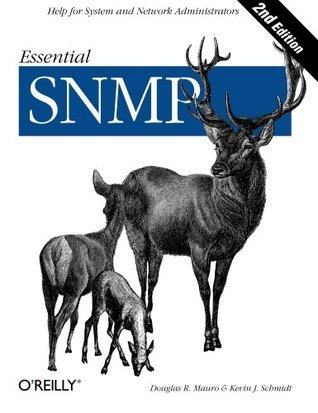

# #469 Essential SNMP

Book notes - Essential SNMP by Douglas R. Mauro, Kevin J. Schmidt, Kevin Schmidt.
First published July 18, 2001. 2nd Edition October 25, 2005.

## Notes

[](https://amzn.to/4bc1YaX)

### Table of Contents

* 1: Introduction to SNMP and Network Management
    * 1.2: The Concept of Network Management
    * 1.3: Applying the Concepts of Network Management
    * 1.4: Change Management
    * 1.5: Getting More Information
* 2: SNMPV1 and SNMPv2
    * 2.2: SNMP Communities
    * 2.3: The Structure of Management Information
    * 2.4: Extensions to the SMI in Version 2
    * 2.5: A Closer Look at MIB-II
    * 2.6: SNMP Operations
    * 2.7: Host Management Revisited
    * 2.8: Remote Monitoring Revisited
    * 2.9: Reverse Engineering SNMP
* 3: SNMPv3
    * 3.2: USM
    * 3.3: VACM
    * 3.4: SNMPV3 in the Real World
* 4: NMS Architectures
    * 4.2: NMS Architectures
    * 4.3: A Look Ahead
* 5: Configuring Your NMS
    * 5.2: Castle Rock's SNMPc Enterprise Edition
* 6: Configuring SNMP Agents
    * 6.2: Security Concerns
    * 6.3: Agent Configuration Walkthroughs
* 7: Polling and Setting
    * 7.2: Retrieving Multiple MIB Values
    * 7.3: Setting a MIB Value
    * 7.4: Error Responses
* 8: Polling and Thresholds
    * 8.2: External Polling
* 9: Traps
    * 9.2: Receiving Traps
    * 9.3: Sending Traps
* 10: Extensible SNMP Agents
    * 10.2: SystemEDGE
    * 10.3: OpenView's Extensible Agent
* 11: Adapting SNMP to Fit Your Environment
    * 11.2: Who's Logging into My Machine? (I-Am-In)
    * 11.3: Throw Core
    * 11.4: Veritas Disk Check
    * 11.5: Disk-Space Checker
    * 11.6: Port Monitor
    * 11.7: Service Monitoring
    * 11.8: Pinging with Cisco
    * 11.9: Simple SNMP Agent
    * 11.10: Switch Port Control
    * 11.11: Wireless Networking
    * 11.12: SNMP: The Object-Oriented Way
    * 11.13: Final Words
* 12: MRTG
    * 12.2: Viewing Graphs
    * 12.3: Graphing Other Objects
    * 12.4: Other Data-Gathering Applications
    * 12.5: Pitfalls
    * 12.6: Getting Help
* 13: RRDtool and Cricket
    * 13.2: Cricket
* 14: Java and SNMP
    * 14.2: SNMP getnext
    * 14.3: SNMP set
    * 14.4: Sending Traps and Informs
    * 14.5: Receiving Traps and Informs
    * 14.6: Resources
* A: Using Input and Output Octets
* B: More on OpenView's NNM
    * B.2: Adding a Menu to NNM
    * B.3: Profiles for Different Users
    * B.4: Using NNM for Communications
* C: Net-SNMP Tools
    * C.2: Common Command-Line Arguments
    * C.3: Net-SNMP Command-Line Tools
* D: SNMP RFCs
    * D.2: SMIv2 Data Definition Language
    * D.3: SNMPv3 Protocol
    * D.4: SNMP Agent Extensibility
    * D.5: SMIv1 MIB Modules
    * D.6: SMIv2 MIB Modules
    * D.7: IANA-Maintained MIB Modules
    * D.8: Related Documents
* E: SNMP Support for Perl
    * E.2: Net-SNMP
* F: Network Management Software
    * F.2: NMS Suites
    * F.3: Element Managers (Vendor-Specific Management)
    * F.4: Trend Analysis
    * F.5: Supporting Software
* G: Open Source Monitoring Software
    * G-2: Nagios
    * G-3: JFFNMS
    * G-4: OpenNMS
    * G-5: NINO
* H: Network Troubleshooting Primer
    * H-2: ipconfig and ifconfig
    * H-3: arp
    * H-4: netstat
    * H-5: traceroute and tracert
    * H-6: nslookup and dig
    * H-7: whois
    * H-8: Ethereal

### Source Code

Example sources are maintained on <https://resources.oreilly.com/examples/9780596008406/>
The git repo actually contains a zipped archive of the sources.
I've extracted locally to a folder called `example_source_v2` as follows:

```sh
git clone https://resources.oreilly.com/examples/9780596008406/
mkdir ./example_source_v2
tar zxvf 9780596008406/esnmp2-examples.tar.gz  -C ././example_source_v2
rm -fR 9780596008406
```

## Credits and References

* Essential SNMP, 2nd Edition
    * [amazon](https://amzn.to/4bc1YaX)
    * [goodreads](https://www.goodreads.com/book/show/1508489.Essential_SNMP)
    * [O'Reilly](https://www.oreilly.com/library/view/essential-snmp-2nd/0596008406/)
    * [example source](https://resources.oreilly.com/examples/9780596008406/)
* Essential SNMP, 1st Edition
    * [example source](https://resources.oreilly.com/examples/9780596000202/)
