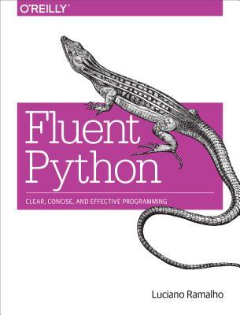

# #xxx Fluent Python

Book Notes - Fluent Python: Clear, Concise, and Effective Programming by Luciano Ramalho.
First published January 25, 2015.

## Notes

[](https://amzn.to/46UJ7Pc)

### Contents

* I. Prologue
    * 1 The Python Data Model
* II. Data Structures
    * 2 An Array of Sequences
    * 3 Dictionaries and Sets
    * 4 Text versus Bytes
* III. Functions as Objects
    * 5 First-Class Functions
    * 6 Design Patterns with First-Class Functions
    * 7 Function Decorators and Closures
* IV. Object-Oriented Idioms
    * 8 Object References, Mutability, and Recycling
    * 9 A Pythonic Object
    * 10 Sequence Hacking, Hashing, and Slicing
    * 11 Interfaces: From Protocols to ABCs
    * 12 Inheritance: For Good or For Worse
    * 13 Operator Overloading: Doing It Right
* V. Control Flow
    * 14 Iterables, Iterators, and Generators
    * 15 Context Managers and else Blocks
    * 16 Coroutines
    * 17 Concurrency with Futures
    * 18 Concurrency with asyncio
* VI. Metaprogramming
    * 19 Dynamic Attributes and Properties
    * 20 Attribute Descriptors
    * 21 Class Metaprogramming
* Afterword
* A. Support Scripts
* Python Jargon

### Getting the Example Source

```sh
git clone https://github.com/fluentpython/example-code example_source_v1
git clone https://github.com/fluentpython/example-code-2e example_source_v2
```

## Credits and References

* Fluent Python, the site
    * <https://www.fluentpython.com/>
    * <https://github.com/fluentpython/book-site>
* Fluent Python
    * [amazon](https://amzn.to/46UJ7Pc)
    * [O'Reilly](https://www.oreilly.com/library/view/fluent-python/9781491946237/)
    * [goodreads](https://www.goodreads.com/book/show/22800567-fluent-python)
    * [examples](https://github.com/fluentpython/example-code)
* Fluent Python, 2nd Edition
    * [O'Reilly](https://www.oreilly.com/library/view/fluent-python-2nd/9781492056348/)
    * [examples](https://github.com/fluentpython/example-code-2e)
