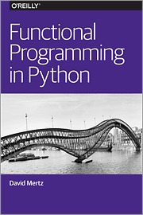
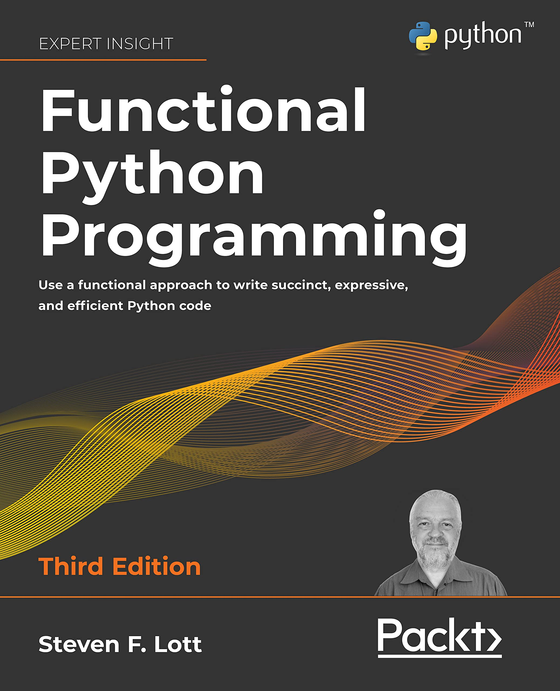

# #xxx Functional Programming in Python

Book notes - Functional Programming in Python by David Mertz. An O'Reilly report published May 1, 2015.

## Notes

Functional Programming in Python
is an O'Reilly report published in 2015.

### Contents

* (Avoiding) Flow Control
    * Encapsulation
    * Comprehensions
    * Recursion
    * Eliminating Loops
* Callables
    * Named Functions and Lambdas
    * Closures and Callable Instances
    * Methods of Classes
    * Multiple Dispatch
* Lazy Evaluation
    * The Iterator Protocol
    * Module: itertools
* Higher-Order Functions
    * Utility Higher-Order Functions
    * The operator Module
    * The functools Module
    * Decorators

## Functional Python Programming

For a full text, see for example
[Functional Python Programming, 3rd Edition, by Steven F. Lott](https://amzn.to/4hEakL8).

## Credits and References

* Functional Programming in Python, O'Reilly report, by David Mertz
    * [O'Reilly](https://www.oreilly.com/library/view/functional-programming-in/9781492048633/)
    * [goodreads](https://www.goodreads.com/book/show/25977827-functional-programming-in-python)
* Functional Python Programming, 3rd Edition, by Steven F. Lott
    * [amazon](https://amzn.to/4hEakL8)
    * [O'Reilly](https://www.oreilly.com/library/view/functional-python-programming/9781803232577/)
    * [goodreads](https://www.goodreads.com/book/show/75041363)
