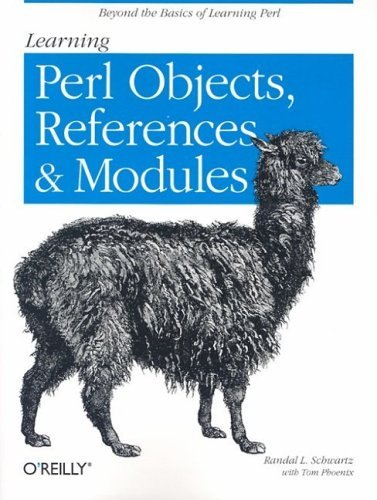

# #450 Learning Perl Objects, References, and Modules

Book notes - Learning Perl Objects, References, and Modules by Randal L. Schwartz, Tom Phoenix.
First published June 9, 2003.

## Notes

[](https://amzn.to/3OFiZT0)

### Contents

1. Introduction
2. Building Larger Programs
3. Introduction to References
4. References and Scoping
5. Manipulating Complex Data Structures
6. Subroutine References
7. Practical Reference Tricks
8. Introduction to Objects
9. Objects with Data
10. Object Destruction
11. Some Advanced Object Topics
12. Using Modules
13. Writing a Distribution
14. Essential Testing
15. Contributing to CPAN

### Source Code

Example sources are maintained at <https://resources.oreilly.com/examples/9780596004781/>.
Cloning the repo to an `example_source` folder:

```sh
git clone https://resources.oreilly.com/examples/9780596004781 example_source
```

## Credits and References

* Learning Perl Objects, References, and Modules
    * [amazon](https://amzn.to/3OFiZT0)
    * [goodreads](https://www.goodreads.com/book/show/86380.Perl_Hacks)
    * [O'Reilly](https://www.oreilly.com/library/view/learning-perl-objects/0596004788/)
    * [source code](https://resources.oreilly.com/examples/9780596004781/)
