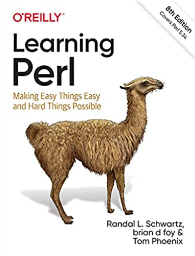

# #439 Learning Perl

Book notes - Learning Perl: Making Easy Things Easy and Hard Things Possible by Randal L. Schwartz, Brian D. Foy, Tom Phoenix.
First published November 1, 1993. Most recently published as an Eighth edition in 2021.

## Notes

Learning Perl, also known as the llama book, is a tutorial book for the Perl programming language, and is published by O'Reilly Media. The first edition (1993) was authored solely by Randal L. Schwartz, and covered Perl 4. All subsequent editions have covered Perl 5.

I first read it in its second edition (1997). As of 2026, the book is in its [eighth edition (2021)](https://www.learning-perl.com/2020/09/learning-perl-8th-edition/).

[](https://amzn.to/4cgUNiV)

### Contents - Second Edition

* Chapter 1: Introduction
* Chapter 2: Scalar Data
* Chapter 3: Arrays and List Data
* Chapter 4: Control Structures
* Chapter 5: Hashes
* Chapter 6: Basic I/O
* Chapter 7: Regular Expressions
* Chapter 8: Functions
* Chapter 9: Miscellaneous Control Structures
* Chapter 10: Filehandles and File Tests
* Chapter 11: Formats
* Chapter 12: Directory Access
* Chapter 13: File and Directory Manipulation
* Chapter 14: Process Management
* Chapter 15: Other Data Transformation
* Chapter 16: System Database Access
* Chapter 17: User Database Manipulation
* Chapter 18: Converting Other Languages to Perl
* Chapter 19: CGI Programming
* Appendix A: Exercise Answers
* Appendix B: Libraries and Modules
* Appendix C: Networking Clients
* Appendix D: Topics We Didn't Mention

### Source Code - Seventh Edition

Example sources are maintained on [GitHub](https://github.com/briandfoy/Learning-Perl-Sample-Files).
They were last updated for the 7th edition
Cloning to an `example_source_v7` folder:

```sh
git clone https://github.com/briandfoy/Learning-Perl-Sample-Files example_source_v7
```

### Source Code - Second Edition

Example sources are maintained at <https://resources.oreilly.com/examples/9781565922846/>.
Cloning to an `example_source_v2` folder:

```sh
git clone https://resources.oreilly.com/examples/9781565922846 example_source_v2
```

## Credits and References

* <https://www.learning-perl.com/>
* <https://en.wikipedia.org/wiki/Learning_Perl>
* Learning Perl - Eighth Edition
    * [amazon](https://amzn.to/4cgUNiV)
    * [goodreads](https://www.goodreads.com/book/show/58153486-learning-perl)
    * [O'Reilly](https://www.oreilly.com/library/view/learning-perl-8th/9781492094944/)
* Learning Perl - Seventh Edition
    * <https://github.com/briandfoy/Learning-Perl-Sample-Files> - sources
* Learning Perl - Second Edition
    * [O'Reilly](https://www.oreilly.com/library/view/learning-perl-second/1565922840/)
    * <https://resources.oreilly.com/examples/9781565922846/> - sources
