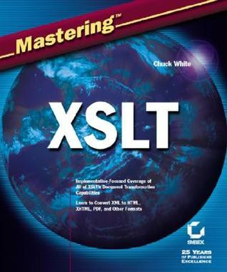

# #xxx Mastering XSLT

Book notes - Mastering XSLT, by Chuck White.
First published January 1, 2002

## Notes

[](https://amzn.to/3NpIoiT)

### Contents

* Introduction.
* Part 1: The Basics of XSLT.
    * Chapter 1: XSLT’s Role.
    * Chapter 2: Stylesheet Structures.
    * Chapter 3: XSLT Templates.
    * Chapter 4: The XSLT Data Model.
    * Chapter 5: Expressions.
    * Chapter 6: Variables and Parameters in XSLT.
    * Chapter 7: Functions.
* Part 2: Processing Techniques.
    * Chapter 8: Managing Output.
    * Chapter 9: Looping, Iteration, and Conditionals.
    * Chapter 10: Grouping and Indexing.
    * Chapter 11: Managing Multiple Documents and Modularization.
    * Chapter 12: Sorting and Numbering.
    * Chapter 13: Generating Documentation and Comments.
    * Chapter 14: XSLT Extensions.
    * Chapter 15: Fallback in XSLT.
* Part 3: Generating HTML Files.
    * Chapter 16: Generating HTML.
    * Chapter 17: Generating Tables.
    * Chapter 18: Working with Forms.
    * Chapter 19: HTML: Special Considerations.
* Part 4: Special Outputting Issues.
    * Chapter 20: Outputting Strings and Special Characters.
    * Chapter 21: Math.
    * Chapter 22: Outputting SVG Using XSLT.
    * Chapter 23: Generating RTF and Other Non-XML Markup.
* Appendices.
    * Appendix A: XPath.
    * Appendix B: XML/XSL Resources.
    * Appendix C: An Introduction to Functional Programming with XSLT.
    * Bonus Appendix D: Finding and Using XSLT Tools
    * Bonus Appendix E: XSLT Functions
    * Bonus Appendix F: XSLT Code Library: Basic Code and Templates
    * Bonus Appendix G: XSLT Elements and Attributes
    * Bonus Appendix H: The Functional Programming Language XSLT: A Proof Through
* Index

### Source Code

Example sources are available from [Wiley](https://www.wiley.com/en-us/Mastering+XSLT-p-9780782140941)
at
<https://media.wiley.com/product_ancillary/47/07821409/DOWNLOAD/4094AllCodeFiles.zip>.

Extracting to an `example_source` folder:

```sh
mkdir example_source
cd example_source
wget https://media.wiley.com/product_ancillary/47/07821409/DOWNLOAD/4094AllCodeFiles.zip
unzip 4094AllCodeFiles.zip
rm 4094AllCodeFiles.zip
for i in *.zip; do unzip $i -d $(basename $i .zip) ; done
for i in *.ZIP; do unzip $i -d $(basename $i .ZIP) ; done
rm *.ZIP *.zip
```

There is a mirror of the examples at <https://github.com/mastering-xslt/examples>

## Credits and References

* Mastering XSLT
    * [amazon](https://amzn.to/3NpIoiT)
    * [goodreads](https://www.goodreads.com/book/show/539206.Mastering_XSLT)
    * [Wiley](https://www.wiley.com/en-us/Mastering+XSLT-p-9780782140941)
    * <https://github.com/mastering-xslt/examples> - mirror of the examples
