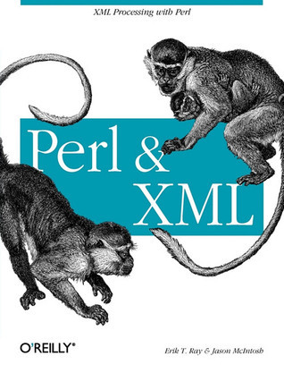

# #446 Perl and XML

Book notes - Perl and XML: XML Processing with Perl by Erik T. Ray, Jason McIntosh.
First published January 1, 2002.

## Notes

I leaned heavily on this book when facing some challenges using Perl to glue together
some integrations back the day when XML was all the rage i.e. before JSON.

[](https://amzn.to/3Ok2Sdu)

From the book description:

### Contents

1. Perl and XML
2. An XML Recap
3. XML Basics: Reading and Writing
4. Event Streams
5. SAX
6. Tree Processing
7. DOM
8. Beyond Trees: XPath, XSLT, and More
9. RSS, SOAP, and Other XML Applications
10. Coding Strategies

### Source Code

Example sources are maintained at <https://resources.oreilly.com/examples/9780596002053/>.
The repo contains a zipped version of the sources, so I uncompress them to an `example_source` folder
after cloning the repo:

```sh
git clone https://resources.oreilly.com/examples/9780596002053 example_source_repo
mkdir example_source
tar -zxvf example_source_repo/perl_testing_adn_examples.tar.gz -C ./example_source
```

## Credits and References

* Perl and XML: XML Processing with Perl
    * [amazon](https://amzn.to/3Ok2Sdu)
    * [goodreads](https://www.goodreads.com/book/show/769148.Perl_and_XML)
    * [O'Reilly](https://www.oreilly.com/library/view/perl-and-xml/059600205X/)
    * [source code](https://resources.oreilly.com/examples/9780596002053/)
