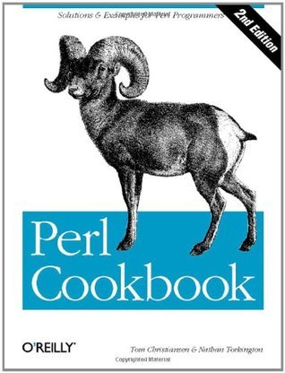

# #443 Perl Cookbook

Book notes - Perl Cookbook, by Tom Christiansen, Nathan Torkington.
First published August 1, 1998. Latest second edition, 2003.

## Notes

[](https://amzn.to/4cRiFsv)

### Contents

1. Strings
2. Numbers
3. Dates and Times
4. Arrays
5. Hashes
6. Pattern Matching
7. File Access
8. File Contents
9. Directories
10. Subroutines
11. References and Records
12. Packages, Libraries, and Modules
13. Classes, Objects, and Ties
14. Database Access
15. Interactivity
16. Process Management and Communication
17. Sockets
18. Internet Services
19. CGI Programming
20. Web Automation
21. mod_perl
22. XML

### Source Code

Example sources are maintained at <https://resources.oreilly.com/examples/9780596003135/>.
Cloning to an `example_source` folder:

```sh
git clone https://resources.oreilly.com/examples/9780596003135 example_source
```

## Credits and References

* Perl Cookbook, Second Edition
    * [amazon](https://amzn.to/4cRiFsv)
    * [goodreads](https://www.goodreads.com/book/show/209275.Perl_Cookbook)
    * [O'Reilly](https://www.oreilly.com/library/view/perl-cookbook-2nd/0596003137/)
    * [source code](https://resources.oreilly.com/examples/9780596003135/)
