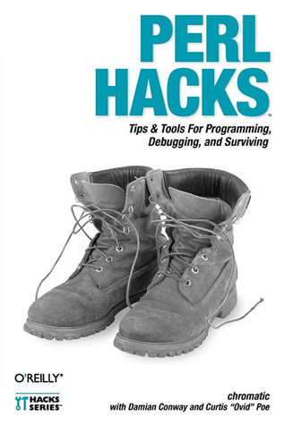

# #449 Perl Hacks

Book notes - Perl Hacks: Tips & Tools for Programming, Debugging, and Surviving by Shane Warden, Damian Conway, Curtis "Ovid" Poe.
First published January 1, 2006.

## Notes

[](https://amzn.to/4sWI8GU)

### Contents

* 1 Productivity Hacks
    * Hack #2. Put Perldoc to Work
    * Hack #3. Browse Perl Docs Online
    * Hack #4. Make the Most of Shell Aliases
    * Hack #5. Autocomplete Perl Identifiers in Vim
    * Hack #6. Use the Best Emacs Mode for Perl
    * Hack #7. Enforce Local Style
    * Hack #8. Don't Save Bad Perl
    * Hack #9. Automate Checkin Code Reviews
    * Hack #10. Run Tests from Within Vim
    * Hack #11. Run Perl from Emacs
* 2 User Interaction
    * Hack #13. Interact Correctly on the Command Line
    * Hack #14. Simplify Your Terminal Interactions
    * Hack #15. Alert Your Mac
    * Hack #16. Interactive Graphical Apps
    * Hack #17. Collect Configuration Information
    * Hack #18. Rewrite the Web
* 3 Data Munging
    * Hack #20. Read Files Backwards
    * Hack #21. Use Any Spreadsheet As a Data Source
    * Hack #22. Factor Out Database Code
    * Hack #23. Build a SQL Library
    * Hack #24. Query Databases Dynamically Without SQL
    * Hack #25. Bind Database Columns
    * Hack #26. Iterate and Generate Expensive Data
    * Hack #27. Pull Multiple Values from an Iterator
* 4 Working with Modules
    * Hack #29. Manage Module Paths
    * Hack #30. Reload Modified Modules
    * Hack #31. Create Personal Module Bundles
    * Hack #32. Manage Module Installations
    * Hack #33. Presolve Module Paths
    * Hack #34. Create a Standard Module Toolkit
    * Hack #35. Write Demos from Tutorials
    * Hack #36. Replace Bad Code from the Outside
    * Hack #37. Drink to the CPAN
    * Hack #38. Improve Exceptional Conditions
    * Hack #39. Search CPAN Modules Locally
    * Hack #40. Package Standalone Perl Applications
    * Hack #41. Create Your Own Lexical Warnings
    * Hack #42. Find and Report Module Bugs
* 5 Object Hacks
    * Hack #44. Serialize Objects (Mostly) for Free
    * Hack #45. Add Information with Attributes
    * Hack #46. Make Methods Really Private
    * Hack #47. Autodeclare Method Arguments
    * Hack #48. Control Access to Remote Objects
    * Hack #49. Make Your Objects Truly Polymorphic
    * Hack #50. Autogenerate Your Accessors
* 6 Debugging
    * Hack #52. Make Invisible Characters Apparent
    * Hack #53. Debug with Test Cases
    * Hack #54. Debug with Comments
    * Hack #55. Show Source Code on Errors
    * Hack #56. Deparse Anonymous Functions
    * Hack #57. Name Your Anonymous Subroutines
    * Hack #58. Find a Subroutine's Source
    * Hack #59. Customize the Debugger
* 7 Developer Tricks
    * Hack #61. Test with Specifications
    * Hack #02. Segregate Developer and User Tests
    * Hack #63. Run Tests Automatically
    * Hack #64. See Test Failure Diagnostics - in Color!
    * Hack #65. Test Live Code
    * Hack #66. Cheat on Benchmarks
    * Hack #67. Build Your Own Perl
    * Hack #68. Run Test Suites Persistently
    * Hack #69. Simulate Hostile Environments in Your Tests
* 8 Know Thy Code
    * Hack #71. Inspect Your Data Structures
    * Hack #72. Find Functions Safely
    * Hack #73. Know What's Core and When
    * Hack #74. Trace All Used Modules
    * Hack #75. Find All Symbols in a Package
    * Hack #76. Peek Inside Closures
    * Hack #77. Find All Global Variables
    * Hack #78. Introspect Your Subroutines
    * Hack #79. Find Imported Functions
    * Hack #80. Profile Your Program Size
    * Hack #81. Reuse Perl Processes
    * Hack #82. Trace Your Ops
    * Hack #83. Write Your Own Warnings
* 9 Expand Your Perl Foo
    * Hack #85. Replace Soft References with Real Ones
    * Hack #86. Optimize Away the Annoying Stuff
    * Hack #87. Lock Down Your Hashes
    * Hack #88. Clean Up at the End of a Scope
    * Hack #89. Invoke Functions in Odd Ways
    * Hack #90. Glob Those Sequences
    * Hack #91. Write Less Error-Checking Code
    * Hack #92. Return Smarter Values
    * Hack #93. Return Active Values
    * Hack #94. Add Your Own Perl Syntax
    * Hack #95. Modify Semantics with a Source Filter
    * Hack #96. Use Shared Libraries Without XS
    * Hack #97. Run Two Services on a Single TCP Port
    * Hack #98. Improve Your Dispatch Tables
    * Hack #99. Track Your Approximations
    * Hack #100. Overload Your Operators
    * Hack #101. Learn from Obfuscations

### Source Code

Example sources are maintained at <https://resources.oreilly.com/examples/9780596526740/>.
The repo contains a zipped version of the sources, so I uncompress them to an `example_source` folder
after cloning the repo:

```sh
git clone https://resources.oreilly.com/examples/9780596526740 example_source_repo
mkdir example_source
tar -zxvf example_source_repo/perl_hacks_examples.tar.gz -C ./example_source
```

## Credits and References

* Perl Hacks
    * [amazon](https://amzn.to/4sWI8GU)
    * [goodreads](https://www.goodreads.com/book/show/86380.Perl_Hacks)
    * [O'Reilly](https://www.oreilly.com/library/view/perl-hacks/0596526741/)
    * [source code](https://resources.oreilly.com/examples/9780596526740/)
