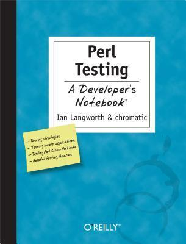

# #445 Perl Testing

Book notes - Perl Testing: A Developer's Notebook by Ian Langworth, chromatic.
First published January 1, 2005.

## Notes

I returned to Perl after being thoroughly test-infected by the Ruby community.
When I went searching for equivalent tools for Perl, this is the book that gave me the jump-start into making sure my
Perl was not just canonical, but well tested!

[](https://amzn.to/48gCbwX)

From the book description:

> Perl has a strong history of automated tests. A very early release of Perl 1.0 included a comprehensive test suite, and it's only improved from there. Learning how Perl's test tools work and how to put them together to solve all sorts of previously intractable problems can make you a better programmer in general. Besides, it's easy to use the Perl tools described to handle all sorts of testing problems that you may encounter, even in other languages.
>
> Perl Testing: A Developer's Notebook will help you dive right in and:
>
> * Write basic Perl tests with ease and interpret the results
> * Apply special techniques and modules to improve your tests
> * Bundle test suites along with projects
> * Test databases and their data
> * Test websites and web projects
> * Use the "Test Anything Protocol" which tests projects written in languages other than Perl

### Contents

* 1: Beginning Testing
    * See: [LCK#454 Test::Simple](../../perl/test-simple/)
* 2: Writing Tests
* 3: Managing Tests
* 4: Distributing Your Tests (and Code)
* 5: Testing Untestable Code
* 6: Testing Databases
* 7: Testing Web Sites
* 8: Unit Testing with Test:: Class
* 9: Testing Everything Else

### Source Code

Example sources are maintained at <https://resources.oreilly.com/examples/9780596100926/>.
The repo contains a zipped version of the sources, so I uncompress them to an `example_source` folder
after cloning the repo:

```sh
git clone https://resources.oreilly.com/examples/9780596100926 example_source_repo
mkdir example_source
tar -zxvf example_source_repo/perl_testing_adn_examples.tar.gz -C ./example_source
```

## Credits and References

* Perl Testing: A Developer's Notebook
    * [amazon](https://amzn.to/48gCbwX)
    * [goodreads](https://www.goodreads.com/book/show/16607842-perl-testing)
    * [O'Reilly](https://www.oreilly.com/library/view/perl-testing-a/0596100922/)
    * [source code](https://resources.oreilly.com/examples/9780596100926/)
