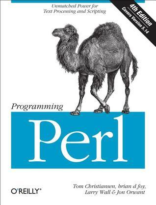

# #440 Programming Perl

Book notes - Programming Perl: Unmatched power for text processing and scripting
by Tom Christiansen, Brian D Foy, Larry Wall, Jon Orwant.
First published January 1, 1991. Latest 4th edition in 2012.

## Notes

Programming Perl, best known as the Camel Book among programmers, is a book about writing programs using the Perl programming language, revised as several editions (1991–2012) to reflect major language changes since Perl version 4.

I first read it in its second edition (1996). As of 2026, the book is in its 4th edition (2012).

[](https://amzn.to/4stdLHG)

### Contents - Second Edition

* Chapter 1: An Overview of Perl
* Chapter 2: The Gory Details
* Chapter 3: Functions
* Chapter 4: References and Nested Data Structures
* Chapter 5: Packages, Modules, and Object Classes
* Chapter 6: Social Engineering
* Chapter 7: The Standard Perl Library
* Chapter 8: Other Oddments
* Chapter 9: Diagnostic Messages

### Source Code - 4th Edition

Example sources are maintained at <https://resources.oreilly.com/examples/9780596004927/>.
Cloning to an `example_source_v4` folder:

```sh
git clone https://resources.oreilly.com/examples/9780596004927 example_source_v4
```

### Source Code - 2nd Edition

Example sources are maintained at <https://resources.oreilly.com/examples/9781565921498/>.
Cloning to an `example_source_v2` folder:

```sh
git clone https://resources.oreilly.com/examples/9781565921498 example_source_v2
```

## Credits and References

* <https://www.programmingperl.org/>
* <https://en.wikipedia.org/wiki/Programming_Perl>
* Programming Perl - 4th Edition
    * [amazon](https://amzn.to/4stdLHG)
    * [goodreads](https://www.goodreads.com/book/show/11505157-programming-perl)
    * [O'Reilly](https://www.oreilly.com/library/view/programming-perl-4th/9781449321451/)
    * <https://resources.oreilly.com/examples/9780596004927> - sources
* Programming Perl - 2nd Edition
    * <https://resources.oreilly.com/examples/9781565921498/> - sources
