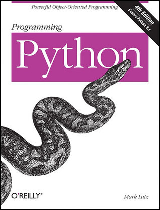

# #484 Programming Python

Book Notes - Programming Python: Powerful Object-Oriented Programming, 4th Edition, by Mark Lutz.
First published January 1, 1996. 4th Edition 2011.

## Notes

[](https://amzn.to/4xRz3RY)

### Contents

* I. The Beginning
    * 1 A Sneak Preview
* II. System Programming
    * 2 System Tools
    * 3 Script Execution Context
    * 4 File and Directory Tools
    * 5 Parallel System Tools
    * 6 Complete System Programs
* III. GUl Programming
    * 7 Graphical User Interfaces
    * 8 A tkinter Tour, Part 1
    * 9 A tkinter Tour, Part 2
    * 10 GUI Coding Techniques
    * 11 Complete GUl Programs
* IV. Internet Programming
    * 12 Network Scripting
    * 13 Client-Side Scripting
    * 14 The PyMailGUI Client
    * 15 Server-Side Scripting
    * 16 The PyMailCG| Server
* V. Tools and Techniques
    * 17 Databases and Persistence
    * 18 Data Structures
    * 19 Text and Language
    * 20 Python/C Integration
* VI. The End
    * 21 Conclusion: Python and the Development Cycle

### Getting the Example Source

```sh
git clone https://resources.oreilly.com/examples/9780596158118 example_source
```

## Credits and References

* Programming Python: Powerful Object-Oriented Programming, 4th Edition
    * [amazon](https://amzn.to/4xRz3RY)
    * [O'Reilly](https://www.oreilly.com/library/view/programming-python-4th/9781449398712/)
    * [goodreads](https://www.goodreads.com/book/show/8941077-programming-python)
    * [examples](https://resources.oreilly.com/examples/9780596158118)
