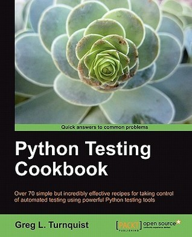

# #464 Python Testing Cookbook

Book notes - Python Testing Cookbook, by Greg L. Turnquist.
First published May 14, 2011.

## Notes

The first edition of the book was written in the Python 2.6 era.
A second edition was published in 2018 but I have not read it and it appears to have been abandoned by the author and publisher.

### Contents

* Chapter 1: Using Unittest To Develop Basic Tests
    * Introduction
    * Asserting the basics
    * Setting up and tearing down a test harness
    * Running test cases from the command line with increased verbosity Running a subset of test case methods
    * Chaining together a suite of tests
    * Defining test suites inside the test module
    * Retooling old test code to run inside unittest
    * Breaking down obscure tests into simple ones
    * Testing the edges
    * Testing corner cases by iteration
* Chapter 2: Running Automated Test Suites with Nose
    * Introduction
    * Getting nosy with testing
    * Embedding nose inside Python
    * Writing a nose extension to pick tests based on regular expressions
    * Writing a nose extension to generate a CSV report
    * Writing a project-level script that lets you run different test suites
* Chapter 3: Creating Testable Documentation with doctest
    * Introduction
    * Documenting the basics
    * Catching stack traces
    * Running doctests from the command line
    * Coding a test harness for doctest
    * Filtering out test noise
    * Printing out all your documentation including a status report
    * Testing the edges
    * Testing corner cases by iteration
    * Getting nosy with doctest
    * Updating the project-level script to run this chapter's doctests
* Chapter 4: Testing Customer Stories with Behavior Driven Development
    * Introduction
    * Naming tests that sound like sentences and stories
    * Testing separate doctest documents Writing a testable story with doctest Writing a testable novel with doctest Writing a testable story with Voidspace
    * Mock and nose
    * Writing a testable story with mockito and nose
    * Writing a testable story with Lettuce
    * Using Should DSL to write succinct assertions with Lettuce Updating the project-level script to run this chapter's BDD tests
* Chapter 5: High Level Customer Scenarios with Acceptance Testing
    * Introduction
    * Installing Pyccuracy
    * Testing the basics with Pyccuracy Using Pyccuracy to verify web app security
    * Installing the Robot Framework
    * Creating a data-driven test suite with Robot Writing a testable story with Robot
    * Tagging Robot tests and running a subset
    * Testing web basics with Robot Using Robot to verify web app security
    * Creating a project-level script to verify this chapter's acceptance tests
* Chapter 6: Integrating Automated Tests with Continuous Integration
    * Introduction
    * Generating a continuous integration report for Jenkins using NoseXUnit Configuring Jenkins to run Python tests upon commit
    * Configuring Jenkins to run Python tests when scheduled Generating a CI report for TeamCity using teamcity-nose Configuring TeamCity to run Python tests upon commit
    * Configuring TeamCity to run Python tests when scheduled
* Chapter 7: Measuring your Success with Test Coverage
    * Introduction
    * Building a network management application
    * Installing and running coverage on your test suite
    * Generating an HTML report using coverage
    * Generating an XML report using coverage
    * Getting nosy with coverage
    * Filtering out test noise from coverage
    * Letting Jenkins get nosy with coverage
    * Updating the project-level script to provide coverage reports
* Chapter 8: Smoke/Load Testing-Testing Major Parts
    * Introduction
    * Defining a subset of test cases using import statements
    * Leaving out integration tests
    * Targeting end-to-end scenarios
    * Targeting the test server Coding a data simulator
    * Recording and playing back live data in real time
    * Recording and playing back live data as fast as possible
    * Automating your management demo
* Chapter 9: Good Test Habits for New and Legacy Systems
    * Introduction
    * Something is better than nothing
    * Coverage isn't everything
    * Be willing to invest in test fixtures
    * If you aren't convinced on the value of testing, your team won't be either
    * Harvesting metrics
    * Capturing a bug in an automated test Separating algorithms from concurrency
    * Pause to refactor when test suite takes too long to run Cash in on your confidence
    * Be willing to throw away an entire day of changes
    * Instead of shooting for 100 percent coverage, try to have a steady growth Randomly breaking your app can lead to better code

### Source Code - First Edition

See [examples_v1](./examples_v1/).

## Credits and References

* Python Testing Cookbook, 1st Edition
    * [amazon](https://amzn.to/43w8025)
    * [goodreads](https://www.goodreads.com/book/show/11803506-python-testing-cookbook)
