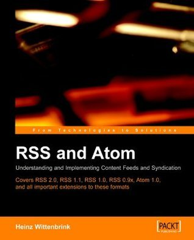

# #428 RSS and Atom

Book notes - RSS and Atom: Understanding and Implementing Content Feeds and Syndication, by Heinz Wittenbrink.
First published January 1, 2005.

## Notes

I remember using this book as a pretty good reference to figure out ATOM and RSS syntax.
Seems long out of circulation, though sources are still available.

[](https://amzn.to/4cMe6RP)

### Contents

* Introduction
* Chapter 1: What are Newsfeeds?
    * 1.1 Applications
    * 1.2 Feed-Based Services
    * 1.3 RSS Requirements
    * 1.4 Semantics: The RSS Model
    * 1.4.1 Minimal Information
    * 1.4.2 Other Content and Metadata
    * 1.5 Syntax: RSS as an XML Format
    * 1.6 Feed Formats and other XML Formats
    * 1.7 The Versions of RSS and Atom: Their Evolution and the Future
        * 1.7.1 The Beginnings: MCF, Scripting News, and CDF
        * 1.7.2 RSS 0.91
        * 1.7.3 RSS 1.0
        * 1.7.4 RSS 0.92
        * 1.7.5 RSS 0.93
        * 1.7.6 RSS 2.0
        * 1.7.7 From a Syndication to a Publication Format: Atom, the New Alternative
        * 1.7.8 Which Format for Which Purpose?
* Chapter 2: Really Simple Syndication: RSS 2.0 and Its Predecessors
    * 2.1 Overview
        * 2.1.1 RSS 2.0: Lowest Common Denominator of the Feed Formats
        * 2.1.2 Important New Developments: Podcasting and Further Extensions
        * 2.1.3 Design Principles
    * 2.2 The RSS 2.0 Vocabulary
        * 2.2.1 Basic Structure of an RSS 2.0 Document
        * 2.2.2 Basic Information of an RSS 2.0 Document: title, link, and description
        * 2.2.3 Text or HTML as the Content of title and description
    * 2.3 RSS 2.0 Elements for Rich Metadata
        * 2.3.1 Dates: Time Specifications and Updating
        * 2.3.2 Specification of Persons and Authors
        * 2.3.3 Identification and Description of the Content
        * 2.3.4 Technology
        * 2.3.5 Internationalization
        * 2.3.6 Elements for the Support of Publication and Subscription Tools
        * 2.3.7 Characterization of a Feed with an Image: The image Element Support for the Functions of Aggregators: cloud, ttl, textinput, skipHours and hour, skipDay, and day
    * 2.4 Adding Multimedia Data with enclosure
    * 2.5 The Predecessors of RSS 2.0
        * 2.5.1 RSS 0.91
        * 2.5.2 RSS 0.92
        * 2.5.3 RSS 0.93 and 0.94
        * 2.5.4 Differences Between RSS 2.0 and the Earlier Versions
    * 2.6 Extension Modules
        * 2.6.1 The blogChannel Module
        * 2.6.2 The BitTorrent Module
        * 2.6.3 The creativeCommons Module
        * 2.6.4 The Easy News Topics Module
        * 2.6.5 The OpenSearch Module from Amazon
        * 2.6.6 The RSS Media Module from Yahoo!
        * 2.6.7 Microsoft's Simple List Extensions
        * 2.6.8 The Simple Semantic Resolution Module: RSS 2.0 as RDF
    * 2.7 Aggregation of Feeds and OPML
* Chapter 3: RSS for the Semantic Web: RSS 1.0 and RSS 1.1
    * 3.1 RDF Basics
    * 3.2 The Basic Structure of an RSS 1.0 Document
        * 3.2.1. Namespaces
        * 3.2.2 The Structure of the Document as a Consequence of the RDF Model
    * 3.3 The Core Vocabulary of RSS 1.0
    * 3.3.1 Structure
    * 3.3.2 Descriptive Elements
    * 3.4 Modules for Metadata
    * 3.5 RS$ 1.0 Modules
        * 3.5.1 Dublin Core
        * 3.5.2 Syndication Modules
        * 3.5.3 Content Module
        * 3.5.4 Suggested Modules
    * 3.6 RSS 1.1
        * 3.6.1 Channel as Root Element
* Chapter 4: Atom
    * 4.1 Overview
    * 4.2 The Structure of an Atom Feed
        * 4.2.1 Overview: Atom Elements
        * 4.2.2 The Basic Structure of an Atom Document
        * 4.2.3 Content as a "First-Class Citizen"
        * 4.2.4 The Use of Links in Atom
        * 4.2.5 Other Metadata
    * 4.3 Extensibility
    * 4.4 Publishing with the Atom Publishing Protocol
        * 4.4.1 Design Principles
        * 4.4.2 Entry Documents and Publishing Extensions
        * 4.4.3 Functions of the Atom APIs
        * 4.4.4 Format of Documents in the Communication Between Client and Server
        * 4.4.5 How to Support Specific Functionality of Publishing Systems?
        * 4.4.6 Communication through SOAP
        * 4.4.7 Extensions of the Publishing Protocol
* Appendix A
    * A.1 Reference: XML Namespaces
    * A.2 Outline Processor Markup Language
    * A.3 Overview: RSS 2.0 Elements
    * A.4 Overview: RSS 1.0 Elements
    * A.5 RSS 1.0 Modules
    * A.6 Overview: RSS 1.1 Elements
    * A.7 Overview: Atom Elements
    * A.8 Bibliography

### Source Code

Example sources are maintained on <https://resources.oreilly.com/examples/9781904811572/>
Cloning to an `example_source` folder:

```sh
git clone https://resources.oreilly.com/examples/9781904811572/ example_source
```

## Credits and References

* RSS and Atom: Understanding and Implementing Content Feeds and Syndication
    * [amazon](https://amzn.to/4cMe6RP)
    * [goodreads](https://www.goodreads.com/book/show/926313.Rss_and_Atom)
    * [O'Reilly](http://shop.oreilly.com/product/9781904811572.do)
    * [example source](https://resources.oreilly.com/examples/9781904811572/)
