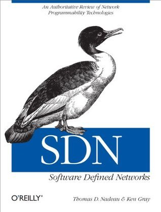

# #467 SDN: Software Defined Networks

Book notes - SDN: Software Defined Networks: An Authoritative Review of Network Programmability Technologies, by Thomas D. Nadeau, Ken Gray.
First published January 1, 2013

## Notes

[](https://amzn.to/4eJoKJw)

### Table of Contents

* 1: Introduction
* 2: Centralized and Distributed Control and Data Plane
    * Introduction
        * Evolution versus Revolution
    * What Do They Do?
        * The Control Plane
        * Data Plane
        * Moving Information Between Planes
        * Why Can Separation Be Important?
    * Distributed Control Planes
        * IP and MPLS
        * Creating the IP Underlay
        * Convergence Time
        * Load Balancing
        * High Availability
        * Creating the MPLS Overlay
        * Replication
    * Centralized Control Planes
        * Logical Versus Literal
        * ATM/LANE
        * Route Servers
    * Conclusions
* 3: OpenFlow
    * Introduction
        * Wire Protocol
        * Replication
        * FAWG (Forwarding Abstraction Workgroup)
        * Config and Extensibility
        * Architecture
    * Hybrid Approaches
        * Ships in the Night
        * Dual Function Switches
    * Conclusions
* 4: SDN Controllers
    * Introduction
    * General Concepts
        * VMware
        * Nicira
        * VMware/Nicira
        * OpenFlow-Related
        * Mininet
        * NOX/POX
        * Trema
        * Ryu
        * Big Switch Networks/Floodlight
    * Layer 3 Centric
        * L3VPN
        * Path Computation Element Server
    * Plexxi
        * Plexxi Affinity
    * Cisco OnePK
        * Relationship to the Idealized SDN Framework
    * Conclusions
* 5: Network Programmability
    * Introduction
    * The Management Interface
        * The Application-Network Divide The Command-Line Interface
        * NETCONF and NETMOD
        * SNMP
    * Modern Programmatic Interfaces
        * Publish and Subscribe Interfaces
        * XMPP
        * Google's Protocol Buffers
        * Thrift
        * JSON
        * I2RS
    * Modern Orchestration
        * OpenStack
        * CloudStack
        * Puppet
        * Conclusions
* 6: Data Center Concepts and Constructs
    * Introduction
    * The Multitenant Data Center
    * The Virtualized Multitenant Data Center
        * Orchestration
        * Connecting a Tenant to the Internet/VPN
        * Virtual Machine Migration and Elasticity
        * Data Center Interconnect (DCI)
        * Fallacies of Data Center Distributed Computing
        * Data Center Distributed Computing Pitfalls to Consider
    * SDN Solutions for the Data Center Network
        * The Network Underlay
    * VLANs
    * EVPN
        * Locator ID Split (LISP)
    * VxLan
    * NVGRE
        * OpenFlow
        * Network Overlays
        * Network Overlay Types
    * Conclusions
* 7: Network Function Virtualization
    * Introduction
    * Virtualization and Data Plane I/O
        * Data Plane I/O
        * I/O Summary
    * Services Engineered Path
    * Service Locations and Chaining
        * Metadata
        * An Application Level Approach
        * Scale
    * NFV at ETSI
    * Non-ETSI NFV Work
        * Middlebox Studies
        * Embrane/LineRate
        * Platform Virtualization
    * Conclusions
* 8: Network Topology and Topological Information Abstraction
    * Introduction
    * Network Topology
    * Traditional Methods
    * LLDP
    * BGP-TE/LS
        * BGP-LS with PCE
    * ALTO
        * BGP-LS and PCE Interaction with ALTO
    * I2RS Topology
        * Conclusions
* 9: Building an SDN Framework
    * Introduction
    * Build Code First; Ask Questions Later
    * The Juniper SDN Framework
    * IETF SDN Framework(s)
        * SDN(P)
        * ABNO
    * Open Daylight Controller/Framework
        * API
        * High Availability and State Storage
        * Analytics
    * Policy
    * Conclusions
* 10: Use Cases for Bandwidth Scheduling, Manipulation, and Calendaring
    * Introduction
    * Bandwidth Calendaring
        * Base Topology and Fundamental Concepts OpenFlow and PCE Topologies
        * Example Configuration
        * OpenFlow Provisioned Example
        * Enhancing the Controller
        * Overlay Example Using PCE Provisioning
        * Expanding Your Reach: Barbarians at the Gate
    * Big Data and Application Hyper-Virtualization for Instant CSPF
    * Expanding Topology
    * Conclusions
* 11: Use Cases for Data Center Overlays, Big Data, and Network Function Virtualization
    * Introduction
    * Data Center Orchestration
        * Creating Tenant and Virtual Machine State
        * Forwarding State
        * Data-Driven Learning
        * Control-Plane Signaling
        * Scaling and Performance Considerations
    * Puppet (DevOps Solution)
    * Network Function Virtualization (NFV)
        * NFV in Mobility
    * Optimized Big Data
    * Conclusions
* 12: Use Cases for Input Traffic Monitoring, Classification, and Triggered Actions
    * Introduction
    * The Firewall
    * Firewalls as a Service
    * Network Access Control Replacement
    * Extending the Use Case with a Virtual Firewall Feedback and Optimization
    * Intrusion Detection/Threat Mitigation
    * Conclusions
* 13: Final Thoughts and Conclusions
    * What Is True About SDN?
        * Economics
        * SDN Is Really About Operations and Management
    * Multiple Definitions of SDN
    * Are We Making Progress Yet?

### Source Code

Example sources are maintained on <https://resources.oreilly.com/examples/0636920027577/>
Cloning to an `example_source` folder:

```sh
git clone https://resources.oreilly.com/examples/0636920027577/ example_source
```

## Credits and References

* SDN: Software Defined Networks
    * [amazon](https://amzn.to/4eJoKJw)
    * [goodreads](https://www.goodreads.com/book/show/18957515-sdn)
    * [O'Reilly](https://www.oreilly.com/library/view/sdn-software-defined/9781449342425/)
    * [example source](https://resources.oreilly.com/examples/0636920027577/)
