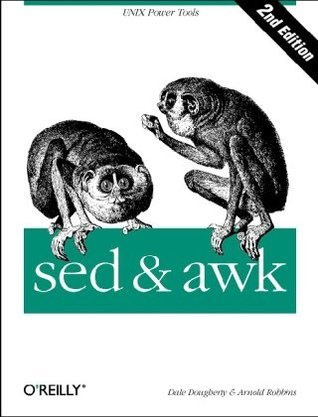

# #461 sed & awk

Book notes - sed & awk 2nd Edition, by Dale Dougherty, Arnold Robbins.
First published November 8, 1990.

## Notes

[](https://amzn.to/4uybk7S)

### Contents

* 1: Power Tools for Editing
    * May You Solve Interesting Problems
    * A Stream Editor
    * A Pattern-Matching Programming Language
    * Four Hurdles to Mastering sed and awk
* 2: Understanding Basic Operations
    * Awk, by Sed and Grep, out of Ed Command-Line Syntax
    * Using sed
    * Using awk
    * Using sed and awk Together
* 3: Understanding Regular Expression Syntax
    * That's an Expression
    * A Line-Up of Characters
    * I Never Metacharacter I Didn't Like
* 4: Writing sed Scripts
    * Applying Commands in a Script
    * A Global Perspective on Addressing
    * Testing and Saving Output
    * Four Types of sed Scripts
    * Getting to the PromiSed Land
* 5: Basic sed Commands
    * About the Syntax of sed Commands
    * Comment
    * Substitution
    * Delete
    * Append, Insert, and Change
    * List
    * Transform
    * Print
    * Print Line Number
    * Next
    * Reading and Writing Files
    * Quit
* 6: Advanced sed Commands
    * Multiline Pattern Space
    * A Case for Study Hold That Line
    * Advanced Flow Control Commands
    * To Join a Phrase
* 7: Writing Scripts for awk
    * Playing the Game
    * Hello, World
    * Awk's Programming Model
    * Pattern Matching
    * Records and Fields
    * Expressions
    * System Variables
    * Relational and Boolean Operators
    * Formatted Printing
    * Passing Parameters Into a Script
    * Information Retrieval
* 8: Conditionals, Loops, and Arrays
    * Conditional Statements
    * Looping
    * Other Statements That Affect Flow Control
    * Arrays
    * An Acronym Processor
    * System Variables That Are Arrays
* 9: Functions
    * Arithmetic Functions
    * String Functions
    * Writing Your Own Functions
* 10: The Bottom Drawer
    * The getline Function The close() Function
    * The system() Function
    * A Menu-Based Command Generator
    * Directing Output to Files and Pipes
    * Generating Columnar Reports
    * Debugging
    * Limitations
    * Invoking awk Using the #! Syntax
* 11: A Flock of awks
    * Original awk
    * Freely Available awks
    * Commercial awks
    * Epilogue
* 12: Full-Featured Applications
    * An Interactive Spelling Checker
    * Generating a Formatted Index
    * Spare Details of the masterindex Program
* A Miscellany of Scripts
    * uutot.awk—Report UUCP Statistics
    * phonebill-Track Phone Usage
    * combine-Extract Multipart uuencoded Binaries
    * mailavg-Check Size of Mailboxes
    * adj—Adjust Lines for Text Files
    * readsource-Format Program Source Files for troff
    * gent-Get a termcap Entry
    * plpr—Ipr Preprocessor
    * transpose—Perform a Matrix Transposition
    * m1-Simple Macro Processor
* A: Quick Reference for sed
* B: Quick Reference for awk
* C: Supplement for Chapter 12

### Source Code

Example sources are maintained on <https://resources.oreilly.com/examples/9781565922259/>
Cloning to an `example_source` folder:

```sh
git clone https://resources.oreilly.com/examples/9781565922259/ example_source
```

## Credits and References

* sed & awk 2nd Edition
    * [amazon](https://amzn.to/4uybk7S)
    * [goodreads](https://www.goodreads.com/book/show/354484.sed_awk)
    * [O'Reilly](https://www.oreilly.com/library/view/sed-awk/1565922255/)
    * [example source](https://resources.oreilly.com/examples/9781565922259/)
