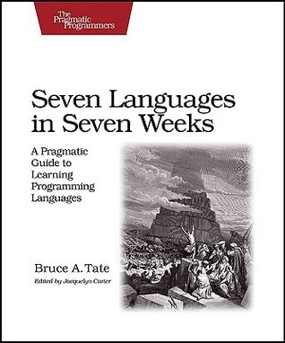

# #378 Seven Languages in Seven Weeks

Book notes - Seven Languages in Seven Weeks: A Pragmatic Guide to Learning Programming Languages, by Bruce A. Tate. First published November 17, 2010.

## Notes

The classic by Bruce Tate. In the early 2000's there was distinct interest in rejecting the idea of a monoculture
.. perhaps on the back of the 90's battles between Microsoft with VB vs. IBM Java trying to convince everyone that there could only be one answer.
It was an enlightened era, where perhaps we would be better served by selecting the language to best suit each specific situation,
rather than choosing one language and trying to use it everywhere.

"Seven Languages in Seven Weeks" aimed to introduce a range of languages:
more than just a "Hello World" in each language; enough to get the true flavor of the language.

[](https://amzn.to/3WXqV2k)

### Contents

* 1 Introduction
    * 1.1 Method to the Madness
    * 1.2 The Languages
    * 1.3 Buy This Book
    * 1.4 Don't Buy This Book
    * 1.5 A Final Charge
* 2 Ruby
    * 2.1 Quick History
    * 2.2 Day 1: Finding a Nanny
    * 2.3 Day 2: Floating Down from the Sky
    * 2.4 Day 3: Serious Change
    * 2.5 Wrapping Up Ruby
* 3 Io
    * 3.1 Introducing Io
    * 3.2 Day 1: Skipping School, Hanging Out
    * 3.3 Day 2: The Sausage King
    * 3.4 Day 3: The Parade and Other Strange Places
    * 3.5 Wrapping Up lo
* 4 Prolog
    * 4.1 About Prolog
    * 4.2 Day 1: An Excellent Driver
    * 4.3 Day 2: Fifteen Minutes to Wapner
    * 4.4 Day 3: Blowing Up Vegas
    * 4.5 Wrapping Up Prolog
* 5 Scala
    * 5.1 About Scala
    * 5.2 Day 1: The Castle on the Hill
    * 5.3 Day 2: Clipping Bushes and Other New Tricks
    * 5.4 Day 3: Cutting Through the Fluff
    * 5.5 Wrapping Up Scala
* 6 Erlang
    * 6.1 Introducing Erlang
    * 6.2 Day 1: Appearing Human
    * 6.3 Day 2: Changing Forms
    * 6.4 Day 3: The Red Pill
    * 6.5 Wrapping Up Erlang
* 7 Clojure
    * 7.1 Introducing Clojure
    * 7.2 Day 1: Training Luke
    * 7.3 Day 2: Yoda and the Force
    * 7.4 Day 3: An Eye for Evil
    * 7.5 Wrapping Up Clojure
* 8 Haskell
    * 8.1 Introducing Haskell
    * 8.2 Day 1: Logical
    * 8.3 Day 2: Spock's Great Strength
    * 8.4 Day 3: The Mind Meld Wrapping Up Haskell
    * 8.5 Wrapping Up Haskell
    * See [LCK#009 About Haskell](../../haskell/about/)
* 9 Wrap-Up
    * 9.1 Programming Models
    * 9.2 Concurrency
    * 9.3 Programming Constructs
    * 9.4 Finding Your Voice

### Source Code

Source code is available from the [Pragmatic Programmers](https://pragprog.com/titles/btlang/seven-languages-in-seven-weeks/) listing.
Getting the sources:

```sh
wget https://media.pragprog.com/titles/btlang/code/btlang-code.zip
unzip btlang-code.zip
rm btlang-code.zip
```

## Credits and References

* Seven Languages in Seven Weeks
    * [amazon](https://amzn.to/3WXqV2k)
    * [goodreads](https://www.goodreads.com/book/show/7912517-seven-languages-in-seven-weeks)
    * [Pragmatic Programmers](https://pragprog.com/titles/btlang/seven-languages-in-seven-weeks/)
* [examples source (zip)](https://media.pragprog.com/titles/btlang/code/btlang-code.zip)
