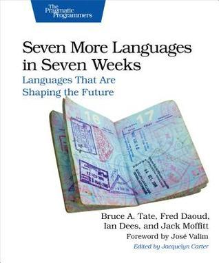

# #379 Seven More Languages in Seven Weeks

Book notes - Seven More Languages in Seven Weeks: Languages That Are Shaping the Future, by Bruce A. Tate, Ian Dees, Frederic Daoud, Jack Moffitt. First published September 25, 2014.

## Notes

The first sequel to the classic by Bruce Tate. Introduces a further set of languages: Lua, Factor, Elm, Elixir, Julia, miniKanren, Idris.

[](https://amzn.to/47qTlXc)

### Contents

* 1 Lua
    * Day 1: The Call to Adventure
    * Day 2: Tables All the Way Down
    * Day 3: Lua and the World
    * Wrapping Up Lua
* 2 Factor
    * Day 1: Stack On, Stack Off
    * Day 2: Painting the Fence
    * Day 3: Balancing on a Boat
    * Wrapping Up Factor
* 3 Elm
    * Day 1: Handling the Basics
    * Day 2: Taming Callbacks
    * Day 3: It's All a Game
    * Wrapping Up Elm
    * See [LCK#106 About Elm](../../elm/about/)
* 4 Elixir
    * Day 1: Laying a Great Foundation
    * Day 2: Controlling Mutations
    * Day 3: Spawning and Respawning
    * Wrapping Up Elixir
    * See [LCK#105 About Elixir](../../elixir/about/)
* 5 Julia
    * Day 1: Resistance Is Futile
    * Day 2: Getting Assimilated
    * Day 3: Become One with Julia
    * Wrapping Up Julia
* 6 miniKanren
    * Day 1: Unified Theories of Code
    * Day 2: Mixing the Logical and Functional
    * Day 3: Writing Stories with Logic
    * Wrapping Up miniKanren
* 7 Idris
    * Day 1: The Basics
    * Day 2: Getting Started With Dependent Types
    * Day 3: Dependent Types in Action
    * Wrapping Up Idris
* Wrapping Up
    * The Origins
    * The Central Expressway
    * The Frontier
    * The Dirty Map
    * A Final Challenge

### Source Code

Source code is available from the [Pragmatic Programmers](https://pragprog.com/titles/btlang/seven-languages-in-seven-weeks/) listing.
Getting the sources:

```sh
wget https://media.pragprog.com/titles/7lang/code/7lang-code.zip
unzip 7lang-code.zip
rm 7lang-code.zip
```

## Credits and References

* Seven Languages in Seven Weeks
    * [amazon](https://amzn.to/47qTlXc)
    * [goodreads](https://www.goodreads.com/book/show/22633418-seven-more-languages-in-seven-weeks)
    * [Pragmatic Programmers](https://pragprog.com/titles/7lang/seven-more-languages-in-seven-weeks/)
* [examples source (zip)](https://media.pragprog.com/titles/7lang/code/7lang-code.zip)
