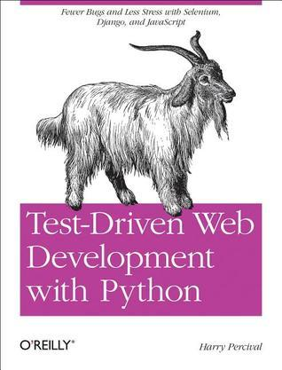

# #487 Test-Driven Development with Python

Book Notes - Test-Driven Development with Python: Obey the Testing Goat: Using Django, Selenium, and JavaScript by Harry Percival.
First published January 1, 2010. Third Edition 2025.

## Notes

[](https://amzn.to/4iPRwus)

I first got this in its beta release for the first edition. The third edition was released in 2025.

### Contents

#### PartI. The Basics of TDD and Django

* 1 - Getting Django Set Up Using a Functional Test
    * Obey the Testing Goat! Do Nothing Until You Have a Test
    * Getting Django Up and Running
    * Starting a Git Repository
* 2 - Extending Our Functional Test Using the unittest Module
    * Using a Functional Test to Scope Out a Minimum Viable App
    * The Python Standard Library's unittest Module
    * Implicit waits
    * Commit
* 3 - Testing a Simple Home Page with Unit Tests
    * Our First Django App, and Our First Unit Test
    * Unit Tests, and How They Differ from Functional Tests
    * Unit Testing in Django
    * Django's MVC, URLs, and View Functions
    * At Last! We Actually Write Some Application Code!
    * urls.py
    * Unit Testing a View
        * The Unit-Test/Code Cycle
* 4 - What Are We Doing with All These Tests?
    * Programming Is like Pulling a Bucket of Water up from a Well
    * Using Selenium to Test User Interactions
    * The "Don't Test Constants" Rule, and Templates to the Rescue
        * Refactoring to Use a Template
    * On Refactoring
    * A Little More of Our Front Page
    * Recap: The TDD Process
* 5 - Saving User Input
    * Wiring Up Our Form to Send a POST Request
    * Processing a POST Request on the Server
    * Passing Python Variables to Be Rendered in the Template
    * Three Strikes and Refactor
    * The Django ORM and Our First Model
        * Our First Database Migration
        * The Test Gets Surprisingly Far
        * A New Field Means a New Migration
    * Saving the POST to the Database
    * Redirect After a POST
        * Better Unit Testing Practice: Each Test Should Test One Thing
    * Rendering Items in the Template
    * Creating Our Production Database with migrate
* 6 - Getting to the Minimum Viable Site
    * Ensuring Test Isolation in Functional Tests
        * Running Just the Unit Tests
    * Small Design When Necessary
        * YAGNI!
        * REST
    * Implementing the New Design Using TDD
    * Iterating Towards the New Design
    * Testing Views, Templates, and URLs Together with the Django Test Client
        * A New Test Class
        * A New URL
        * A New View Function
        * A Separate Template for Viewing Lists
    * Another URI and View for Adding List Items
        * A Test Class for New List Creation
        * A URL and View for New List Creation
        * Removing Now-Redundant Code and Tests
        * Pointing Our Forms at the New URL
    * Adjusting Our Models
        * A Foreign Key Relationship
        * Adjusting the Rest of the World to Our New Models
    * Each List Should Have Its Own URI
        * Capturing Parameters from URLs
        * Adjusting new _list to the New World
    * One More View to Handle Adding Items to an Existing List
        * Beware of Greedy Regular Expressions!
        * The Last New URL
        * The Last New View
        * But How to Use That URL in the Form?
    * A Final Refactor Using URL includes

#### Part II. Web Development Sine Qua Nons

* 7 - Prettification: Layout and Styling, and What to Test About It
    * What to Functionally Test About Layout and Style Prettification: Using a CSS Framework
    * Django Template Inheritance
    * Integrating Bootstrap
        * Rows and Columns
    * Static Files in Django
        * Switching to StaticLiveServerTestCase
    * Using Bootstrap Components to Improve the Look of the Site
        * Jumbotron!
        * Large Inputs
        * Table Styling
    * Using Our Own CSS
    * What We Glossed Over: collectstatic and Other Static Directories
    * A Few Things That Didn't Make It
* 8 - Testing Deployment Using a Staging Site
    * TDD and the Danger Areas of Deployment
    * As Always, Start with a Test Getting a Domain Name
    * Manually Provisioning a Server to Host Our Site
        * Choosing Where to Host Our Site
        * Spinning Up a Server
        * User Accounts, SSH, and Privileges
        * Installing Nginx
        * Configuring Domains for Staging and Live
        * Using the FT to Confirm the Domain Works and Nginx Is Running
    * Deploying Our Code Manually
        * Adjusting the Database Location
        * Creating a Virtualenv
        * Simple Nginx Configuration
        * Creating the Database with migrate
    * Getting to a Production-Ready Deployment
        * Switching to Gunicorn
        * Getting Nginx to Serve Static Files Switching to Using Unix Sockets
        * Switching DEBUG to False and Setting ALLOWED_HOSTS
        * Using Upstart to Make Sure Gunicorn Starts on Boot
        * Saving Our Changes: Adding Gunicorn to Our requirements.txt
    * Automating
        * "Saving Your Progress"
* 9 - Automating Deployment with Fabric...
    * Breakdown of a Fabric Script for Our Deployment
    * Trying It Out
        * Deploying to Live
        * Nginx and Gunicorn Config Using sed
    * Git Tag the Release
    * Further Reading
* 10 - Input Validation and Test Organisation.
    * Validation FT: Preventing Blank Items
        * Skipping a Test
        * Splitting Functional Tests out into Many Files
        * Running a Single Test File
        * Fleshing Out the FT
    * Using Model-Layer Validation
        * Refactoring Unit Tests into Several Files
        * Unit Testing Model Validation and the self assertRaises Context Manager
        * A Django Quirk: Model Save Doesn't Run Validation
    * Surfacing Model Validation Errors in the View
        * Checking Invalid Input Isn't Saved to the Database
    * Django Pattern: Processing POST Requests in the Same View as Renders the Form
        * Refactor: Transferring the new_item Functionality into view_list
        * Enforcing Model Validation in view_list
    * Refactor: Removing Hardcoded URLs
        * The `{\% url \%}` Template Tag
    * Using `get_absolute_url` for Redirects
* 11 - A Simple Form
    * Moving Validation Logic into a Form
        * Exploring the Forms API with a Unit Test
        * Switching to a Django ModelForm
        * Testing and Customising Form Validation
    * Using the Form in Our Views
        * Using the Form in a View with a GET Request
        * A Big Find and Replace
    * Using the Form in a View That Takes POST Requests
        * Adapting the Unit Tests for the new _list View
        * Using the Form in the View
        * Using the Form to Display Errors in the Template
    * Using the Form in the Other View
        * A Helper Method for Several Short Tests
    * Using the Form's Own Save Method
* 12 - More Advanced Forms
    * Another FT for Duplicate Items
        * Preventing Duplicates at the Model Layer
        * A Little Digression on Queryset Ordering and String Representations
        * Rewriting the Old Model Test
        * Some Integrity Errors Do Show Up on Save
    * Experimenting with Duplicate Item Validation at the Views Layer
    * A More Complex Form to Handle Uniqueness Validation
    * Using the Existing List Item Form in the List View
* 13 - Dipping Our Toes, Very Tentatively, into JavaScript
    * Starting with an FT
    * Setting Up a Basic JavaScript Test Runner
    * Using jQuery and the Fixtures Div
    * Building a JavaScript Unit Test for Our Desired Functionality
    * Javascript Testing in the TDD Cycle
    * Columbo Says: Onload Boilerplate and Namespacing
    * A Few Things That Didn't Make It
* 14 - Deploying Our New Code..
    * Staging Deploy
    * Live Deploy
    * What to Do If You See a Database Error
    * Wrap-Up: git tag the New Release

#### Part III. More Advanced Topics

* 15 - User Authentication, Integrating Third-Party Plugins, and Mocking with JavaScript.
    * Mozilla Persona (BrowserID)
    * Exploratory Coding, aka "Spiking"
        * Starting a Branch for the Spike
        * Frontend and JavaScript Code
        * The Browser-ID Protocol
        * The Server Side: Custom Authentication
    * De-spiking
        * A Common Selenium Technique: Explicit Waits
        * Reverting Our Spiked Code
    * JavaScript Unit Tests Involving External Components: Our First Mocks!
        * Housekeeping: A Site-Wide Static Files Folder
        * Mocking: Who, Why, What?
        * Namespacing
        * A Simple Mock to Unit Tests Our initialize Function
        * More Advanced Mocking
        * Checking Call Arguments
        * QUnit setup and teardown, Testing Ajax
        * More Nested Callbacks! Testing Asynchronous Code
* 16 - Server-Side Authentication and Mocking in Python
    * A Look at Our Spiked Login View
    * Mocking in Python
        * Testing Our View by Mocking Out authenticate
        * Checking the View Actually Logs the User In
    * De-spiking Our Custom Authentication Backend: Mocking Out an Internet
        * Request
        * 1 if = 1 More Test
        * Patching at the Class Level
        * Beware of Mocks in Boolean Comparisons
        * Creating a User if Necessary
        * The get_user Method
    * A Minimal Custom User Model
        * A Slight Disappointment
        * Tests as Documentation
        * Users Are Authenticated
    * The Moment of Truth: Will the FT Pass?
    * Finishing Off Our FT, Testing Logout
* 17 - Test Fixtures, Logging, and Server-Side Debugging
    * Skipping the Login Process by Pre-creating a Session
        * Checking It Works
    * The Proof Is in the Pudding: Using Staging to Catch Final Bugs
        * Setting Up Logging
        * Fixing the Persona Bug
    * Managing the Test Database on Staging
        * A Django Management Command to Create Sessions
        * Getting the FT to Run the Management Command on the Server
        * An Additional Hop via subprocess
    * Baking In Our Logging Code
        * Using Hierarchical Logging Config
    * Wrap-Up
* 18 - Finishing "My Lists": Outside-In TDD
    * The Alternative: "Inside Out"
    * Why Prefer "Outside-In"?
    * The FT for "My Lists"
    * The Outside Layer: Presentation and Templates
    * Moving Down One Layer to View Functions (the Controller)
    * Another Pass, Outside-In
        * A Quick Restructure of the Template Inheritance Hierarchy
        * Designing Our API Using the Template
        * Moving Down to the Next Layer: What the View Passes to the Template
    * The Next "Requirement" from the Views Layer: New Lists Should Record
        * Owner
        * A Decision Point: Whether to Proceed to the Next Layer with a Failing Test
    * Moving Down to the Model Layer
        * Final Step: Feeding Through the name API from the Template
* 19 - Test Isolation, and "Listening to Your Tests"
    * Revisiting Our Decision Point: The Views Layer Depends on Unwritten
        * Models Code
    * A First Attempt at Using Mocks for Isolation
        * Using Mock side _effects to Check the Sequence of Events
    * Listen to Your Tests: Ugly Tests Signal a Need to Refactor
    * Rewriting Our Tests for the View to Be Fully Isolated
        * Keep the Old Integrated Test Suite Around as a Sanity Check
        * A New Test Suite with Full Isolation
        * Thinking in Terms of Collaborators
    * Moving Down to the Forms Layer
        * Keep Listening to Your Tests: Removing ORM Code from Our Application
    * Finally, Moving Down to the Models Layer
        * Back to Views
    * The Moment of Truth (and the Risks of Mocking)
    * Thinking of Interactions Between Layers as "Contracts"
        * Identifying Implicit Contracts
        * Fixing the Oversight
    * One More Test
    * Tidy Up: What to Keep from Our Integrated Test Suite
        * Removing Redundant Code at the Forms Layer
        * Removing the Old Implementation of the View
        * Removing Redundant Code at the Forms Layer
    * Conclusions: When to Write Isolated Versus Integrated Tests
        * Let Complexity Be Your Guide
        * Should You Do Both?
        * Onwards!
* 20 - Continuous Integration (CI)
    * Installing Jenkins
        * Configuring Jenkins Security
        * Adding Required Plugins
    * Setting Up Our Project
    * First Build!
    * Setting Up a Virtual Display so the FTs Can Run Headless
    * Taking Screenshots
    * A Common Selenium Problem: Race Conditions
    * Running Our QUnit JavaScript Tests in Jenkins with PhantomJS
        * Installing node
        * Adding the Build Steps to Jenkins
    * More Things to Do with a CI Server
* 21 - The Token Social Bit, the Page Pattern, and an Exercise for the Reader
    * An FT with Multiple Users, and addCleanup
    * Implementing the Selenium Interact/Wait Pattern
    * The Page Pattern
    * Extend the FT to a Second User, and the "My Lists" Page
    * An Exercise for the Reader
* 22 - Fast Tests, Slow Tests, and Hot Lava
    * Thesis: Unit Tests Are Superfast and Good Besides That
        * Faster Tests Mean Faster Development
        * The Holy Flow State
        * Slow Tests Don't Get Run as Often, Which Causes Bad Code
        * We're Fine Now, but Integrated Tests Get Slower Over Time
        * Don't Take It from Me
        * And Unit Tests Drive Good Design
    * The Problems with "Pure" Unit Tests
        * Isolated Tests Can Be Harder to Read and Write
        * Isolated Tests Don't Automatically Test Integration
        * Unit Tests Seldom Catch Unexpected Bugs
        * Mocky Tests Can Become Closely Tied to Implementation
        * But All These Problems Can Be Overcome
    * Synthesis: What Do We Want from Our Tests, Anyway?
        * Correctness
        * Clean, Maintainable Code
        * Productive Workflow
        * Evaluate Your Tests Against the Benefits You Want from Them
    * Architectural Solutions
        * Ports and Adapters/Hexagonal/Clean Architecture
        * Functional Core, Imperative Shell
    * Conclusion

#### Appendices

* Obey the Testing Goat!
* A. PythonAnywhere
* B. Django Class-Based Views
* C. Provisioning with Ansible
* D. Testing Database Migrations
* E. Behaviour-Driven Development (BDD)
* F. Cheat Sheet
* G. What to Do Next
* H. Bibliography

### Getting the Example Source

```sh
git clone https://github.com/hjwp/book-example.git example_source
```

## Credits and References

* <https://www.obeythetestinggoat.com/>
* Test-Driven Development with Python: Obey the Testing Goat: Using Django, Selenium, and JavaScript, First Edition by Harry Percival
    * [amazon](https://amzn.to/4iPRwus)
    * [O'Reilly](https://www.oreilly.com/library/view/test-driven-development-with/9781449365141/)
    * [goodreads](https://www.goodreads.com/book/show/17912811)
    * [examples](https://github.com/hjwp/book-example)
* Test-Driven Development with Python, 3rd Edition by Harry Percival
    * [amazon](https://amzn.to/3V945HB)
    * [O'Reilly](https://www.oreilly.com/library/view/test-driven-development-with/9781098148706/)
    * [goodreads](https://www.goodreads.com/book/show/17912811)
