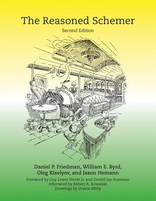

# #425 The Reasoned Schemer

Book notes - The Reasoned Schemer, Second Edition, by Daniel P. Friedman, William E. Byrd, Oleg Kiselyov, Jason Hemann.
First published July 1, 2005 by MIT Press. Second edition 2018.

## Notes

[](https://amzn.to/3PtjWxu)

### Contents

* Foreword
* Preface
* Acknowledgements
* Since the First Edition
* 1 Playthings
* 2 Teaching Old Toys New Tricks
* 3 Seeing Old Friends in New Ways
* 4 Double Your Fun
* 5 Members Only
* 6 The Fun Never Ends ...
* 7 A Bit Too Much
* 8 Just a Bit More
* 9 Thin Ice
* 10 Under the Hood
* Connecting the Wires
* Welcome to the Club
* Afterword
* Index

### Source Code

Source code is available on [GitHub](https://github.com/TheReasonedSchemer2ndEd/CodeFromTheReasonedSchemer2ndEd).

```sh
git clone https://github.com/TheReasonedSchemer2ndEd/CodeFromTheReasonedSchemer2ndEd example_source
```

## Credits and References

* The Reasoned Schemer, Second Edition
    * [MIT Press](https://mitpress.mit.edu/books/reasoned-schemer-second-edition)
    * [Amazon](https://amzn.to/3PtjWxu)
    * [Goodreads](https://www.goodreads.com/book/show/36698753-the-reasoned-schemer)
* <https://github.com/TheReasonedSchemer2ndEd/CodeFromTheReasonedSchemer2ndEd>
