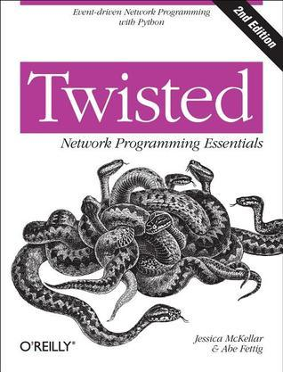

# #488 Twisted Network Programming Essentials

Book Notes - Twisted Network Programming Essentials: Event-driven Network Programming with Python by Jessica McKellar, Abe Fettig.
First published February 12, 2005. Second Edition 2013.

## Notes

[](https://amzn.to/46RprvD)

## Contents

### Part I. Getting Started

* 1 - Getting Started
    * Installing Twisted
        * Installation on Linux
        * Installation on Windows
        * Installation on OS X
    * Installing from Source
        * Required Dependencies
        * Installing Twisted from a Release Tarball
        * Installing Twisted from a Source Checkout
        * Installing Optional Dependencies from Sour
    * Testing Your Installation
    * Using the Twisted Documentation
        * API Documentation
        * Subproject Documentation
    * Finding Answers to Your Questions
        * Mailing Lists
        * IRC Channels
        * Stack Overflow
        * Twisted Blogs
* 2- Building Basic Clients and Servers
    * A TCP Echo Server and Client
    * Event-Driven Programming
    * The Reactor
    * Transports
    * Protocols
        * Protocol Factories
        * Decoupling Transports and Protocols
    * A TCP Quote Server and Client
    * Protocol State Machines
    * More Practice and Next Steps
* 3 - Writing Asynchronous Code with Deferreds
    * What Deferreds Do and Don't Do
    * The Structure of a Deferred Object
    * Callback Chains and Using Deferreds in the Reactor
    * Practice: What Do These Deferred Chains Do?
        * Exercise 1
        * Exercise 2
        * Exercise 3
        * Exercise 4
        * Exercise 5
        * Exercise 6
    * The Truth About add Callbacks
        * Exercise 7
        * Exercise 8
    * Key Facts About Deferreds
    * Summary of the Deferred API
    * More Practice and Next Steps
* 4 - Web Servers
    * Responding to HTTP Requests: A Low-Level Review
        * The Structure of an HTTP Request
        * Parsing HTTP Requests
    * Handling GET Requests
        * Serving Static Content
        * Serving Dynamic Content
        * Dynamic Dispatch
    * Handling POST Requests
        * A Minimal POST Example
    * Asynchronous Responses
    * More Practice and Next Steps
* 5 - Web Clients
    * Basic HTTP Resource Retrieval
        * Printing a Web Resource
        * Downloading a Web Resource
    * Agent
        * Requesting Resources with Agent
        * Retrieving Response Metadata
        * POSTing Data with Agent
    * More Practice and Next Steps

### Part II. Building Production-Grade Twisted Services

* 6 - Deploying Twisted Applications
    * The Twisted Application Infrastructure
        * Services
        * Applications
        * TAC Files
        * twistd
        * Plugins
    * More twistd Examples
    * More Practice and Next Steps
        * Suggested Exercises
* 7 - Logging
    * Basic In-Application Logging
    * twistd Logging
    * Custom Loggers
    * Key Facts and Caveats About Logging
* 8 - Databases
    * Nonblocking Database Queries
    * More Practice and Next Steps
* 9 - Authentication
    * The Components of Twisted Cred
    * Twisted Cred: An Example
    * Credentials Checkers
    * Authentication in Twisted Applications
    * More Practice and Next Steps
* 10 - Threads and Subprocesses
    * Threads
    * Subprocesses
        * Running a Subprocess and Getting the Result
        * Custom Process Protocols
    * More Practice and Next Steps
* 11 - Testing
    * Writing and Running Twisted Unit Tests with Trial
    * Testing Protocols
    * Tests and the Reactor
        * Testing Deferreds
        * Testing the Passage of Time
    * More Practice and Next Steps

### Part III. More Protocols and More Practice

* 12 - Twisted Words
    * IRC Clients
    * IRC Servers
    * More Practice and Next Steps
* 13 - Twisted Mail...
    * SMTP Clients and Servers
        * The SMTP Protocol
        * Sending Emails Using SMTP
        * SMTP Servers
        * Storing Mail
    * IMAP Clients and Servers
        * IMAP Servers
        * IMAP Clients
    * POP3 Clients and Servers
        * POP3 Servers
    * More Practice and Next Steps
* 14 - SSH
    * SSH Servers
        * A Basic SSH Server
    * Using Public Keys for Authentication
    * Providing an Administrative Python Shell
    * Running Commands on a Remote Server
        * SSH Clients
    * More Practice and Next Steps
* 15 - The End.

## Getting the Example Source

```sh
git clone https://github.com/jesstess/twisted-network-programming-essentials-examples.git example_source
```

## Credits and References

* Twisted Network Programming Essentials, Second Edition
    * [amazon](https://amzn.to/46RprvD)
    * [O'Reilly](https://www.oreilly.com/library/view/twisted-network-programming/9781449326104/)
    * [goodreads](https://www.goodreads.com/book/show/15842793)
    * [examples](https://github.com/jesstess/twisted-network-programming-essentials-examples)
