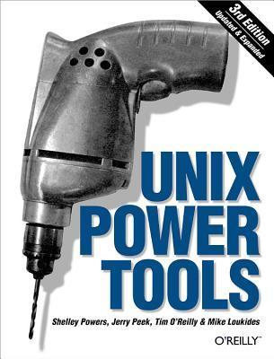

# #462 Unix Power Tools

Book notes - Unix Power Tools, by Shelley Powers, Jerry Peek, Tim O'Reilly, Mike Loukides.
First published January 1, 1993.

## Notes

[](https://amzn.to/4ooMqWF)

### Contents

* I: Basic Unix Environment
    * 1: Introduction
    * 2: Getting Help
* II: Customizing Your Environment
    * 3: Setting Up Your Unix Shell
    * 4: Interacting with Your Environment
    * 5: Getting the Most out of Terminals, xterm, and X Windows
    * 6: Your X Environment
* III: Working with Files and Directories
    * 7: Directory Organization
    * 8: Directories and Files
    * 9: Finding Files with find
    * 10: Linking, Renaming, and Copying Files
    * 11: Comparing Files
    * 12: Showing What's in a File
    * 13: Searching Through Files
    * 14: Removing Files
    * 15: Optimizing Disk Space
* IV: Basic Editing
    * 16: Spell Checking, Word Counting, and Textual Analysis
    * 17: vi Tips and Tricks
    * 18: Creating Custom Commands in vi
    * 19: GNU Emacs
    * 20: Batch Editing
    * 21: You Can't Quite Call This Editing
    * 22: Sorting
* V: Processes and the Kernel
    * 23: Job Control
    * 24: Starting, Stopping, and Killing Processes
    * 25: Delayed Execution
    * 26: System Performance and Profiling
* VI: Scripting
    * 27: Shell Interpretation
    * 28: Saving Time on the Command Line
    * 29: Custom Commands
    * 30: The Use of History
    * 31: Moving Around in a Hurry
    * 32: Regular Expressions (Pattern Matching)
    * 33: Wildcards
    * 34: The sed Stream Editor
    * 35: Shell Programming for the Uninitiated
    * 30: Shell Programming for the Initiated
    * 37: Shell Script Debugging and Gotchas
* VII: Extending and Managing Your Environment
    * 38: Backing Up Files
    * 39: Creating and Reading Archives
    * 40: Software Installation
    * 41: Perl
    * 42: Python
* VIII: Communication and Connectivity
    * 43: Redirecting Input and Output
    * 44: Devices
    * 45: Printing
    * 46: Connectivity
    * 47: Connecting to MS Windows
* IX: Security
    * 48: Security Basics
    * 49: Root, Group, and User Management
    * 50: File Security, Ownership, and Sharing
    * 51: SSH

### Source Code

Example sources are maintained at <https://resources.oreilly.com/examples/9780596003302/>.
The repo contains a zipped version of the sources, so I uncompress them to an `example_source` folder
after cloning the repo:

```sh
git clone https://resources.oreilly.com/examples/9780596003302 example_source_repo
mkdir example_source
tar -zxvf example_source_repo/example_files.tar.gz -C ./example_source
```

## Credits and References

* UNIX PowerTools 2nd Edition
    * [example source](https://resources.oreilly.com/examples/9781565922600/)
* UNIX PowerTools 3rd Edition
    * [amazon](https://amzn.to/4ooMqWF)
    * [goodreads](https://www.goodreads.com/book/show/9714503-unix-power-tools)
    * [O'Reilly](https://www.oreilly.com/library/view/unix-power-tools/0596003307/)
    * [example source](https://resources.oreilly.com/examples/9780596003302/)
