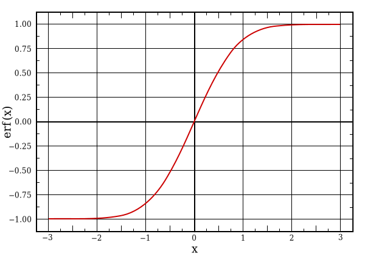

# #102 Error Function

Methods for calculating the Gauss error function in C with standard libraries and the GNU Scientific Library.

## Notes

In mathematics, the
[error function](https://en.wikipedia.org/wiki/Error_function)
is the probability that Y falls in the range [−x, x],
where the random value Y is normally distributed with mean 0 and variance 1/2.

[](https://en.wikipedia.org/wiki/File:Error_Function.svg)

### Using the C Standard Library

The [erf.c](./erf.c?raw=true) example calculates the probability and area under the curve for a couple of sample values.
It uses the [erf()](https://en.cppreference.com/w/c/numeric/math/erf) function from the C standard library,
defined in header `<math.h>`.

The example requires linking with the math library (`-lm`).
The [Makefile](./Makefile?raw=true) is setup to compile and link the example, else it can be done by hand:

```
gcc erf.c -o erf -lm -Wall -O3 -std=gnu11
```

### Installing the GNU Scientific Library

It is probably most common to install the GSL in precompiled form via a package managed.
On Mac, I'd do that with `brew install gsl` - see the [gsl homebrew fomula](https://formulae.brew.sh/formula/gsl)

But for now, I'm going to install from source as follows.
NB: 1.15 is a pretty old version now.

```
wget ftp://ftp.gnu.org/gnu/gsl/gsl-1.15.tar.gz
tar xvzf gsl-1.15.tar.gz
rm gsl-1.15.tar.gz
cd gsl-1.15
./configure
make
sudo make install
```

All worked fine - installed to `/usr/local/lib/libgsl*` and `/usr/local/include/gsl/`,
and can now be referenced with the help of `pkg-config`:

```
$ pkg-config --libs gsl
-L/usr/local/lib -lgsl -lgslcblas -lm
```

### Using the GNU Scientific Library

The [erf_gsl.c](./erf_gsl.c?raw=true) example repeats the calculation, but using functions from the GNU Scientific Library, namely:

* [gsl_sf_erf](https://www.gnu.org/software/gsl/doc/html/specfunc.html#c.gsl_sf_erf)
* [gsl_cdf_gaussian_P](https://www.gnu.org/software/gsl/doc/html/randist.html#c.gsl_cdf_gaussian_P)


## Running the Examples

```
$ make
gcc -Wall -O3 -std=gnu11    erf.c  -lm -o erf
gcc -Wall -O3 -std=gnu11    erf_gsl.c  `pkg-config --libs gsl` -o erf_gsl
./erf
The probability that Normal(0, 1) random variable has a value between -0.25 and 0.25 is: 0.276326
The integral of a Normal(0, 1) distribution between -0.25 and 0.25 is: 0.197413
The probability that Normal(0, 1) random variable has a value between -1.96 and 1.96 is: 0.994426
The integral of a Normal(0, 1) distribution between -1.96 and 1.96 is: 0.950004
./erf_gsl
The probability that Normal(0, 1) random variable has a value between -0.25 and 0.25 is: 0.276326
The integral of a Normal(0, 1) distribution between -0.25 and 0.25 is: 0.197413
The probability that Normal(0, 1) random variable has a value between -1.96 and 1.96 is: 0.994426
The integral of a Normal(0, 1) distribution between -1.96 and 1.96 is: 0.950004
```

## Credits and References

* [error function](https://en.wikipedia.org/wiki/Error_function) - wikipedia
* [21st Century C](https://www.goodreads.com/book/show/17017525-21st-century-c)
* [GSL - GNU Scientific Library](https://www.gnu.org/software/gsl/)
* [erf()](https://en.cppreference.com/w/c/numeric/math/erf) - C standard library
* [erf()](https://www.gnu.org/software/libc/manual/html_node/Special-Functions.html) - GNu libc manual
* [gsl homebrew fomula](https://formulae.brew.sh/formula/gsl)
