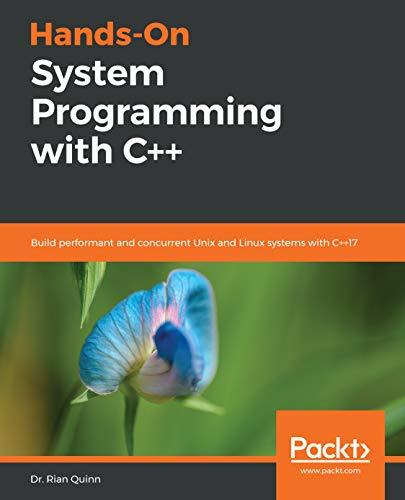

# #168 Hands-On System Programming with C++

Book notes - Hands-On System Programming with C++ by Dr. Rian Quinn.

[](https://amzn.to/4mw7GHJ)

## Notes

* [ebook](https://subscription.packtpub.com/book/application_development/9781789137880)
* [example source](https://github.com/PacktPublishing/Hands-On-System-Programming-with-CPP)

### Table of Contents - Highlights

#### Getting Started with System Programming

Benefits of using C++ for system programming:

* Type safety
* Objects
* Templates
* Functional programming
* Error handling
* APIs and C++ containers

#### The C standard language

The C standard is a huge standard that is managed by the International Organization for Standardization (ISO):
[ISO/IEC 9899:TC3](http://www.open-std.org/jtc1/sc22/wg14/www/docs/n1256.pdf).

Libraries

Standard C not only defines a syntax, the environment, and how programs are linked, it also provides a set of libraries including:

* errno.h: working with errors
* inttypes.h: type information
* limits.h: limits of each type
* setjump.h: APIs for C-style exception handling
* signal.h: APIs for handling signals sent from the system to your program,
* stdbool.h: type information
* stddef.h: type information
* stdint.h: type information
* stdio.h: working with input and output
* stdlib.h: various utilities, including dynamic memory allocation APIs
* time.h: working with clocks

#### The C++ standard

Like the C standard, the C++ standard is huge and is managed by the ISO:
[Working Draft, Standard for Programming Language C++](http://www.open-std.org/jtc1/sc22/wg21/docs/papers/2017/n4713.pdf).

#### The POSIX standard

The POSIX standard defines all of the functionality a POSIX-compliant operating system must implement:
[1003.1-2017 - IEEE Standard for Information Technology--Portable Operating System Interface (POSIX(R)) Base Specifications, Issue 7](https://ieeexplore.ieee.org/document/8277153/)

Some key things it defines:

* Memory management
* Filesystems
* Sockets
* Threading

Under the hood, most of the system-level APIs that C and C++ provide actually execute POSIX functions;
libc is generally considered to be a subset of the greater POSIX standard.

#### System Types for C and C++

Exploring C and C++ default types

* char, wchar_t
* short int, int, long int
* float, double, long double
* bool (C++ only)

#### C++, RAII, and the GSL Refresher

* A brief overview of C++17
* Resource Acquisition Is Initialization (RAII)
* The Guideline Support Library (GSL)

#### Programming Linux/Unix Systems

* The Linux ABI
* The Unix filesystem
* Unix processes
* Unix signals

#### Learning to Program Console Input/Output

* Learning about stream-based IO
* Beginning with user-defined types
* Learning about manipulators
* Recreating the echo program
* Understanding the Serial Echo server example

#### A Comprehensive Look at Memory Management

* Learning about the new and delete functions
* Understanding smart pointers and ownership
* Learning about mapping and permissions
* Learning importance of memory fragmentation

#### Learning to Program File Input/Output

* Opening a file
* Reading and writing to a file
* Understanding file utilities
* Understanding the logger example
* Learning about the tail file example
* Comparing C++ versus mmap benchmark

#### A Hands-On Approach to Allocators

* Introducing the C++ allocators
* Studying an example of stateless, cache–aligned allocator
* Studying an example of a stateful, memory–pool allocator

#### Programming POSIX Sockets Using C++

* Beginning with POSIX sockets
* Beginning with APIs
* Studying an example on the UDP echo server
* Studying an example on the TCP echo server
* Exploring an example on TCP Logger
* Trying out an example for processing packets
* Processing an example of processing JSON

#### Time Interfaces in Unix

* Learning about POSIX time.h APIs
* Exploring C++ Chrono APIs
* Studying an example on the read system clock
* Studying an example on high-resolution timer

#### Learning to Program POSIX and C++ Threads

* Understanding POSIX threads
* Exploring C++ threads
* Studying an example on parallel computation
* Studying an example on benchmarking with threads
* Studying an example on thread logging

#### Error – Handling with Exceptions

* Error handling POSIX-style
* Learning about set jump exceptions
* Understanding exception support in C++

### Getting the Example Source

```sh
git clone https://github.com/PacktPublishing/Hands-On-System-Programming-with-CPP.git example_source
```

## Credits and References

* [Hands-On System Programming with C++](https://subscription.packtpub.com/book/application_development/9781789137880) - ebook
* [Hands-On System Programming with C++](https://www.goodreads.com/book/show/43517659-hands-on-system-programming-with-c) - goodreads
* [example source](https://github.com/PacktPublishing/Hands-On-System-Programming-with-CPP)
* [ISO/IEC 9899:TC3](http://www.open-std.org/jtc1/sc22/wg14/www/docs/n1256.pdf)
* [1003.1-2017 - IEEE Standard for Information Technology--Portable Operating System Interface (POSIX(R)) Base Specifications, Issue 7](https://ieeexplore.ieee.org/document/8277153/)
* [Working Draft, Standard for Programming Language C++](http://www.open-std.org/jtc1/sc22/wg21/docs/papers/2017/n4713.pdf)
