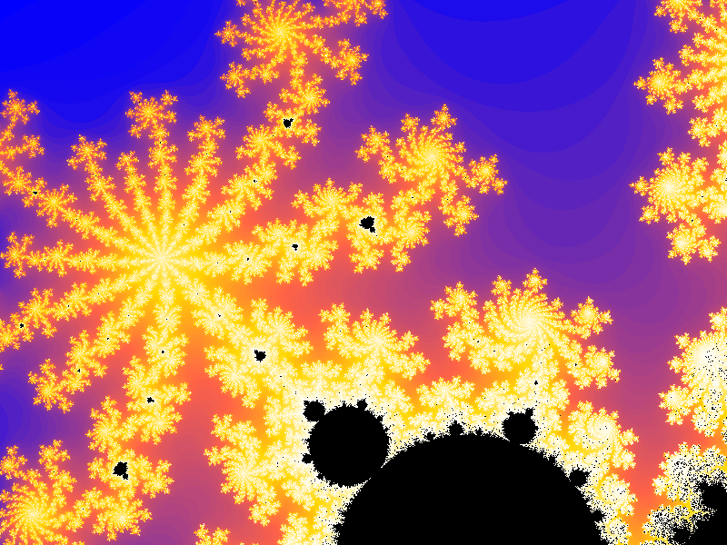

# #302

A learning example Mandelbrot fractal generator in C++

## Notes

This is based on the example from the
[Learn Advanced C++ Programming](https://www.udemy.com/course/learn-advanced-c-programming/)
course on Udemy.

I am running/testing the code on Apple Silicon with the clang compiler:

    $ g++ --version
    Apple clang version 15.0.0 (clang-1500.3.9.4)
    Target: arm64-apple-darwin23.6.0
    Thread model: posix

## Build

* `make` (default: all)
* `make all`
* `make run`
* `make clean`

## Run

`./fractal.exe` produces `mandelbrot.bmp`:

## Credits and References

* [Mandelbrot set](https://en.wikipedia.org/wiki/Mandelbrot_set)
* [Learn Advanced C++ Programming](https://www.udemy.com/course/learn-advanced-c-programming/)
