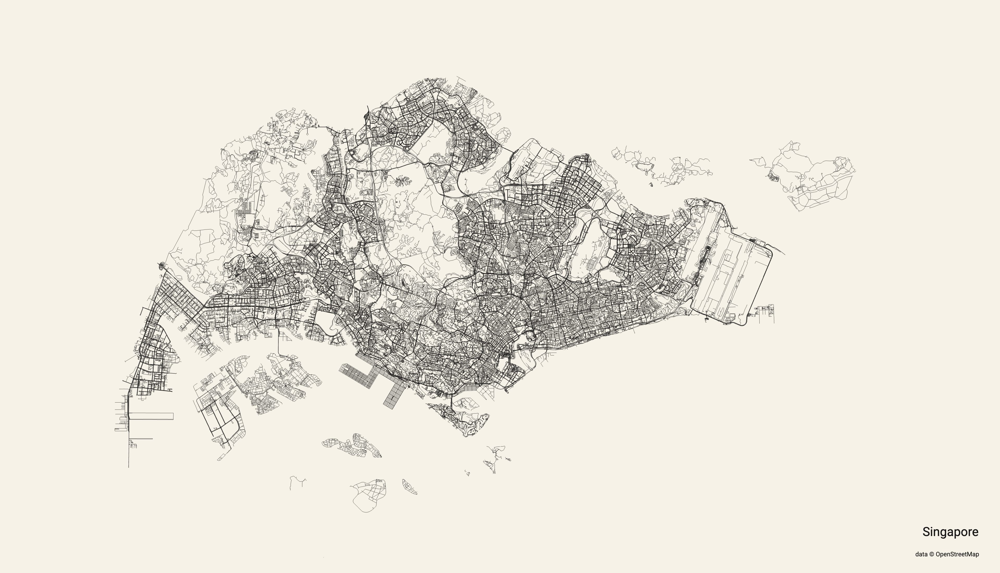

# #408 City Roads

City Roads as art! Something quite delightful about this open source project.

## Notes

I recently discovered <https://anvaka.github.io/city-roads/>.
It is a deceptively simple application - fetching road details from OpenStreetMap using overpass API and rendering the map.
But the results can be quite stunning, worthy of a good quality print and framing for the wall.

Here's Singapore:

For developers, the source is a good study too: <https://github.com/anvaka/city-roads>.

## Credits and References

* <https://anvaka.github.io/city-roads/>
* <https://github.com/anvaka/city-roads>
