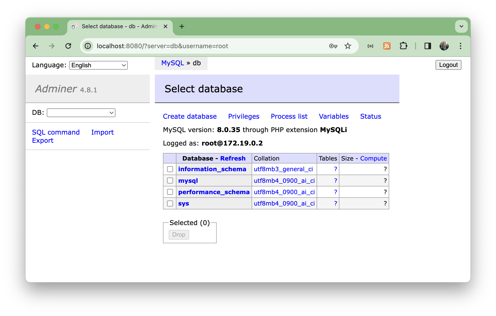

# MySQL 8

All about MySQL 8 and examples of running with docker

## Notes

Like many (I guess), I've been stuck running MySQL 5 for years. But there was a new version .. in 2016!
[MySQL 8.0 Release Notes](https://dev.mysql.com/doc/relnotes/mysql/8.0/en/).

[What Is New in MySQL 8.0](https://dev.mysql.com/doc/refman/8.0/en/mysql-nutshell.html) provides a summary of changes.

### Running with Docker

See the [docker-compose.yml](./docker-compose.yml). It defines:

* instance of [mysql:8.0.35](https://hub.docker.com/_/mysql)
* instance of [adminer](https://hub.docker.com/_/adminer/)

It configures 'root' user with mysql_native_password 'example'. Startup:

    $ docker-compose up
    [+] Running 4/4
     ✔ Network mysql8_default      Created                                                                                                                                         0.0s 
     ✔ Volume "mysql8_db_data"     Created                                                                                                                                         0.0s 
     ✔ Container mysql8-db-1       Created                                                                                                                                         0.0s 
     ✔ Container mysql8-adminer-1  Created                                                                                                                                         0.0s 
    Attaching to adminer-1, db-1
    db-1       | 2024-01-13 01:24:50+00:00 [Note] [Entrypoint]: Entrypoint script for MySQL Server 8.0.35-1.el8 started.
    adminer-1  | [Sat Jan 13 01:24:50 2024] PHP 7.4.33 Development Server (http://[::]:8080) started
    ...

Running mysql client from the docker image. 
Since the client is running within a docker container, needing to access the database in another,
the host needs to be specified correctly (192.168.10.108 is my current host IP):

    $ docker run -it --rm mysql:8.0.35 mysql -h 192.168.10.108 -u root -pexample -e "\s"
    mysql: [Warning] Using a password on the command line interface can be insecure.
    --------------
    mysql  Ver 8.0.35 for Linux on aarch64 (MySQL Community Server - GPL)

    Connection id:      13
    Current database:   
    Current user:       root@192.168.65.1
    SSL:            Cipher in use is TLS_AES_256_GCM_SHA384
    Current pager:      stdout
    Using outfile:      ''
    Using delimiter:    ;
    Server version:     8.0.35 MySQL Community Server - GPL
    Protocol version:   10
    Connection:     192.168.10.108 via TCP/IP
    Server characterset:    utf8mb4
    Db     characterset:    utf8mb4
    Client characterset:    latin1
    Conn.  characterset:    latin1
    TCP port:       3306
    Binary data as:     Hexadecimal
    Uptime:         1 min 38 sec

    Threads: 2  Questions: 15  Slow queries: 0  Opens: 120  Flush tables: 3  Open tables: 39  Queries per second avg: 0.153
    --------------

#### Using Adminer

Runs [adminer](https://www.adminer.org/) - database management in a single PHP file - on <http://localhost:8080>.
Note: adminer doesn't work with passwordless login

### Running No Password

Old users of mysql (or users of old mysql) will perhaps expect default config of root with no password.

The [mysql-nopassword.yml](./mysql-nopassword.yml) config sets `MYSQL_ALLOW_EMPTY_PASSWORD` to allow this

    $ docker-compose -f mysql-nopassword.yml up
    [+] Running 2/2
     ✔ Network mysql8_default    Created                                                                                                                                           0.0s 
     ✔ Container mysql8-mysql-1  Created                                                                                                                                           0.0s 
    Attaching to mysql-1
    mysql-1  | 2024-01-13 02:47:50+00:00 [Note] [Entrypoint]: Entrypoint script for MySQL Server 8.0.35-1.el8 started.

Connecting with no password:

    $ docker run -it --rm mysql:8.0.35 mysql -h 192.168.10.108 -u root -e "\s"
    --------------
    mysql  Ver 8.0.35 for Linux on aarch64 (MySQL Community Server - GPL)

    Connection id:      8
    Current database:   
    Current user:       root@192.168.65.1
    SSL:            Cipher in use is TLS_AES_256_GCM_SHA384
    Current pager:      stdout
    Using outfile:      ''
    Using delimiter:    ;
    Server version:     8.0.35 MySQL Community Server - GPL
    Protocol version:   10
    Connection:     192.168.10.108 via TCP/IP
    Server characterset:    utf8mb4
    Db     characterset:    utf8mb4
    Client characterset:    latin1
    Conn.  characterset:    latin1
    TCP port:       3306
    Binary data as:     Hexadecimal
    Uptime:         1 min 2 sec

    Threads: 2  Questions: 5  Slow queries: 0  Opens: 119  Flush tables: 3  Open tables: 38  Queries per second avg: 0.080
    --------------

Setting an alias can simplify client commands:

    $ alias mysql-client="docker run -it --rm mysql:8.0.35 mysql -h 192.168.10.108 -u root"
    $ mysql-client  -e "\s"
    --------------
    mysql  Ver 8.0.35 for Linux on aarch64 (MySQL Community Server - GPL)

    Connection id:      8
    Current database:   
    Current user:       root@192.168.65.1
    SSL:            Cipher in use is TLS_AES_256_GCM_SHA384
    Current pager:      stdout
    Using outfile:      ''
    Using delimiter:    ;
    Server version:     8.0.35 MySQL Community Server - GPL
    Protocol version:   10
    Connection:     192.168.10.108 via TCP/IP
    Server characterset:    utf8mb4
    Db     characterset:    utf8mb4
    Client characterset:    latin1
    Conn.  characterset:    latin1
    TCP port:       3306
    Binary data as:     Hexadecimal
    Uptime:         21 sec

    Threads: 2  Questions: 5  Slow queries: 0  Opens: 119  Flush tables: 3  Open tables: 38  Queries per second avg: 0.238
    --------------

Alternatively, mysql client invocation details can be hidden with a script,
though it can mean some extra parameter quoting if needing to passw quoted string.
See [mysql-client.sh](./mysql-client.sh) for example:

    $ $ ./mysql-client.sh -h 192.168.10.108 -u root -e '"select version();"'
    +-----------+
    | version() |
    +-----------+
    | 8.0.35    |
    +-----------+

## Credits and References

* [MySQL 8.0 Release Notes](https://dev.mysql.com/doc/relnotes/mysql/8.0/en/)
* [mysql (docker hub)](https://hub.docker.com/_/mysql)
* [adminer (docker hub)](https://hub.docker.com/_/adminer/)
* [adminer](https://www.adminer.org/) - database management in a single PHP file
