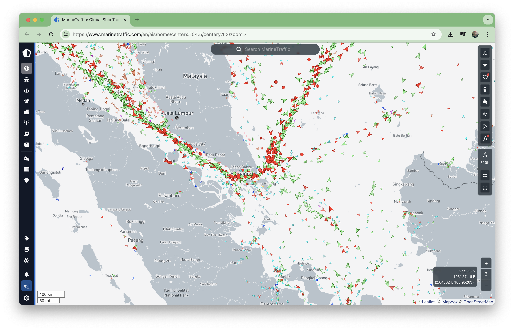
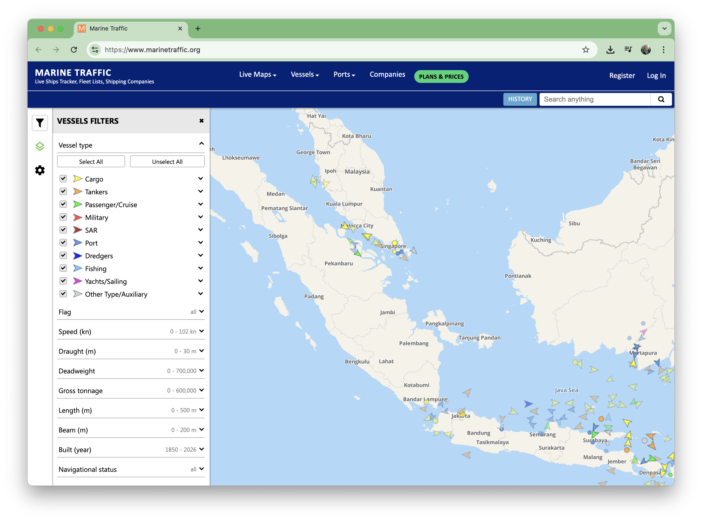
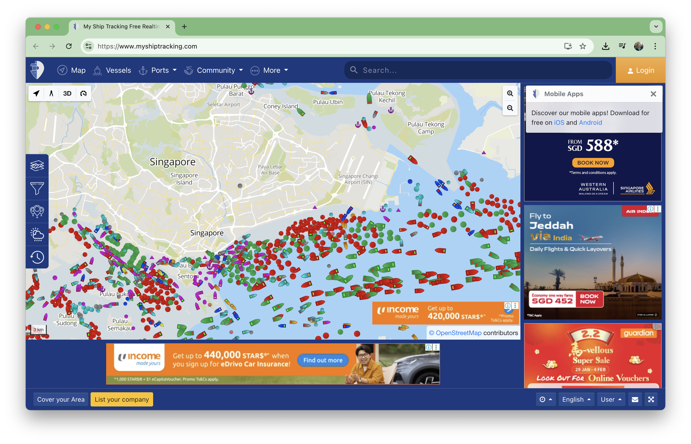
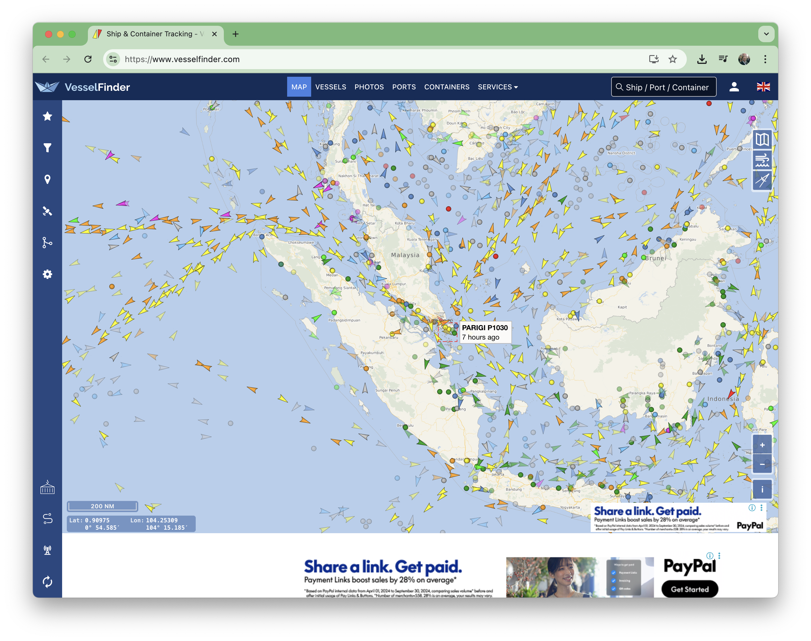
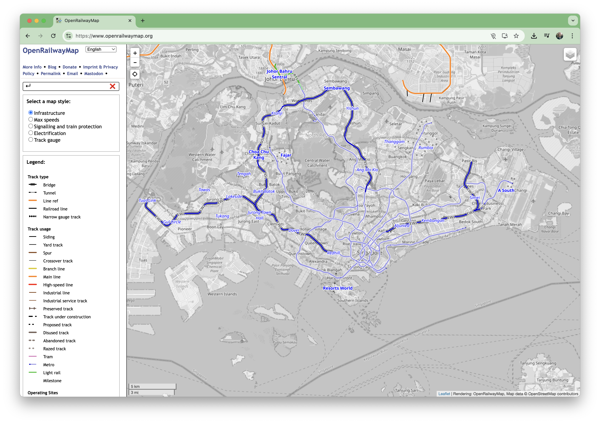

# #410 Transportation Trackers

A catalog and quick survey of transportation trackers: aviation; maritime; rail.

## Notes

### Aviation

#### airloom

<https://objectiveunclear.com/airloom.html>

A pretty compelling rendering of flight data, especially with the altitude of aircraft rendered in 3D.

#### flightradar24

<https://www.flightradar24.com/>

The big brother of flight trackers.

### Maritime

#### Marine Traffic (.com)

<https://www.marinetraffic.com/>

On eof the most comprehensive maritime trackers.

#### Marine Traffic (.org)

<https://www.marinetraffic.org/>

#### My Ship Tracking

<https://www.myshiptracking.com/>

#### Vessel Finder

<https://www.vesselfinder.com/>

### Rail

#### Open Railway Map

<https://www.openrailwaymap.org/>

Maps most railways around the world. No rail traffic tracking though.

## Credits and References

* <https://airplanes.live/> - flight data
* <https://ourairports.com/> - airport data
* <https://www.planespotters.net/> - aircraft data
* <https://en.wikipedia.org/wiki/Automatic_identification_system>
