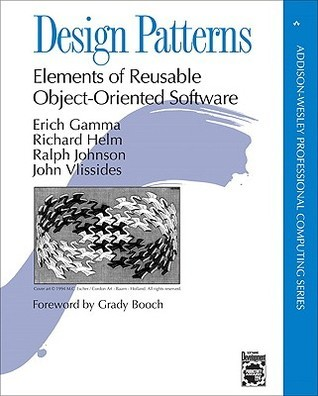

# #xxx Design Patterns

Book notes - Design Patterns: Elements of Reusable Object-Oriented Software by Erich Gamma, Grady Booch, Richard Helm, Ralph Johnson, John Vlissides

## Notes

[Design Patterns: Elements of Reusable Object-Oriented Software](https://www.goodreads.com/book/show/85009.Design_Patterns)
is the classic "Gang of Four" work that first introduced me to design patterns in software.

## Contents

* Introduction
    * What Is a Design Pattern?
    * Design Patterns in Smalltalk MVC
    * Describing Design Patterns
    * The Catalog of Design Patterns
    * Organizing the Catalog
    * How Design Patterns Solve Design Problems
    * How to Select a Design Pattern
    * How to Use a Design Pattern
* A Case Study: Designing a Document Editor
    * Design Problems
    * Document Structure
    * Formatting
    * Embellishing the User Interface
    * Supporting Multiple Look-and-Feel Standards
    * Supporting Multiple Window Systems
    * User Operations
    * Spelling Checking and Hyphenation
    * Summary
* Design Pattern Catalog
    * Creational Patterns
        * Abstract Factory
        * Builder
        * Factory Method
        * Prototype
        * Singleton
        * Discussion of Creational Patterns
    * Structural Patterns
        * Adapter
        * Bridge
        * Composite
        * Decorator
        * Facade
        * Flyweight
        * Proxy
        * Discussion of Structural Patterns
    * Behavioral Patterns
        * Chain of Responsibility
        * Command
        * Interpreter
        * Iterator
        * Mediator
        * Memento
        * Observer
        * State
        * Strategy
        * Template Method
        * Visitor
        * Discussion of Behavioral Patterns
* Conclusion
    * What to Expect from Design Patterns
    * A Brief History
    * The Pattern Community
    * An Invitation
    * A Parting Thought
* A Glossary
* B Guide to Notation
    * B.1 Class Diagram
    * B.2 Object Diagram.
    * B.3 Interaction Diagram
* C Foundation Classes
    * C.1 List
    * C.2 Iterator
    * С.3 Listiterator
    * C.4 Point .
    * C.5 Rect

## Credits and References

* Design Patterns
    * [amazon](https://amzn.to/47mhiPE)
    * [goodreads](https://www.goodreads.com/book/show/85009.Design_Patterns)
    * [O'Reilly](https://www.oreilly.com/library/view/design-patterns-elements/0201633612/)
* <https://en.wikipedia.org/wiki/Design_Patterns>
* <https://en.wikipedia.org/wiki/Software_design_pattern>
