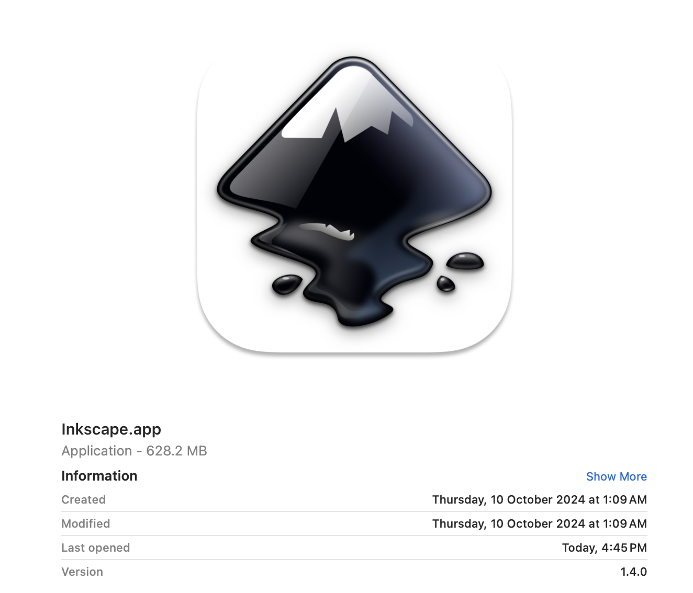

# #315 Inkscape

About Inkscape, with installation on macOS.

## Notes

Inkscape is a Free and open source vector graphics editor for GNU/Linux, Windows and macOS.

### Key Features

* rich set of features for both artistic and technical illustrations
* uses vector graphics to allow for sharp printouts and renderings at unlimited resolution
* the standardized SVG file format as its main format
* can import and export various file formats, including SVG, AI, EPS, PDF, PS and PNG.

### Installation - macOS

Previously I've had Inkscape 0.92.x installed using [brew](https://formulae.brew.sh/cask/inkscape#default),
but it seems that may now only be supported for Intel architecture.

I've since switched machines and wanted to get Inkscape installed again (current version is 1.4).
It seems the packaging has vastly improved in the intervening years.
Installation packages for all supported operating system and processor architectures are [available](https://inkscape.org/release/inkscape-1.4/).

This time I just installed using the dmg file for arm64 architecture.

## Credits and References

* [Inkscape](https://inkscape.org/)
* [Inkscape Beginners’ Guide!](https://inkscape-manuals.readthedocs.io/en/latest/)
