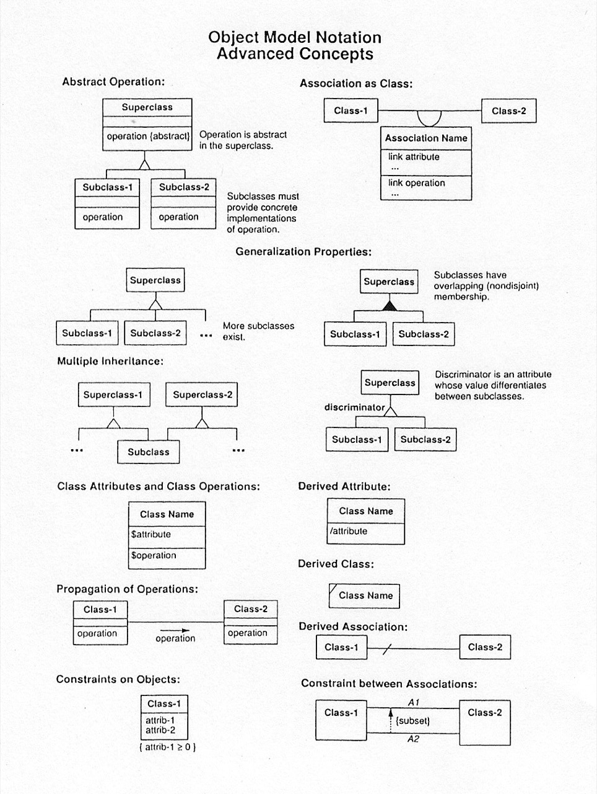

# #xxx Object Oriented Modeling And Design

Book notes - Object Oriented Modeling And Design by James Rumbaugh, Michael R. Blaha, William Premerlani, Frederick Eddy, William Lorensen.

## Notes

This is the book that was my first (IIRC) formal introduction to Object Oriented Modeling and Design back in the day..

## Table of Contents - Highlights

### CHAPTER 1 INTRODUCTION

* 1.1 What Is Object-Oriented?, 1
* 1.2 What Is Object-Oriented Development?, 4
* 1.3 Object-Oriented Themes, 7
* 1.4 Evidence for Usefulness of Object-Oriented Development, 9
* 1.5 Organization of this Book, 10
* Bibliographic Notes, 12
* References, 12
* Exercises, 13

### Part 1: Modeling Concepts

#### CHAPTER 2 MODELING AS A DESIGN TECHNIQUE

* 2.1 Modeling, 15
* 2.2 The Object Modeling Technique, 16
* 2.3 Chapter Summary, 19
* Exercises, 19

#### CHAPTER 3 OBJECT MODELING

* 3.1 Objects and Classes, 21
* 3.2 Links and Associations, 27
* 3.3 Advanced Link and Association Concepts, 31
* 3.4 Generalization and Inheritance, 38
* 3.5 Grouping Constructs, 43
* 3.6 A Sample Object Model, 43
* 3.7 Practical Tips, 46
* 3.8 Chapter Summary, 47
* Bibliographic Notes, 48
* References, 48
* Exercises, 49

#### CHAPTER 4 ADVANCED OBJECT MODELING

* 4.1 Aggregation, 57
* 4.2 Abstract Classes, 61
* 4.3 Generalization as Extension and Restriction, 63
* 4.4 Multiple Inheritance, 65
* 4.5 Metadata, 69
* 4.6 Candidate Keys, 71
* 4.7 Constraints, 73
* 4.8 Chapter Summary, 77
* Bibliographic Notes, 79
* References, 79
* Exercises, 80

#### CHAPTER 5 DYNAMIC MODELING

* 5.1 Events and States, 84
* 5.2 Operations, 92
* 5.3 Nested State Diagrams, 94
* 5.4 Concurrency, 99
* 5.5 Advanced Dynamic Modeling Concepts, 101
* 5.6 A Sample Dynamic Model, 105
* 5.7 Relation of Object and Dynamic Models, 110
* 5.8 Practical Tips, 111
* 5.9 Chapter Summary, 112
* Bibliographic Notes, 113
* References, 115
* Exercises, 115

#### CHAPTER 6 FUNCTIONAL MODELING

* 6.1 Functional Models, 123
* 6.2 Data Flow Diagrams, 124
* 6.3 Specifying Operations, 130
* 6.4 Constraints, 132
* 6.5 A Sample Functional Model, 133
* 6.6 Relation of Functional to Object and Dynamic Models, 137
* 6.7 Chapter Summary, 139
* Bibliographic Notes, 140
* References, 140
* Exercises, 141

### Part 2: Design Methodology

#### CHAPTER 7 METHODOLOGY PREVIEW

* 7.1 OMT as a Software Engineering Methodology, 144
* 7.2 The OMT Methodology, 145
* 7.3 Impact of an Object-Oriented Approach, 146
* 7.4 Chapter Summary, 146
* Exercises, 147

#### CHAPTER 8 ANALYSIS

* 8.1 Overview of Analysis, 148
* 8.2 Problem Statement, 150
* 8.3 Automated Teller Machine Example, 151
* 8.4 Object Modeling, 152
* 8.5 Dynamic Modeling, 169
* 8.6 Functional Modeling, 179
* 8.7 Adding Operations, 183
* 8.8 Iterating the Analysis, 185
* 8.9 Chapter Summary, 187
* Bibliographic Notes, 188
* References, 188
* Exercises, 189

#### CHAPTER 9 SYSTEM DESIGN

* 9.1 Overview of System Design, 198
* 9.2 Breaking a System into Subsystems, 199
* 9.3 Identifying Concurrency, 202
* 9.4 Allocating Subsystems to Processors and Tasks, 203
* 9.5 Management of Data Stores, 205
* 9.6 Handling Global Resources, 207
* 9.7 Choosing Software Control Implementation, 207
* 9.8 Handling Boundary Conditions, 210
* 9.9 Setting Trade-off Priorities, 210
* 9.10 Common Architectural Frameworks, 211
* 9.11 Architecture of the ATM System, 217
* 9.12 Chapter Summary, 218
* Bibliographic Notes, 220
* References, 220
* Exercises, 221

#### CHAPTER 10 OBJECT DESIGN

* 10.1 Overview of Object Design, 227
* 10.2 Combining the Three Models, 229
* 10.3 Designing Algorithms, 230

### Part 4: Applications

#### CHAPTER 18 OBJECT DIAGRAM COMPILER

* 18.1 Background, 398
* 18.2 Problem Statement, 399
* 18.3 Analysis, 401
* 18.4 System Design, 407
* 18.5 Object Design, 408
* 18.6 Implementation, 412
* 18.7 Lessons Learned, 412
* 18.8 Chapter Summary, 413
* Bibliographic Notes, 413
* References, 413
* Exercises, 414

#### CHAPTER 19 COMPUTER ANIMATION

* 19.1 Background, 417
* 19.2 Problem Statement, 418
* 19.3 Analysis, 420
* 19.4 System Design, 424
* 19.5 Object Design, 426
* 19.6 Implementation, 428
* 19.7 Lessons Learned, 430
* 19.8 Chapter Summary, 431
* Bibliographic Notes, 431
* References, 432
* Exercises, 432

#### CHAPTER 20 ELECTRICAL DISTRIBUTION DESIGN SYSTEM

* 20.1 Background, 433
* 20.2 Problem Statement, 435
* 20.3 Analysis, 436
* 20.4 System Design, 444
* 20.5 Object Design, 445
* 20.6 Implementation, 448
* 20.7 Lessons Learned, 448
* 20.8 Chapter Summary, 449
* Bibliographic Notes, 449
* References, 449
* Exercises, 450

#### APPENDICES

* APPENDIX A
* OMT GRAPHICAL NOTATION
* APPENDIX B GLOSSARY
* ANSWERS TO SELECTED EXERCISES

## Object Model Notation References

### Basic Concepts

### Advanced Concepts

### Dynamic Model Notation

### Functional Model Notation

## Credits and References

* [goodreads](https://www.goodreads.com/book/show/3121682-object-oriented-modeling-and-design)
* <https://en.wikipedia.org/wiki/Object-oriented_analysis_and_design>
* <https://en.wikipedia.org/wiki/Object-oriented_modeling>
