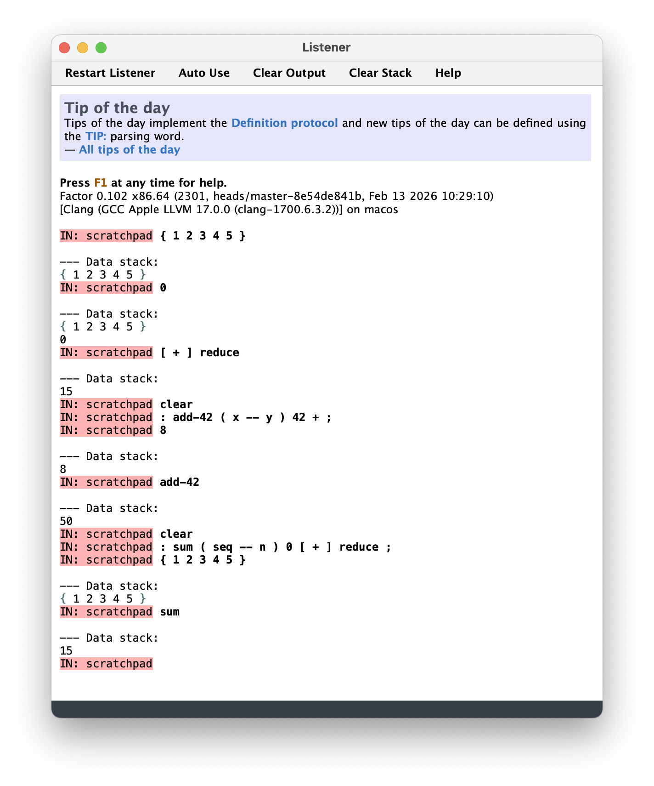

# #xxx About Factor

An overview of the Factor programming language, its features, and ecosystem. Includes setting up and running on macOS.

## Notes

Factor features in Bruce Tate's [Seven More Languages in Seven Weeks](../../books/seven-more-languages-in-seven-weeks/).

[](https://factorcode.org/)

### Factor In a Nutshell

Factor is..

* a modern, stack-based, concatenative programming language inspired by Forth.
* dynamically typed and interactive, with a strong emphasis on metaprogramming and extensibility.
* open source and implemented primarily in itself (self-hosting).
* designed for expressiveness, code reuse, and composability through small, reusable “words” (functions).
* multi-paradigm, supporting functional, object-oriented, and imperative styles.

Factor has..

* a powerful interactive development environment (listener + UI tools) built into the language.
* a dataflow-oriented syntax where programs are composed by chaining words that operate on an implicit data stack.
* generic functions and a dynamic object system with multiple dispatch.
* advanced metaprogramming capabilities, including macros and parsing words that extend the syntax.
* automatic memory management via a generational garbage collector.
* a built-in optimizing compiler and supports native code generation.
* concurrency support, including lightweight threads and message passing.
* an integrated standard library covering networking, UI, databases, parsing, and more.
* a relatively small but dedicated ecosystem, with community-maintained libraries (“vocabularies”).

Factor is governed by

* an open-source development model (BSD-style license).
* community contributions and core maintainers rather than a commercial vendor.
* a design philosophy that prioritizes composability, minimal syntax, and extensibility over mainstream familiarity.

### Seven More Languages in Seven Weeks: Wrapping Up Factor

Core Strengths:

* beautifully devoid of extra syntax and punctuation
* comes with a full-featured library to build real-world applications: command line, GUI, web
* rich set of documentation and examples

Core Weaknesses:

* some structures, such as if/else branches, are harder to read in concatenated form
* small community
* limited resources
* "factor" is widely used in other contexts, so is hard to use in search.

## Test drive: Factor on macOS

I am running macOS on Apple Silicon,
and the pre-built [x86-64 binary download](https://factorcode.org/) works just fine.

A quick test-drive of the GUI REPL:



### Building From Source

It can also be built from source:

```sh
$ git clone https://github.com/factor/factor.git factor-source
$ cd factor-source
$ arch -x86_64 ./build.sh update
...
Bootstrapping is complete.
Now, you can run Factor:
/Users/paulgallagher/MyGithub/tardate/LittleCodingKata/factor/about/factor-source/factor -i=factor.image
Loading resource:basis/bootstrap/finish-bootstrap.factor
Loading resource:basis/command-line/startup/startup.factor
Copying factor.image to factor.image.fresh...
$
```

Testing the installation:

```sh
$ ./factor -i=factor.image --version
Factor 0.102 x86.64 (2301, heads/master-8e54de841b, Feb 13 2026 10:29:10)
[Clang (GCC Apple LLVM 17.0.0 (clang-1700.6.3.2))] on macos
$ ./factor -i=factor.image
Factor 0.102 x86.64 (2301, heads/master-8e54de841b, Feb 13 2026 10:29:10)
[Clang (GCC Apple LLVM 17.0.0 (clang-1700.6.3.2))] on macos
IN: scratchpad "Hello!" print
Hello!
IN: scratchpad
```

### Hello World

Based on an example from Seven More Languages in Seven Weeks.
This is a simple hello world application, with modular organisation and unit tests.

The code is organised as follows. The folder organisation is important, as it maps to namespaces/modules:

* [examples/greeter/greeter.factor](./examples/greeter/greeter.factor) - library that implements the greeting function
* [examples/greeter/greeter-tests.factor](./examples/greeter/greeter-tests.factor) - greeter tests
* [examples/test-suite/test-suite.factor](./examples/test-suite/test-suite.factor) - test suite
* [examples/hello/hello.factor](./examples/hello/hello.factor) - the main program

Running the code, note:

* I am using the factor image compiled from source
* the factor roots is set to the current directory. this allows "hello.factor" to find "examples.greeter" in the roots path.

```sh
$ factor-source/factor -i=factor-source/factor.image -roots=$(pwd) examples/hello/hello.factor
Hello, world
```

Running the test suite:

```sh
$ factor-source/factor -i=factor-source/factor.image -roots=$(pwd) examples/test-suite/test-suite.factor
All tests passed.
```

### The Code

[examples/hello/hello.factor](./examples/hello/hello.factor):

```factor
! START:full
USE: io
! START:init
USE: examples.greeter
IN: examples.hello

: hello-world ( -- ) "world" greeting print ;

MAIN: hello-world
! END:init
! END:full
```

[examples/greeter/greeter.factor](./examples/greeter/greeter.factor):

```factor
! START:full
USING: kernel sequences ;
! START:init
IN: examples.greeter

: greeting ( name -- greeting ) "Hello, " swap append ;
! END:init
! END:full
```

[examples/greeter/greeter-tests.factor](./examples/greeter/greeter-tests.factor):

```factor
! START:full
USING: examples.greeter tools.test ;
IN: examples.greeter.tests

{ "Hello, Test" } [ "Test" greeting ] unit-test
! END:full
```

[examples/test-suite/test-suite.factor](./examples/test-suite/test-suite.factor):

```factor
USING: tools.test io io.streams.null kernel namespaces sequences ;

USE: examples.greeter

IN: examples.test-suite

: test-all-examples ( -- )
    [ "examples" test ] with-null-writer ! (2)
    test-failures get empty? ! (3)
    [ "All tests passed." print ] [ :test-failures ] if ; ! (4)

MAIN: test-all-examples
```

## Credits and References

* <https://factorcode.org/>
* <https://github.com/factor/factor>
* [Seven More Languages in Seven Weeks](../../books/seven-more-languages-in-seven-weeks/) - Chapter 2: Factor
