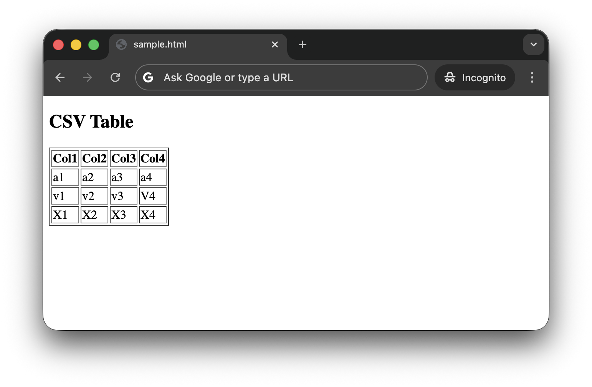

# #xxx XSLT CSV Transforms

XSLT transformations for converting CSV data.

## Notes

CSV source transformation is possible with XSLT, but it requires XSLT 2.0 and 3.0 features, so I will be using Saxon. See [LCK#434 Saxon Processor](../saxon/) for details.

This is a simple demonstration of CSV transformation to XML and HTML formats.

### The Sample File

See [sample.csv](./sample.csv):

```txt
Col1,Col2,Col3,Col4
a1,a2,a3,a4
v1,v2,v3,V4
X1,X2,X3,X4
```

### Transform CSV to XML

See [csv2xml.xsl](./csv2xml.xsl) for the transformation:

```xslt
<?xml version="1.0" encoding="UTF-8"?>
<xsl:stylesheet version="3.0"
  xmlns:xsl="http://www.w3.org/1999/XSL/Transform"
  expand-text="yes">

<xsl:output method="xml" indent="yes"/>

<!-- Parameter -->
<xsl:param name="csv-uri"/>

<xsl:template match="/">
  <rows>
    <xsl:variable name="lines" select="unparsed-text-lines($csv-uri)"/>
    <xsl:variable name="headers" select="tokenize($lines[1], ',')"/>

    <xsl:for-each select="$lines[position() > 1]">
      <row>
        <xsl:variable name="fields" select="tokenize(., ',')"/>

        <xsl:for-each select="1 to count($headers)">
          <xsl:element name="{$headers[current()]}">
            {$fields[current()]}
          </xsl:element>
        </xsl:for-each>
      </row>
    </xsl:for-each>
  </rows>
</xsl:template>

</xsl:stylesheet>
```

Note that the CSV file is referenced by parameter `csv-uri`. Saxon requires a source XML file, so we provide a dummy file [null.xml](./null.xml).
Running the transformation produces the output file [sample.xml](./sample.xml):

```sh
$ xslt3 -s:null.xml -xsl:csv2xml.xsl csv-uri=sample.csv -o:sample.xml
$ cat sample.xml
<?xml version="1.0" encoding="UTF-8"?>
<rows>
   <row>
      <Col1>
            a1
          </Col1>
      <Col2>
            a2
          </Col2>
      <Col3>
            a3
          </Col3>
      <Col4>
            a4
          </Col4>
   </row>
   <row>
      <Col1>
            v1
          </Col1>
      <Col2>
            v2
          </Col2>
      <Col3>
            v3
          </Col3>
      <Col4>
            V4
          </Col4>
   </row>
   <row>
      <Col1>
            X1
          </Col1>
      <Col2>
            X2
          </Col2>
      <Col3>
            X3
          </Col3>
      <Col4>
            X4
          </Col4>
   </row>
</rows>
```

### Transform CSV to HTML

See [csv2html.xsl](./csv2html.xsl) for the transformation:

```xslt
<?xml version="1.0" encoding="UTF-8"?>
<xsl:stylesheet version="3.0"
  xmlns:xsl="http://www.w3.org/1999/XSL/Transform"
  expand-text="yes">

<xsl:output method="html" indent="yes"/>

<!-- Parameter -->
<xsl:param name="csv-uri"/>

<xsl:template match="/">
  <html>
    <body>
      <h2>CSV Table</h2>

      <xsl:variable name="lines" select="unparsed-text-lines($csv-uri)"/>
      <xsl:variable name="headers" select="tokenize($lines[1], ',')"/>

      <table border="1">
        <tr>
          <xsl:for-each select="$headers">
            <th>{.}</th>
          </xsl:for-each>
        </tr>

        <xsl:for-each select="$lines[position() > 1]">
          <tr>
            <xsl:for-each select="tokenize(., ',')">
              <td>{.}</td>
            </xsl:for-each>
          </tr>
        </xsl:for-each>
      </table>

    </body>
  </html>
</xsl:template>

</xsl:stylesheet>
```

Note that the CSV file is referenced by parameter `csv-uri`. Saxon requires a source XML file, so we provide a dummy file [null.xml](./null.xml).
Running the transformation produces the output file [sample.html](./sample.html):

```sh
xslt3 -s:null.xml -xsl:csv2html.xsl csv-uri=sample.csv -o:sample.html
open sample.html
```

[](./sample.html)

### About tokenize

These transforms rely heavily on the [tokenize](https://www.saxonica.com/html/documentation12/functions/fn/tokenize.html) XSLT function.

The [test-tokenize-string.xsl](./test-tokenize-string.xsl) transform is a simple demonstration of its use:

```xslt
<?xml version="1.0" encoding="windows-1252" ?>
<xsl:stylesheet version="2.0" xmlns:xsl="http://www.w3.org/1999/XSL/Transform">
 <!-- simple test of the tokenize function -->
 <xsl:template match="/">
  <xsl:for-each  select="tokenize('a,b,c',',')">
   <xsl:element name="field">
    <xsl:value-of select="."/>
   </xsl:element>
  </xsl:for-each>
 </xsl:template>
</xsl:stylesheet>
```

The result tokenizes the `'a,b,c'` input string:

```sh
$ xslt3 -s:null.xml -xsl:test-tokenize-string.xsl
<?xml version="1.0" encoding="UTF-8"?><field>a</field><field>b</field><field>c</field>
```

### About analyze-string

The [analyze-string](https://www.saxonica.com/html/documentation12/functions/fn/analyze-string.html) can achoeve a similar goal.

The [test-analyze-string.xsl](./test-analyze-string.xsl) transform is a simple demonstration of its use:

```xslt
<?xml version="1.0" encoding="windows-1252" ?>
<xsl:stylesheet xmlns:xsl="http://www.w3.org/1999/XSL/Transform" version="2.0">
  <!-- this demonstrates simple use of analyze-string function -->
  <xsl:template match="/">
  <xsl:analyze-string select="'a,b,c'" regex=",">
    <xsl:matching-substring/>
      <xsl:non-matching-substring>
        <xsl:element name="field">
          <xsl:value-of select="."/>
        </xsl:element>
      </xsl:non-matching-substring>
  </xsl:analyze-string>
  </xsl:template>
</xsl:stylesheet>
```

The result tokenizes the `'a,b,c'` input string:

```sh
$ xslt3 -s:null.xml -xsl:test-analyze-string.xsl
<?xml version="1.0" encoding="UTF-8"?><field>a</field><field>b</field><field>c</field>
```

## Credits and References

* [LCK#434 Saxon Processor](../saxon/)
* [fn:tokenize](https://www.saxonica.com/html/documentation12/functions/fn/tokenize.html)
* [fn:analyze-string](https://www.saxonica.com/html/documentation12/functions/fn/analyze-string.html)
